# Configurar autenticação para [!DNL Adobe Target] APIs

As APIs de Administrador [!DNL Adobe Target], incluindo as APIs [!DNL Recommendations Admin], são protegidas por autenticação para garantir que somente usuários autorizados as usem para acessar [!DNL Adobe Target]. Use o [Adobe Developer Console](https://developer.adobe.com/console/home) para gerenciar esta autenticação para todos os [!DNL Adobe Experience Cloud solutions], incluindo o [!DNL Adobe Target].

>[!IMPORTANT]
>
>As credenciais da Conta de serviço (JWT) descritas neste artigo serão substituídas em favor das novas credenciais de servidor para servidor do OAuth.
>
>As credenciais da Conta de serviço (JWT) continuarão a funcionar até 1º de janeiro de 2025. Você deve migrar seu aplicativo ou integração para usar a nova credencial OAuth de servidor para servidor antes de 1º de janeiro de 2025.
>
>Para obter mais informações e instruções passo a passo para migrar sua integração, consulte [Migrando da credencial de Conta de Serviço (JWT) para a credencial de servidor para servidor OAuth](https://developer.adobe.com/developer-console/docs/guides/authentication/ServerToServerAuthentication/migration/){target=_blank} na documentação do *Developer Console*.
>
>Para obter informações sobre como configurar novas credenciais do OAuth, consulte a [implementação de credenciais de servidor para servidor do OAuth](https://developer.adobe.com/developer-console/docs/guides/authentication/ServerToServerAuthentication/implementation/){target=_blank} na documentação do *Developer Console*.

Estas são as etapas preliminares necessárias para gerar os tokens de autenticação JWT herdados necessários para interagir com êxito com as APIs do [!DNL Adobe Target]:

1. Crie um projeto (anteriormente chamado de integração) no [!DNL Adobe Developer Console].
1. Exportar detalhes do projeto para o Postman.
1. Gerar um token de acesso do portador.
1. Teste o token de acesso do portador.

## Pré-requisitos

| Recurso | Detalhes |
| --- | --- |
| Postman | Para concluir essas etapas com êxito, obtenha o [aplicativo Postman](https://www.postman.com/downloads/) para seu sistema operacional. O Postman Basic é gratuito com a criação da conta. Embora não seja necessário para usar APIs do [!DNL Adobe Target] em geral, o Postman facilita os fluxos de trabalho da API e o [!DNL Adobe Target] fornece várias coleções do Postman para ajudar a executar suas APIs e aprender como elas operam. O restante deste guia pressupõe conhecimento prático do Postman. Para obter ajuda, consulte a [documentação do Postman](https://learning.getpostman.com/). |
| Referências | Familiaridade com os seguintes recursos é presumida no restante deste guia:<ul><li>[Adobe I/O Github](https://github.com/adobeio)</li><li>[Documentação da API de perfil e de administrador do Target](../administer/admin-api/admin-api-overview-new.md)</li><li>[Documentação da API do Recommendations](https://developer.adobe.com/target/administer/recommendations-api/)</li></ul> |

## Criar um projeto do Adobe I/O

Nesta seção, você acessará [!DNL Adobe Developer Console] e criará um projeto para [!DNL Adobe Target]. Para obter mais informações, consulte a [documentação sobre projetos](https://developer.adobe.com/developer-console/docs/guides/projects/).

<!--(1. Generate your private key and public certificate, per the [documentation on authentication](https://developer.adobe.com/developer-console/docs/guides/authentication/). // [//]: # (as described in **Step 1** of [How to set up Adobe IO: Authentication - Step by Step](https://helpx.adobe.com/marketing-cloud-core/kb/adobe-io-authentication-step-by-step.html). After completing Step 1, return to this guide and resume with Step 2, below. // The outcome of this step should be the creation of a `private.key` file and a `certificate_pub.crt` file. Return to this guide once you have generated these two files.)-->

1. No [Adobe Admin Console](https://adminconsole.adobe.com/), verifique se a sua conta de usuário [!DNL Adobe] recebeu acesso de nível de [Administrador de Produto](https://helpx.adobe.com/enterprise/using/admin-roles.html) e [Desenvolvedor](https://helpx.adobe.com/enterprise/using/manage-developers.html) ao [!DNL Target].

1. Na [Adobe Developer Console](https://developer.adobe.com/console/home), selecione a [!UICONTROL Organização da Experience Cloud] para a qual deseja criar essa integração. (Observe que é provável que você só tenha acesso a uma única [!UICONTROL Organização da Experience Cloud].)

   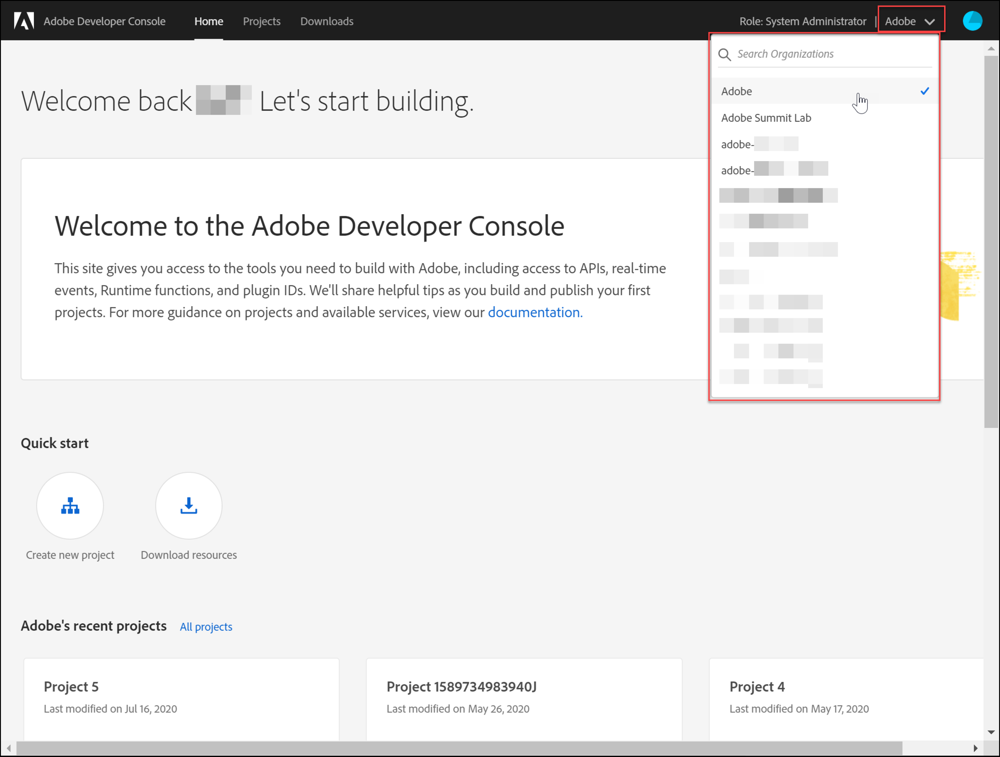

1. Clique em **[!UICONTROL Criar novo projeto]**.

   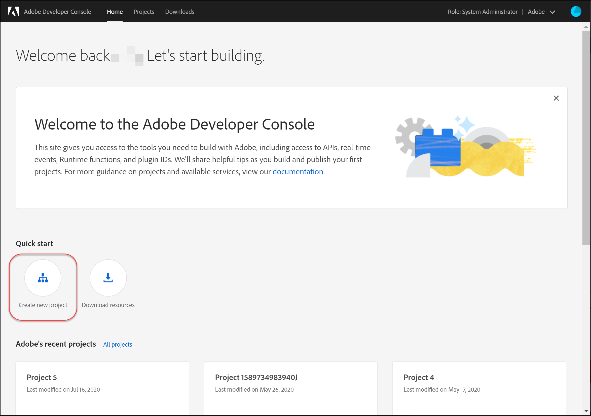

1. Clique em **[!UICONTROL Adicionar API]** para adicionar uma REST API ao seu projeto para acessar serviços e produtos do [!DNL Adobe].

   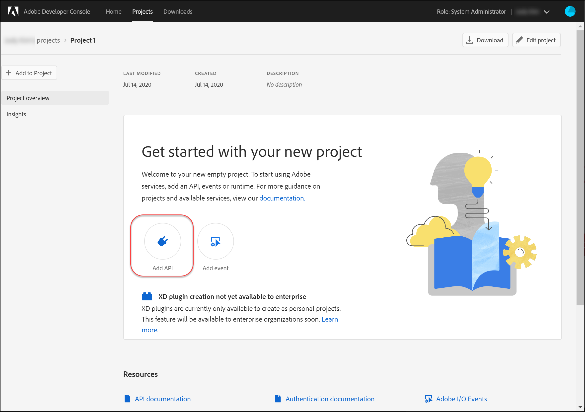

1. Selecione **[!DNL Adobe Target]** como o serviço [!DNL Adobe] ao qual você deseja integrar. Clique no botão **[!UICONTROL Avançar]** que aparece.

   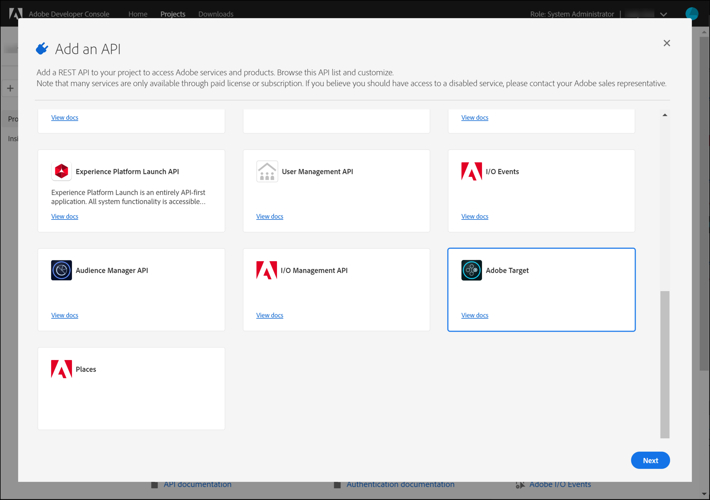

1. Selecione uma opção para associar chaves públicas e privadas à integração de conta de serviço que você está criando para [!DNL Target]. Para este exemplo, selecione **[!UICONTROL Opção 1: gerar um par de chaves]** e clique em **[!UICONTROL Gerar par de chaves]**.

   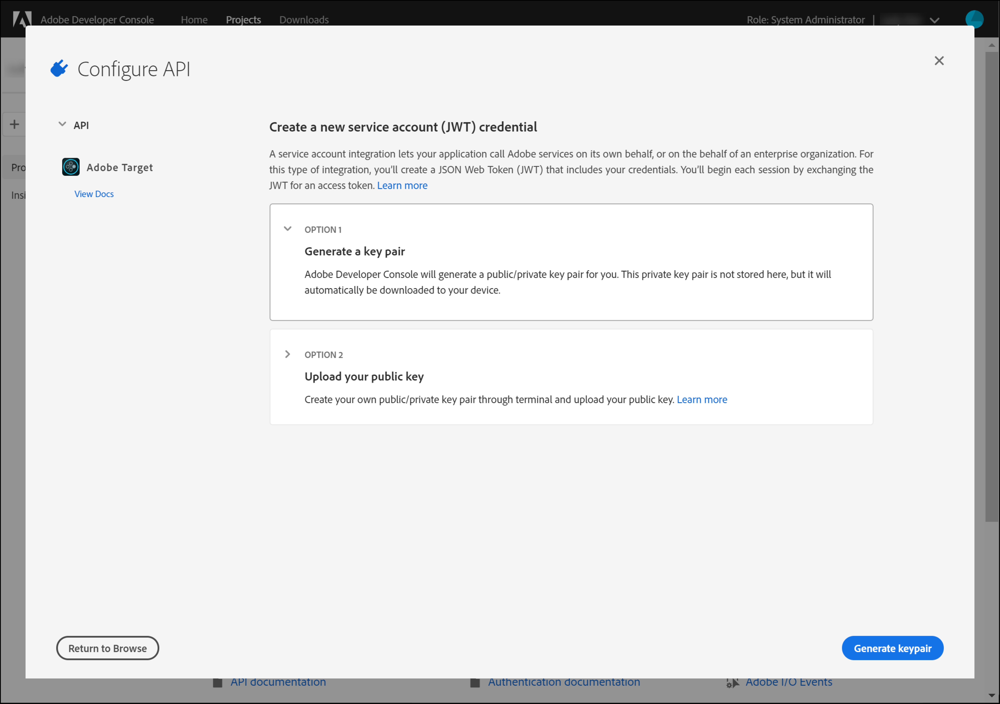

1. Conforme instruído, anote o arquivo de configuração baixado automaticamente (`config`), que contém sua chave privada. Clique em **[!UICONTROL Avançar]**.

   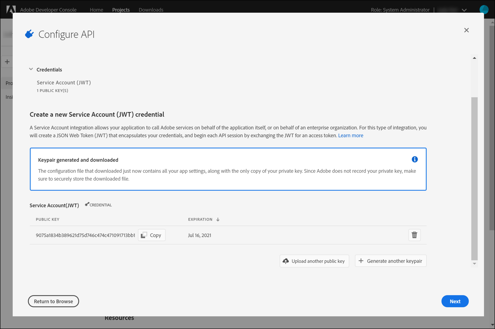

1. Em seu sistema de arquivos, verifique o local de `config`, que é o arquivo de configuração compactado criado na etapa anterior. Novamente, esse arquivo `config` contém sua chave privada, que será necessária posteriormente. O local exato em seu sistema de arquivos pode ser diferente do mostrado aqui.

   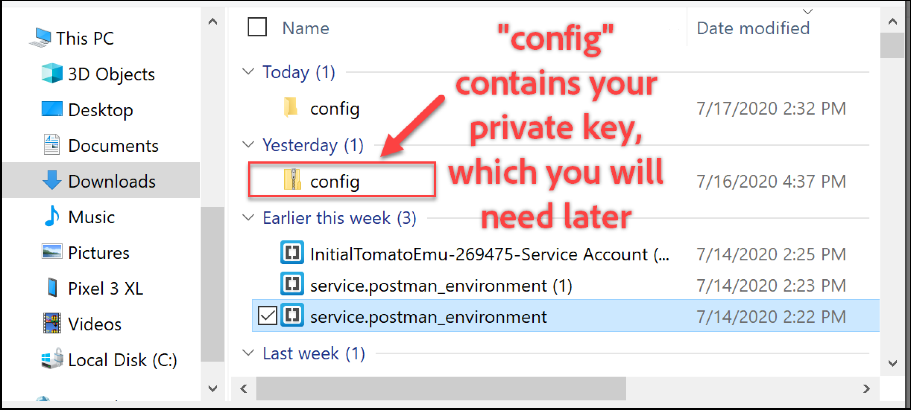

1. De volta à Adobe Developer Console, selecione o(s) [perfil(is) de produto](https://helpx.adobe.com/pt/enterprise/using/manage-products-and-profiles.html) correspondente(s) às propriedades nas quais você está usando o Adobe Recommendations. (Se você não estiver usando propriedades do, selecione a opção Workspace padrão.) Clique em **[!UICONTROL Salvar API configurada]**.

   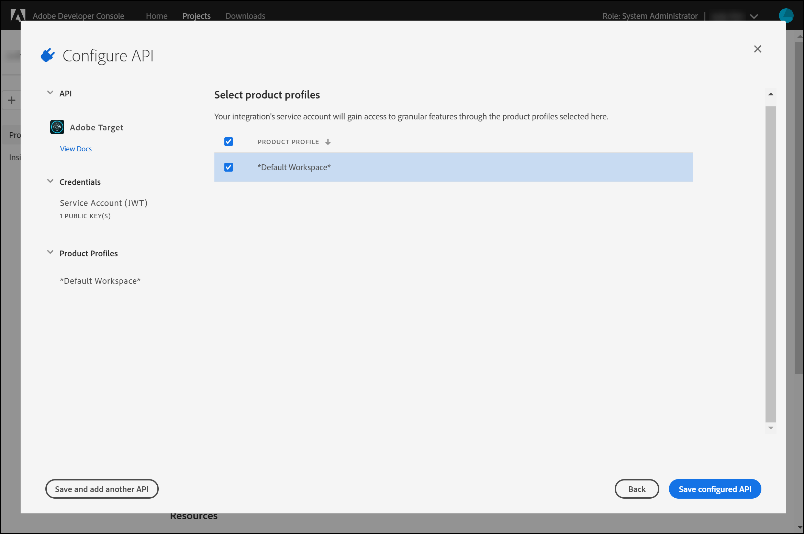

1. Clique em **[!UICONTROL Criar Integração]**. Você deve receber uma mensagem temporária indicando que sua API foi configurada com êxito.
1. Como etapa final, renomeie seu projeto com um nome mais significativo que o `Project 1` original. Para fazer isso, navegue até o projeto usando o caminho de navegação como mostrar, clique em **[!UICONTROL Editar projeto]** para acessar o modal **[!UICONTROL Editar projeto]** e renomear o projeto.

   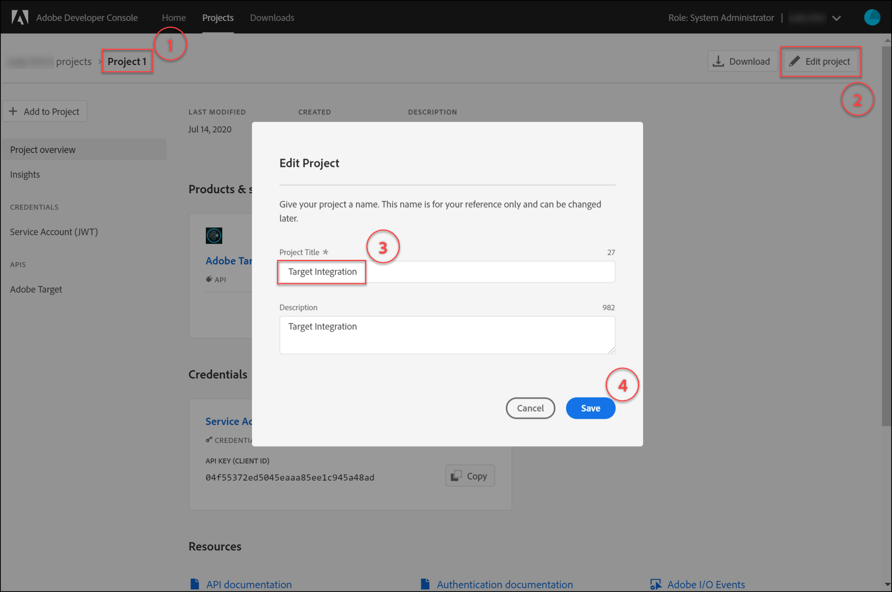

>[!NOTE]
>
>Neste exemplo, nomeamos nosso projeto como Integração &quot;[!DNL Target]&quot;. Se você prevê usar seu projeto para mais do que apenas [!DNL Adobe Target], talvez queira nomeá-lo adequadamente. Por exemplo, você pode optar por nomeá-lo como &quot;APIs do Adobe&quot; ou &quot;APIs da Experience Cloud&quot;, já que ele pode ser usado com outras soluções na Adobe Experience Cloud.

## Exportar detalhes do projeto

Agora que você tem um projeto do Adobe que pode ser usado para acessar o [!DNL Target], certifique-se de enviar os detalhes desse projeto junto com as solicitações de API do Adobe. Esses detalhes são necessários para interagir com várias APIs do Adobe, incluindo várias APIs do [!DNL Target]. Por exemplo, os detalhes da integração incluem informações de autorização e autenticação exigidas pelas [!DNL Target] APIs de administrador. Portanto, para usar as APIs com o Postman, é necessário obter esses detalhes no Postman.

Há várias maneiras de especificar os detalhes do seu projeto no Postman, mas nesta seção, aproveitamos alguns recursos e coleções pré-criados. Primeiro (nesta seção), você exportará os detalhes da sua integração em um ambiente do Postman. Em seguida (na seção a seguir), você gerará um token de acesso do portador para conceder acesso aos recursos necessários do Adobe.

>[!NOTE]
>
>Para obter instruções em vídeo aplicáveis a qualquer solução da Experience Cloud, incluindo o [!DNL Target], consulte [Usar o Postman com APIs do Experience Platform](https://experienceleague.adobe.com/docs/platform-learn/tutorials/platform-api-authentication.html). As seguintes seções são relevantes para as APIs do [!DNL Target]: 1. Criar e exportar a API do Experience Platform para o Postman 2. Gerar um token de acesso com o Postman. Essas etapas também são fornecidas abaixo.

1. Ainda no [Adobe Developer Console](https://developer.adobe.com/console/home), navegue para exibir as credenciais da **[!UICONTROL Conta de Serviço (JWT)]** do seu novo projeto. Use a navegação à esquerda ou a seção **[!UICONTROL Credenciais]**, conforme mostrado.

   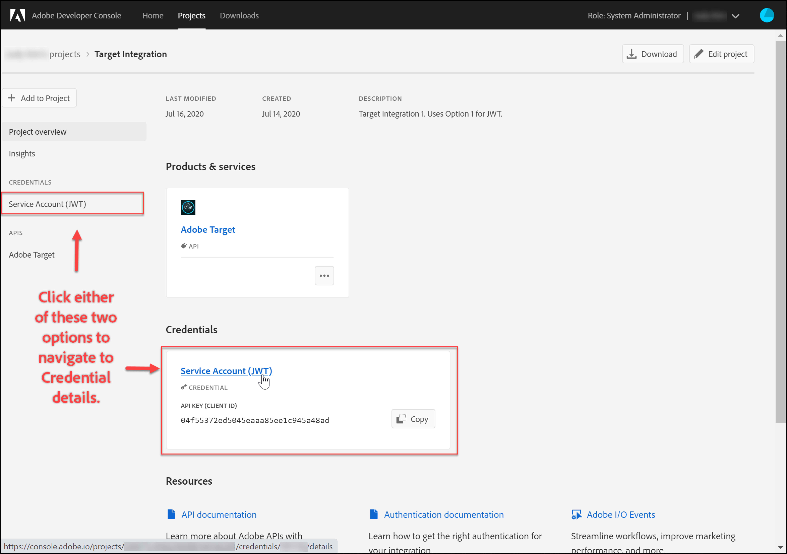

   Em **[!UICONTROL Detalhes da credencial]**, observe que você pode exibir sua(s) **[!UICONTROL Chave(s) pública(s)]**, **[!UICONTROL ID do Cliente]** e outras informações relacionadas à sua conta de serviço.

   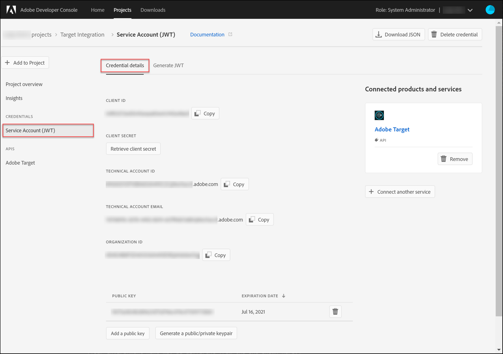

1. Clique para acessar as informações sobre a API **[!DNL Adobe Target]**. Use a navegação à esquerda ou a seção **Produtos e serviços conectados** como mostrado.

   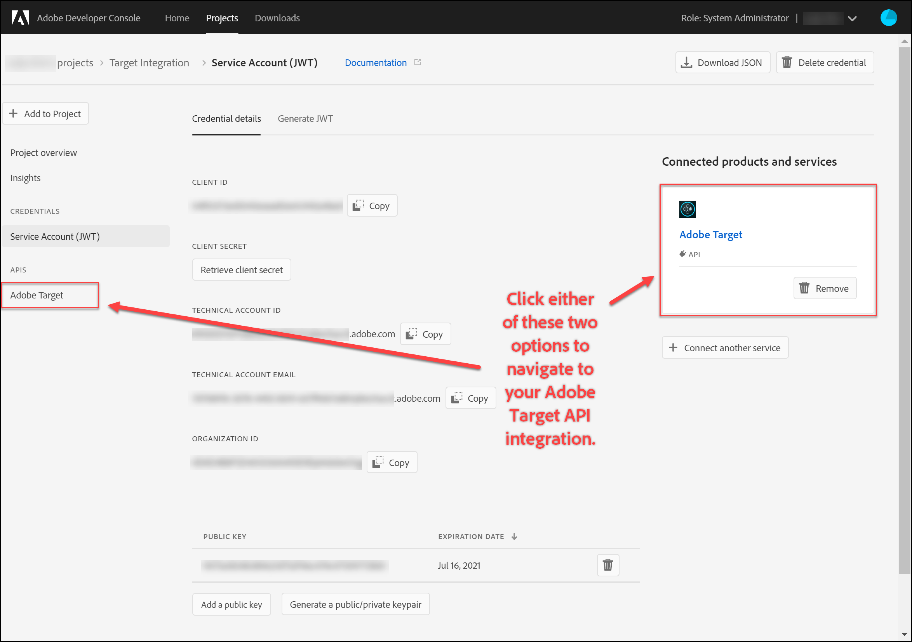

1. Clique em **[!UICONTROL Baixar para Postman]** > **[!UICONTROL Conta de Serviço (JWT)]** para criar um arquivo JSON que capture suas informações de autenticação para um ambiente do Postman.

   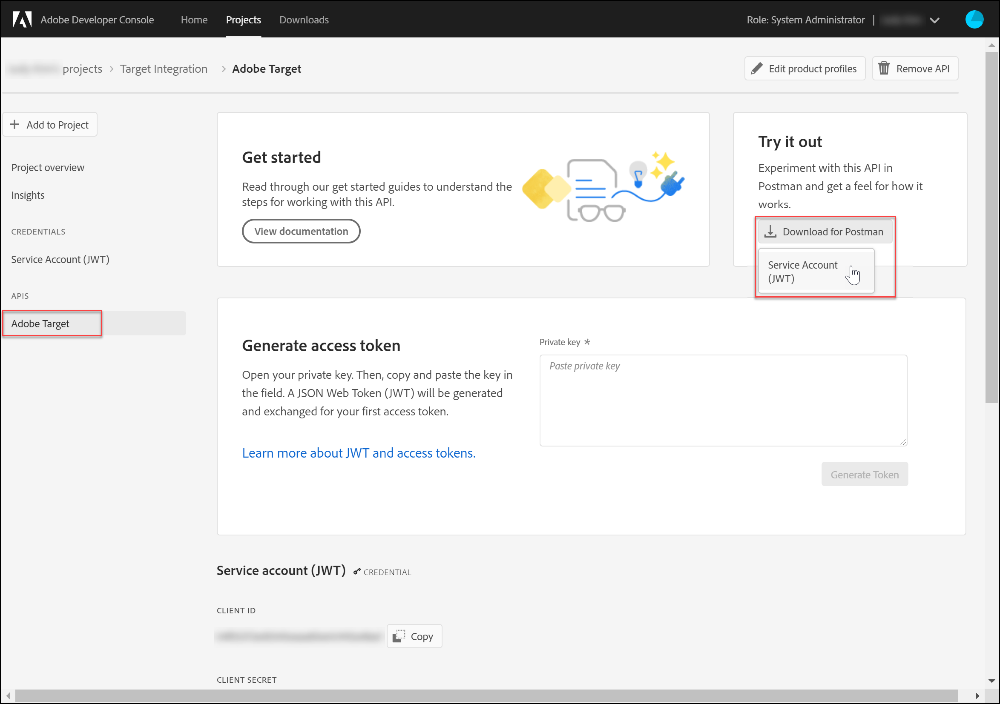

   Observe o arquivo JSON no seu sistema de arquivos.

   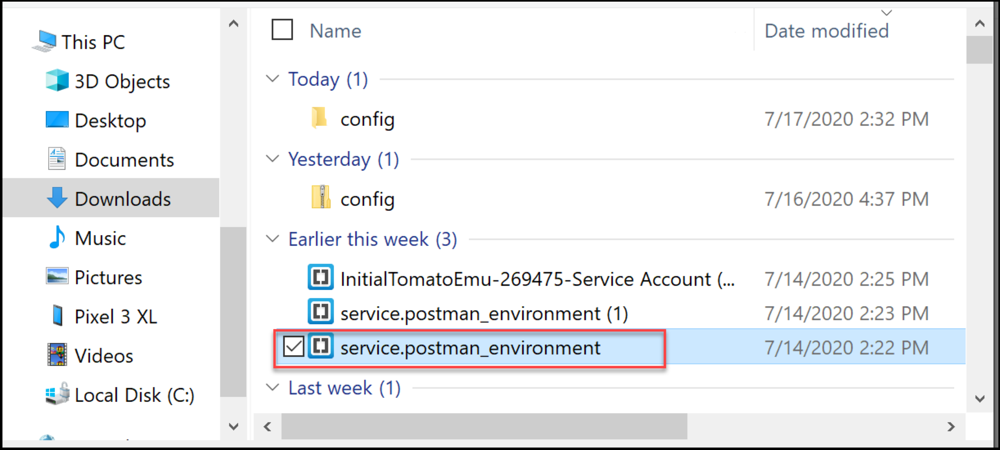

1. No Postman, clique no ícone de engrenagem para gerenciar seus ambientes, em seguida, clique em **[!UICONTROL Importar]** para importar o arquivo JSON (ambiente).

   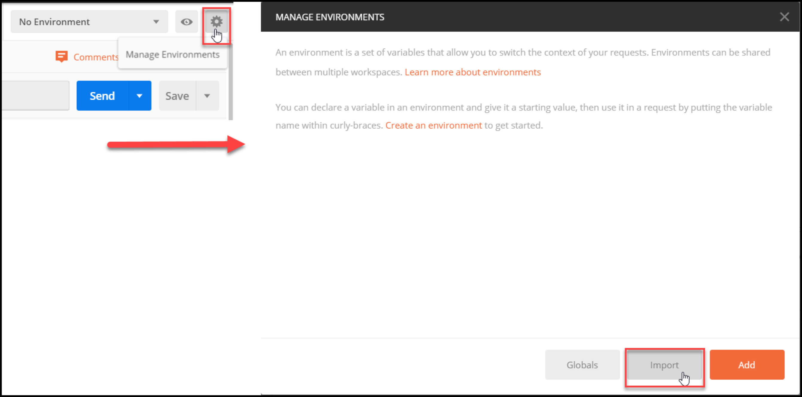

1. Escolha seu arquivo e clique em **[!UICONTROL Abrir]**.

   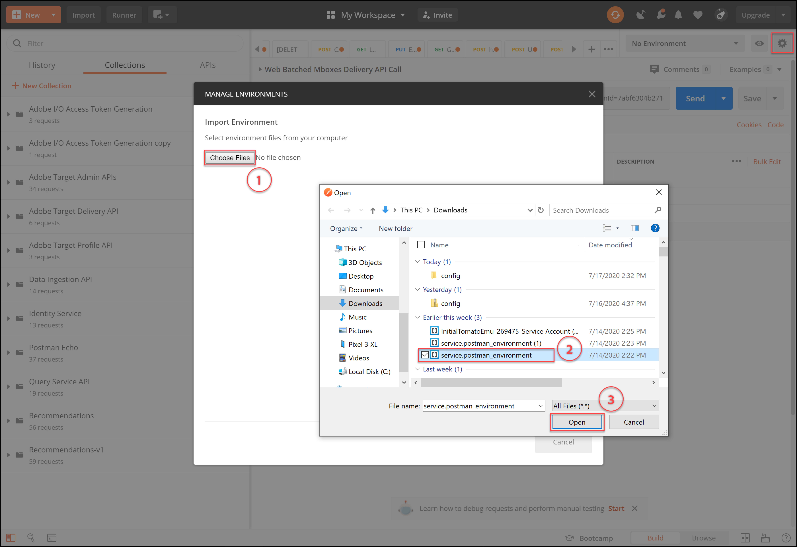

1. No modal **Gerenciar ambientes** do Postman, clique no nome do ambiente recém-importado para inspecioná-lo. (O nome do ambiente pode ser diferente do mostrado aqui. Edite o nome conforme desejado. Ele não precisa necessariamente corresponder ao nome do projeto [!DNL Adobe].)

   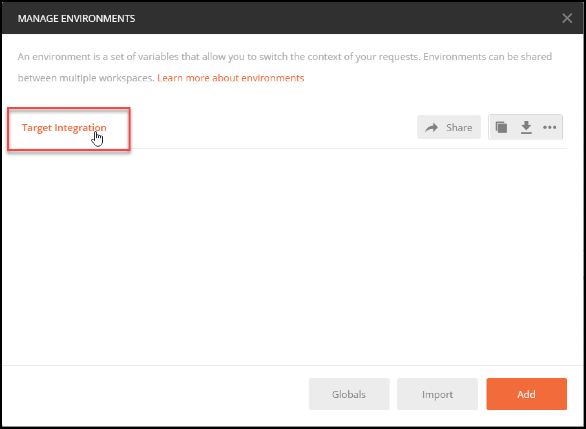

1. Os valores de `CLIENT_SECRET` e `API_KEY` (juntamente com outras variáveis) foram preenchidos previamente a partir da sua integração, conforme definido na Adobe Developer Console. (A variável `CLIENT_SECRET` do Postman deve corresponder à credencial do Adobe `CLIENT SECRET` conforme exibida no Developer Console, e `API_KEY` no Postman também deve corresponder a `CLIENT ID` no Developer Console.) Por outro lado, a observação `PRIVATE_KEY`, `JWT_TOKEN` e `ACCESS_TOKEN` estão em branco. Vamos começar fornecendo o valor `PRIVATE_KEY`.

   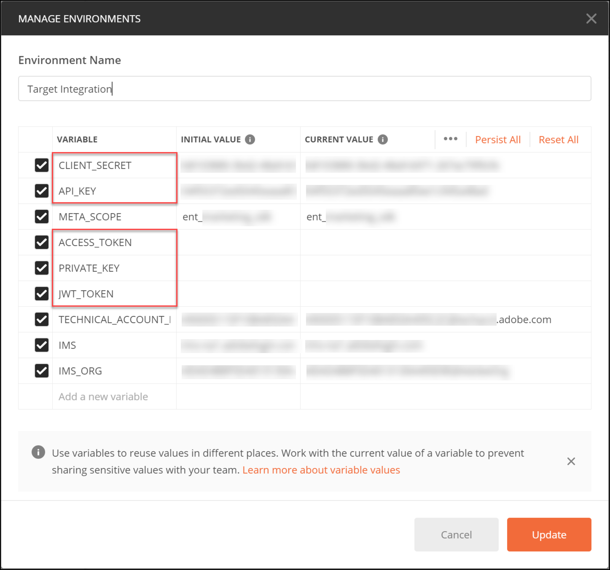

1. Em seu sistema de arquivos, abra o arquivo `config` e abra o arquivo de chave `private`.

   

1. Selecione e copie todo o conteúdo do arquivo de chave `private`.

   

1. No Postman, cole seu valor de chave privada nos campos **[!UICONTROL VALOR INICIAL]** e **[!UICONTROL VALOR ATUAL]**.

   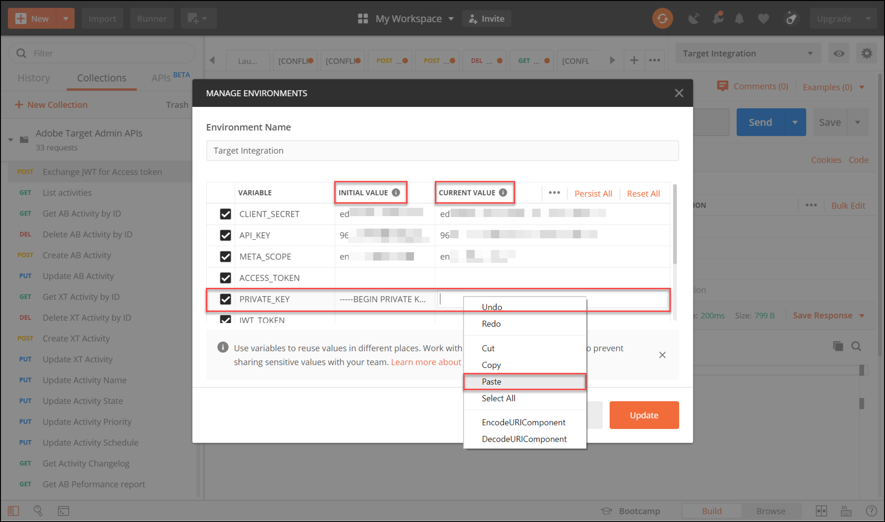

1. Clique em **[!UICONTROL Atualizar]** e feche o modal Ambientes.

## Gerar o token de acesso do portador

Nesta seção, você gera o token de acesso do portador, que é necessário para autenticar sua interação com APIs [!DNL Adobe Target]. Para gerar o token de acesso do portador, é necessário enviar os detalhes da integração (estabelecidos nas seções anteriores) ao [Adobe Identity Management Service (IMS)](https://www.adobe.io/authentication/auth-methods.html#!AdobeDocs/adobeio-auth/master/AuthenticationOverview/AuthenticationGuide.md). Há algumas maneiras diferentes de fazer isso, mas neste guia aproveitamos uma coleção do Postman que contém uma chamada IMS pré-criada que torna o processo direto e fácil. Depois de importar a coleção, você pode reutilizá-la sempre que necessário, para gerar novos tokens não apenas para [!DNL Adobe Target], mas também para outras APIs do Adobe.

1. Navegue até as [chamadas de exemplo da API do Adobe Identity Management Service](https://github.com/adobe/experience-platform-postman-samples/tree/master/apis/ims).

   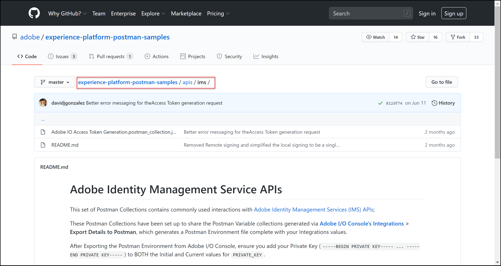

1. Clique na **[!UICONTROL coleção Postman de Geração de Token de Acesso do Adobe I/O]**.

   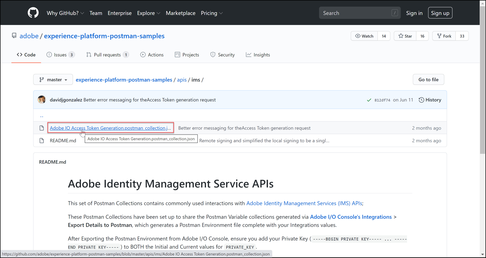

1. Obtenha o JSON bruto para esta coleção clicando em **[!UICONTROL Raw]** e copiando o JSON resultante para a área de transferência. (Como alternativa, você pode salvar o JSON bruto como um arquivo .json.)

   

1. No Postman, importe a coleção colando e enviando o JSON bruto da área de transferência. (Como alternativa, você pode fazer upload do arquivo .json salvo.) Clique em **[!UICONTROL Continuar]**.

   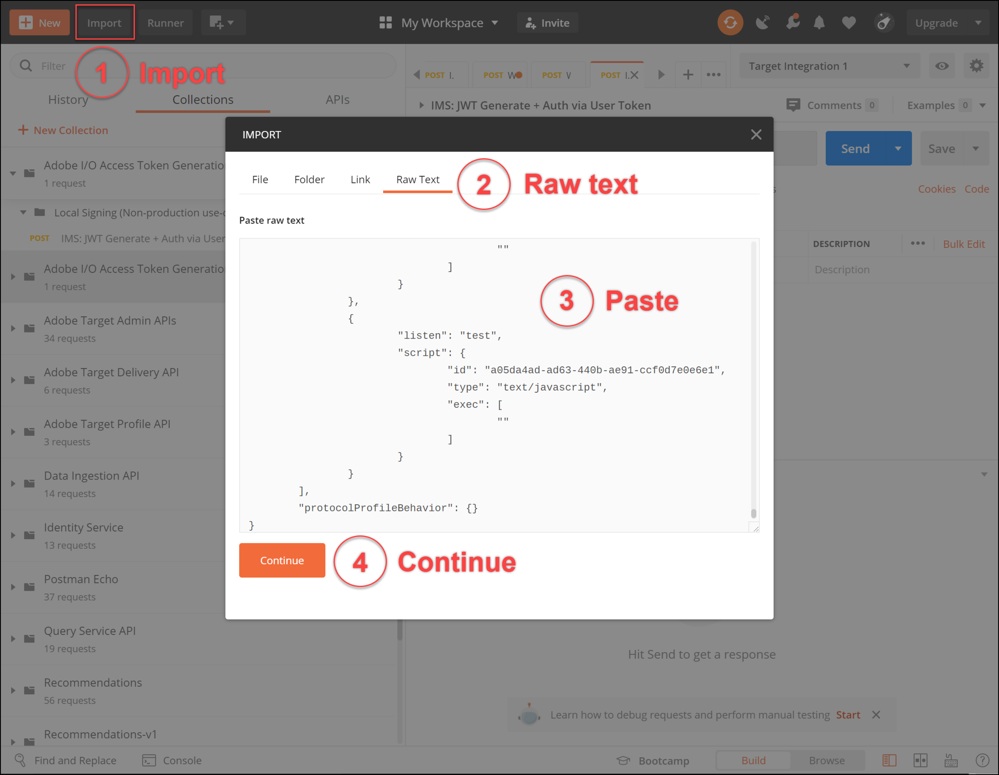

1. Selecione a solicitação **[!UICONTROL IMS: JWT Generate + Auth via User Token]** na coleção Adobe I/O Access Token Generation Postman, verifique se o seu ambiente está selecionado e clique em **[!UICONTROL Enviar]** para gerar o token.

   

   >[!NOTE]
   >
   >Esse token de acesso do portador será válido por 24 horas. Envie a solicitação novamente sempre que precisar gerar um novo token.

1. Abra o modal Gerenciar ambientes novamente e selecione seu ambiente.

   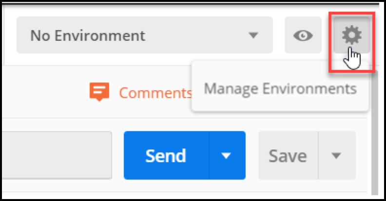

1. Observe que os valores `ACCESS_TOKEN` e `JWT_TOKEN` agora estão preenchidos.

   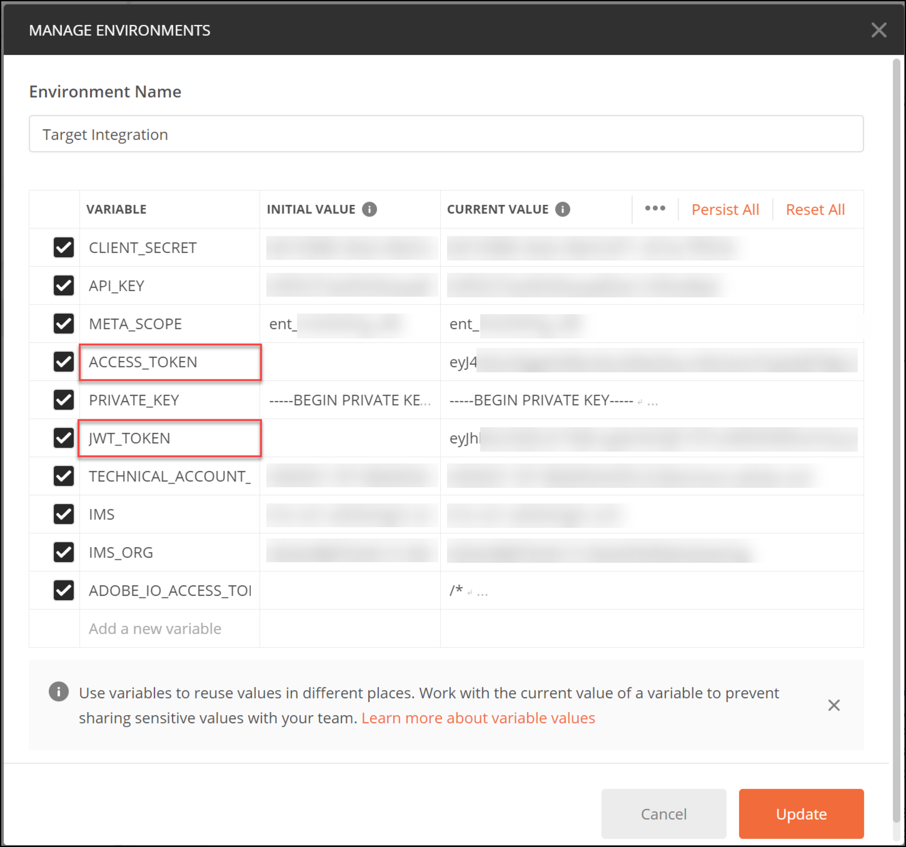

Pergunta: Preciso usar a coleção Adobe I/O Access Token Generation Postman para gerar o JSON Web Token (JWT) e o token de acesso do portador?

Resposta: Não. A coleção Postman de Geração de token de acesso do Adobe I/O está disponível como uma conveniência para gerar mais facilmente o JWT e o token de acesso do portador no Postman. Como alternativa, você pode usar os recursos no Adobe Developer Console para gerar manualmente o token de acesso do portador.

## Testar o token de acesso do portador

Neste exercício, você usará seu novo token de acesso de portador enviando uma solicitação de API que recupera uma lista de atividades da conta [!DNL Target]. Uma resposta bem-sucedida indica que o projeto [!DNL Adobe] e a autenticação estão funcionando como esperado para usar a API.

1. Importe a [[!DNL Adobe Target] Coleção de Postman de APIs de administrador](https://developers.adobetarget.com/api/#admin-postman-collection). Siga todos os prompts até que a coleção seja importada no Postman.

   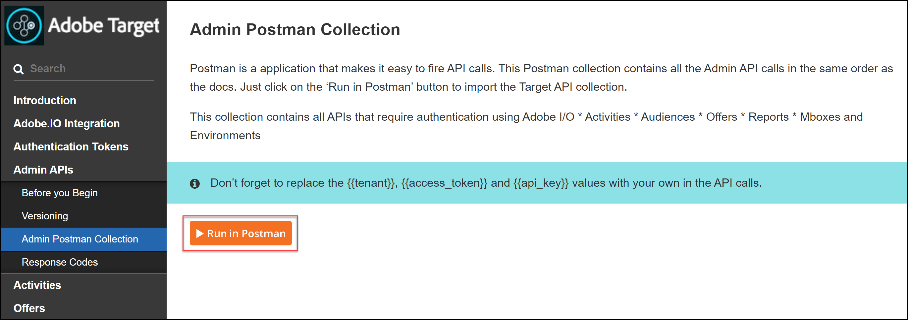

1. Expanda a coleção e observe a solicitação **[!UICONTROL Listar atividades]**.

   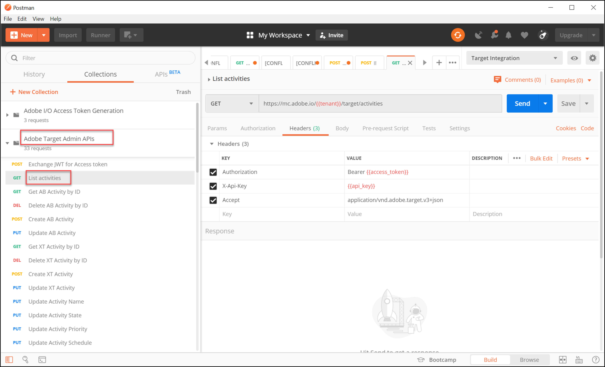

1. Observe que variáveis como `{{access_token}}` não são resolvidas inicialmente. Você poderia resolver isso de várias maneiras diferentes, por exemplo, você poderia definir uma nova variável de coleção chamada `{{access_token}}`, mas neste guia, você alterará a solicitação da API para aproveitar o ambiente do Postman que estava usando anteriormente. Isso permitirá que o ambiente continue a servir como uma consolidação única e consistente de todas as variáveis comuns nas APIs do Adobe.

   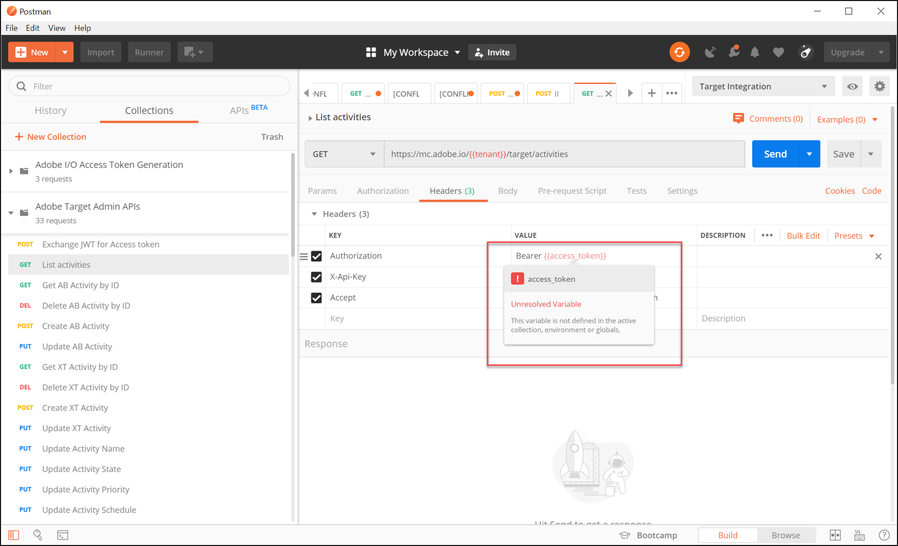

1. Digite para substituir `{{access_token}}` por `{{ACCESS_TOKEN}}`.

   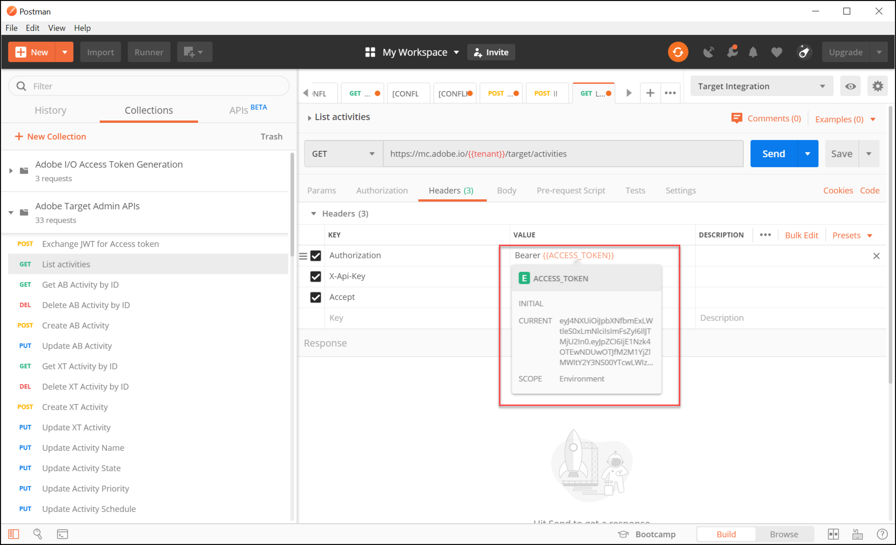

1. Digite para substituir `{{api_key}}` por `{{API_KEY}}`.

   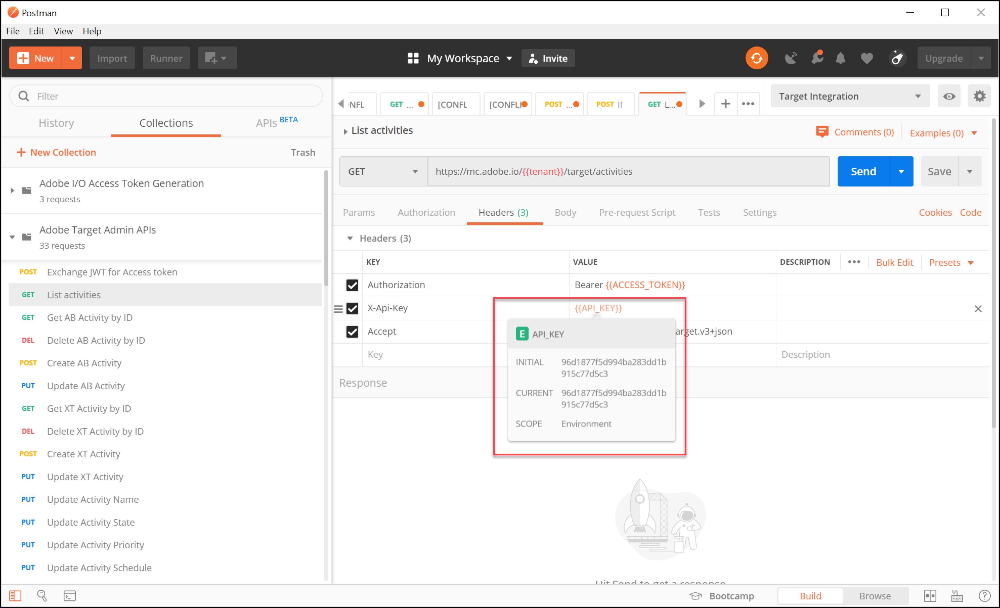

1. Digite para substituir `{{tenant}}` por `{{TENANT_ID}}`. A nota `{{TENANT_ID}}` ainda não foi reconhecida.

   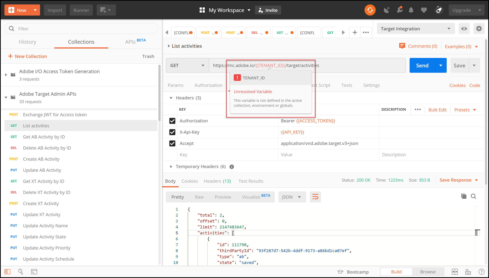

1. Abra o modal Gerenciar ambientes e selecione seu ambiente.

   

1. Digite para adicionar uma nova variável de ambiente `{{TENANT_ID}}`. Copie e cole seu valor de ID de locatário nos campos **[!UICONTROL VALOR INICIAL]** e **[!UICONTROL VALOR ATUAL]** para sua nova variável de ambiente `TENANT_ID`.

   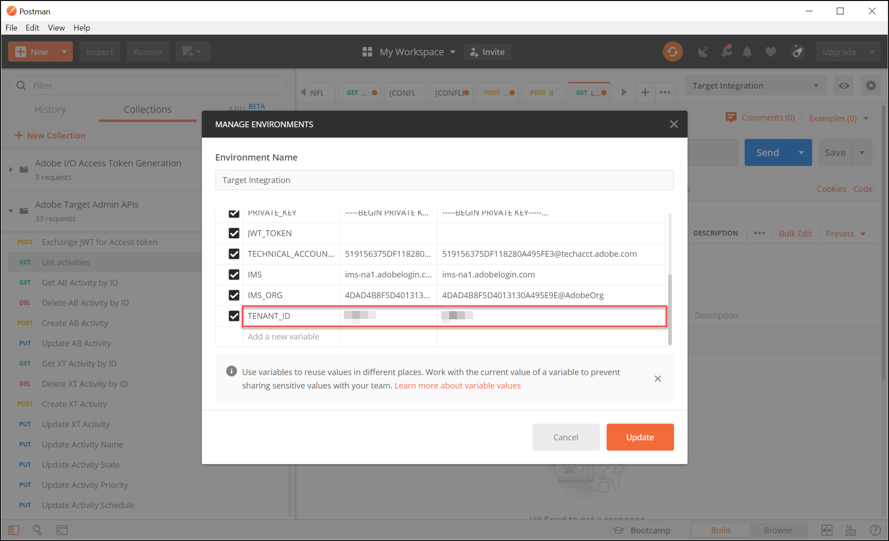

   >[!NOTE]
   >
   >A ID do Locatário é diferente de seu [!DNL Target] `clientcode`. A ID do Locatário existe na URL quando você está conectado a [!DNL Target]. Para obter sua ID de locatário, faça logon na Adobe Experience Cloud, abra o [!DNL Target] e clique no cartão do Target. Use o valor da ID do locatário conforme observado no subdomínio do URL. Por exemplo, se a URL ao fazer logon no [!DNL Adobe Target] for `<https://mycompany.experiencecloud.adobe.com/...>`, sua ID de Locatário será &quot;mycompany&quot;.

1. Envie sua solicitação depois de verificar se você selecionou o ambiente correto. Você deve receber uma resposta contendo sua lista de atividades.

   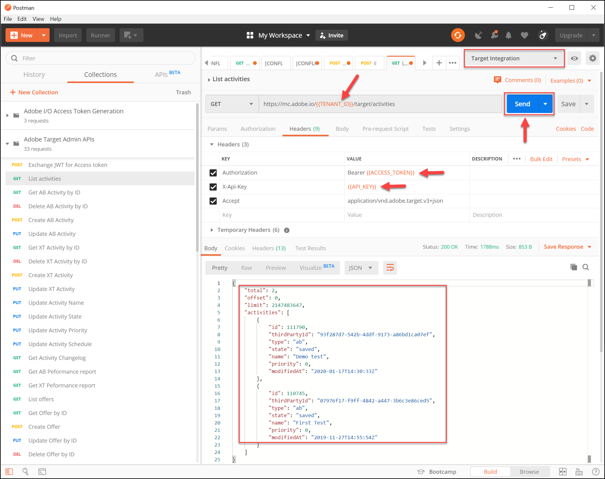

Agora que verificou a autenticação do Adobe, você pode usá-la para interagir com as APIs do [!DNL Adobe Target] (bem como com outras APIs da Adobe). Por exemplo, você pode [Usar APIs do Recommendations](recs-api/overview.md) para criar ou gerenciar recomendações, ou pode usá-las com a [API de Entrega do Target](/help/dev/implement/delivery-api/overview.md).
