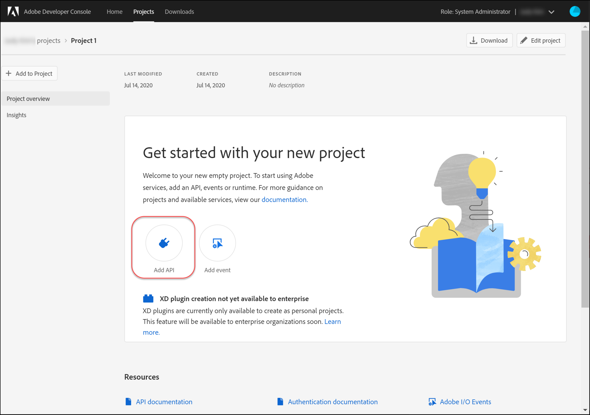
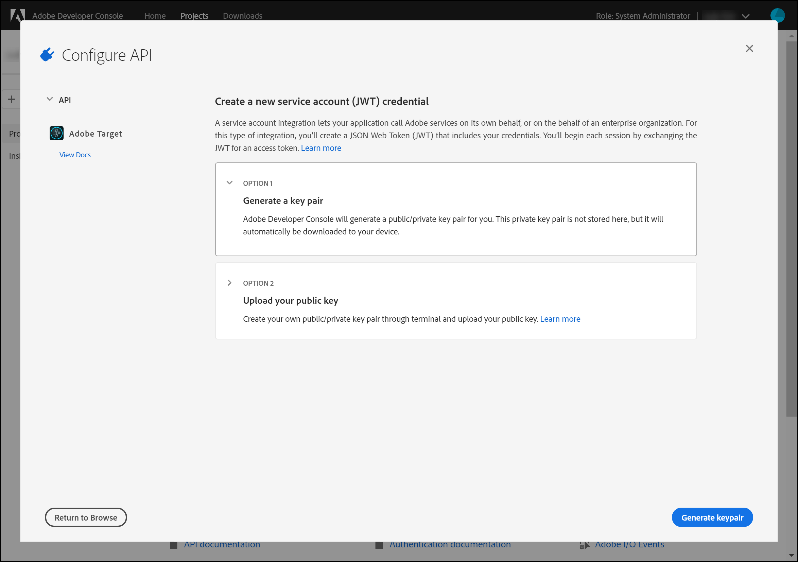
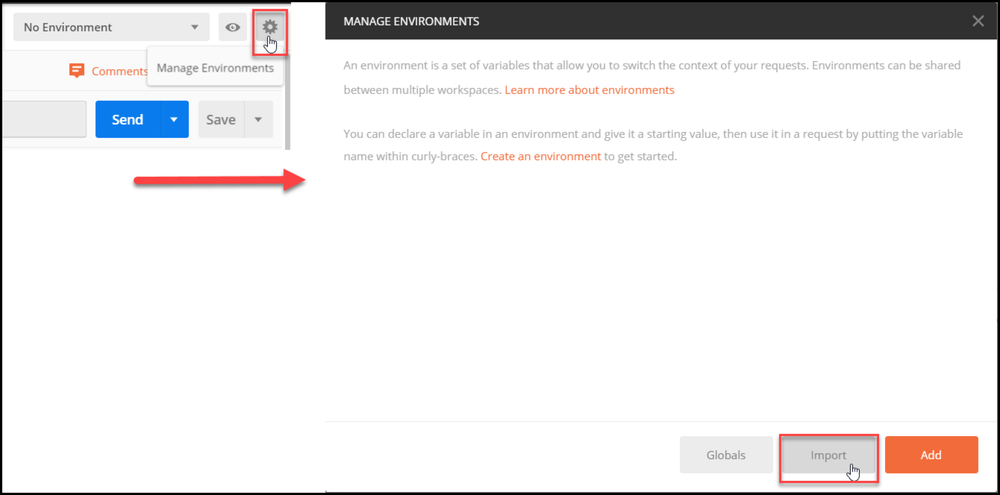

# Configurar autenticação para [!DNL Adobe Target] APIs

A variável [!DNL Adobe Target] APIs de administrador, incluindo [!DNL Recommendations Admin] As APIs são protegidas por autenticação para garantir que somente usuários autorizados as usem para acessar o [!DNL Adobe Target]. Use o [Console do Adobe Developer](https://developer.adobe.com/console/home) para gerenciar esta autenticação para todos [!DNL Adobe Experience Cloud solutions], incluindo [!DNL Adobe Target].

>[!IMPORTANT]
>
>As credenciais da Conta de serviço (JWT) descritas neste artigo serão substituídas em favor das novas credenciais de servidor para servidor do OAuth.
>
>As credenciais da Conta de serviço (JWT) continuarão a funcionar até 1º de janeiro de 2025. Você deve migrar seu aplicativo ou integração para usar a nova credencial OAuth de servidor para servidor antes de 1º de janeiro de 2025.
>
>Para obter mais informações e instruções passo a passo para migrar sua integração, consulte [Migração da credencial de conta de serviço (JWT) para a credencial de servidor para servidor do OAuth](https://developer.adobe.com/developer-console/docs/guides/authentication/ServerToServerAuthentication/migration/){target=_blank} no *Console do desenvolvedor* documentação.
>
>Para obter informações sobre como configurar novas credenciais do OAuth, consulte [Implementação de credencial de servidor para servidor OAuth](https://developer.adobe.com/developer-console/docs/guides/authentication/ServerToServerAuthentication/implementation/){target=_blank} no *Console do desenvolvedor* documentação.

Estas são as etapas preliminares necessárias para gerar os tokens de autenticação JWT herdados necessários para interagir com êxito com o [!DNL Adobe Target] APIs:

1. Crie um projeto (anteriormente chamado de integração) no [!DNL Adobe Developer Console].
1. Exportar detalhes do projeto para o Postman.
1. Gerar um token de acesso do portador.
1. Teste o token de acesso do portador.

## Pré-requisitos

| Recurso | Detalhes |
| --- | --- |
| Postman | Para concluir essas etapas com êxito, obtenha o [aplicativo Postman](https://www.postman.com/downloads/) para o seu sistema operacional. O Postman Basic é gratuito com a criação da conta. Embora não seja necessário para usar o [!DNL Adobe Target] APIs em geral, o Postman facilita os fluxos de trabalho de API e [!DNL Adobe Target] O fornece várias coleções do Postman para ajudar a executar suas APIs e saber como elas operam. O restante deste guia pressupõe conhecimento prático do Postman. Para obter ajuda, consulte [Documentação do Postman](https://learning.getpostman.com/). |
| Referências | Familiaridade com os seguintes recursos é presumida no restante deste guia:<ul><li>[Adobe I/O Github](https://github.com/adobeio)</li><li>[Documentação da API de administrador e perfil do Target](../administer/admin-api/admin-api-overview-new.md)</li><li>[Documentação da API do Recommendations](https://developer.adobe.com/target/administer/recommendations-api/)</li></ul> |

## Criar um projeto Adobe I/O

Nesta seção, você acessará o [!DNL Adobe Developer Console] e criar um projeto para [!DNL Adobe Target]. Para obter mais informações, consulte a [documentação sobre projetos](https://developer.adobe.com/developer-console/docs/guides/projects/).

&lt;!---(1. Gerar sua chave privada e certificado público, de acordo com [documentação sobre autenticação](https://developer.adobe.com/developer-console/docs/guides/authentication/). // [//]: # (conforme descrito em **Etapa 1** de [Como configurar o Adobe IO: Autenticação - passo a passo](https://helpx.adobe.com/marketing-cloud-core/kb/adobe-io-authentication-step-by-step.html). Depois de concluir a Etapa 1, retorne a este guia e retome com a Etapa 2 abaixo. // O resultado desta etapa deve ser a criação de um `private.key` arquivo e um `certificate_pub.crt` arquivo. Retorne a este guia após gerar os dois arquivos.)—>

1. No [Adobe Admin Console](https://adminconsole.adobe.com/), garanta o seu [!DNL Adobe] a conta do usuário foi concedida [Administrador do produto](https://helpx.adobe.com/enterprise/using/admin-roles.html) e [Desenvolvedor](https://helpx.adobe.com/enterprise/using/manage-developers.html) nível de acesso a [!DNL Target].

1. No [Console do Adobe Developer](https://developer.adobe.com/console/home), selecione o [!UICONTROL Organização do Experience Cloud] para o qual você deseja criar essa integração. (Observe que é provável que você só tenha acesso a um único [!UICONTROL Organização do Experience Cloud].)

   

1. Clique em **[!UICONTROL Criar novo projeto]**.

   

1. Clique em **[!UICONTROL Adicionar API]** para adicionar uma REST API ao seu projeto para acessar [!DNL Adobe] serviços e produtos.

   

1. Selecionar **[!DNL Adobe Target]** como o [!DNL Adobe] com o qual você deseja integrar. Clique em **[!UICONTROL Próxima]** que aparece.

   

1. Selecione uma opção para associar chaves públicas e privadas à integração de conta de serviço para a qual você está criando [!DNL Target]. Para este exemplo, selecione **[!UICONTROL Opção 1: gerar um par de chaves]** e clique em **[!UICONTROL Gerar par de chaves]**.

   

1. Conforme instruído, anote o arquivo de configuração baixado automaticamente (`config`), que contém sua chave privada. Clique em **[!UICONTROL Avançar]**.

   

1. Em seu sistema de arquivos, verifique o local de `config`, que é o arquivo de configuração compactado criado na etapa anterior. Novamente, isso `config` O arquivo contém sua chave privada, que será necessária posteriormente. O local exato em seu sistema de arquivos pode ser diferente do mostrado aqui.

   

1. De volta ao Console do Adobe Developer, selecione a [perfil(is) de produto](https://helpx.adobe.com/pt/enterprise/using/manage-products-and-profiles.html) correspondente às propriedades nas quais você está usando o Adobe Recommendations. (Se não estiver usando propriedades, selecione a opção Espaço de trabalho padrão.) Clique em **[!UICONTROL Salvar API configurada]**.

   

1. Clique em **[!UICONTROL Criar integração]**. Você deve receber uma mensagem temporária indicando que sua API foi configurada com êxito.
1. Como etapa final, renomeie seu projeto com um nome mais significativo do que o original `Project 1`. Para fazer isso, navegue até o projeto usando o caminho de navegação como mostrar, clique em **[!UICONTROL Editar projeto]** para acessar o **[!UICONTROL Editar Projeto]** e renomeie o projeto.

   

>[!NOTE]
>
>Neste exemplo, nomeamos nosso projeto como &quot;[!DNL Target] Integração.&quot; Se você prevê usar seu projeto para mais do que apenas [!DNL Adobe Target], convém nomeá-lo de acordo. Por exemplo, você pode optar por nomeá-lo como &quot;APIs de Adobe&quot; ou &quot;APIs de Experience Cloud&quot;, pois ele pode ser usado com outras soluções na Adobe Experience Cloud.

## Exportar detalhes do projeto

Agora que você tem um projeto Adobe, pode usar para acessar o [!DNL Target], você precisa enviar os detalhes desse projeto junto com as solicitações da API Adobe. Esses detalhes são necessários para interagir com várias APIs de Adobe, incluindo várias [!DNL Target] APIs. Por exemplo, os detalhes da integração incluem informações de autorização e autenticação exigidas pelo [!DNL Target] APIs de administrador. Portanto, para usar as APIs com o Postman, é necessário obter esses detalhes no Postman.

Há várias maneiras de especificar os detalhes do seu projeto no Postman, mas nesta seção, aproveitamos alguns recursos e coleções pré-criados. Primeiro (nesta seção), você exportará os detalhes da sua integração em um ambiente do Postman. Em seguida (na seção a seguir), você gerará um token de acesso do portador para conceder acesso aos recursos de Adobe necessários.

>[!NOTE]
>
>Para obter instruções de vídeo aplicáveis a qualquer solução de Experience Cloud, incluindo [!DNL Target], consulte [Uso do Postman com APIs Experience Platform](https://experienceleague.adobe.com/docs/platform-learn/tutorials/platform-api-authentication.html). As seguintes seções são relevantes para o [!DNL Target] APIs: 1. Crie e exporte a API de Experience Platform para o Postman 2. Gerar um token de acesso com o Postman. Essas etapas também são fornecidas abaixo.

1. Ainda no [Console do Adobe Developer](https://developer.adobe.com/console/home), navegue para visualizar as configurações do novo **[!UICONTROL Conta de serviço (JWT)]** credenciais. Use a navegação à esquerda ou a **[!UICONTROL Credenciais]** conforme mostrado.

   

   Entrada **[!UICONTROL Detalhes da credencial]**, observe que você pode visualizar suas **[!UICONTROL Chave(s) pública(s)]**, **[!UICONTROL ID do cliente]** e outras informações relacionadas à sua conta de serviço.

   

1. Clique para acessar as informações sobre o **[!DNL Adobe Target]** API. Use a navegação à esquerda ou a **Produtos e serviços conectados** conforme mostrado.

   

1. Clique em **[!UICONTROL Baixar para Postman]** > **[!UICONTROL Conta de serviço (JWT)]** para criar um arquivo JSON capturando suas informações de autenticação para um ambiente Postman.

   

   Observe o arquivo JSON no seu sistema de arquivos.

   

1. No Postman, clique no ícone de engrenagem para gerenciar os ambientes e clique em **[!UICONTROL Importar]** para importar o arquivo JSON (ambiente).

   

1. Escolha o arquivo e clique em **[!UICONTROL Abertura]**.

   

1. No Postman **Gerenciar ambientes** , clique no nome do ambiente recém-importado para inspecioná-lo. (O nome do ambiente pode ser diferente do mostrado aqui. Edite o nome conforme desejado. Não é necessário necessariamente corresponder ao nome do [!DNL Adobe] projeto.)

   

1. Nota `CLIENT_SECRET` e `API_KEY` (juntamente com outras variáveis) têm seus valores pré-preenchidos, obtidos da sua integração, conforme definido no Console do Adobe Developer. (O Postman `CLIENT_SECRET` deve corresponder ao `CLIENT SECRET` a credencial do Adobe conforme exibida no Console do desenvolvedor e `API_KEY` no Postman também devem corresponder `CLIENT ID` no Console do desenvolvedor.) Em contrapartida, `PRIVATE_KEY`, `JWT_TOKEN`, e `ACCESS_TOKEN` estão em branco. Vamos começar fornecendo o `PRIVATE_KEY` valor.

   

1. No sistema de arquivos, abra `config` e abra o `private` arquivo de chave.

   

1. Selecione e copie todo o conteúdo do `private` arquivo de chave.

   

1. No Postman, cole seu valor de chave privada no **[!UICONTROL VALOR INICIAL]** e **[!UICONTROL VALOR ATUAL]** campos.

   

1. Clique em **[!UICONTROL Atualizar]** e feche o modal Ambientes.

## Gerar o token de acesso do portador

Nesta seção, você gera o token de acesso do portador, que é necessário para autenticar sua interação com o [!DNL Adobe Target] APIs. Para gerar o token de acesso do portador, é necessário enviar os detalhes de integração (estabelecidos nas seções anteriores) para o [Adobe Identity Management Service (IMS)](https://www.adobe.io/authentication/auth-methods.html#!AdobeDocs/adobeio-auth/master/AuthenticationOverview/AuthenticationGuide.md). Há algumas maneiras diferentes de fazer isso, mas neste guia aproveitamos uma coleção do Postman que contém uma chamada IMS pré-criada que torna o processo direto e fácil. Depois de importar a coleção, você pode reutilizá-la sempre que necessário para gerar novos tokens não apenas para [!DNL Adobe Target], mas também outras APIs de Adobe.

1. Navegue até a [Chamadas de amostra da API de serviço do Identity Management do Adobe](https://github.com/adobe/experience-platform-postman-samples/tree/master/apis/ims).

   

1. Clique em **[!UICONTROL Coleção Adobe I/O Access Token Generation Postman]**.

   

1. Obtenha o JSON bruto para esta coleção clicando em **[!UICONTROL Brutos]**, copiando o JSON resultante para a área de transferência. (Como alternativa, você pode salvar o JSON bruto como um arquivo .json.)

   

1. No Postman, importe a coleção colando e enviando o JSON bruto da área de transferência. (Como alternativa, você pode fazer upload do arquivo .json salvo.) Clique em **[!UICONTROL Continuar]**.

   

1. Selecione o **[!UICONTROL IMS: Geração JWT + autenticação via token de usuário]** na coleção Adobe I/O Access Token Generation Postman, certifique-se de que seu ambiente está selecionado e clique em **[!UICONTROL Enviar]** para gerar o token.

   

   >[!NOTE]
   >
   >Esse token de acesso do portador será válido por 24 horas. Envie a solicitação novamente sempre que precisar gerar um novo token.

1. Abra o modal Gerenciar ambientes novamente e selecione seu ambiente.

   

1. Observe que `ACCESS_TOKEN` e `JWT_TOKEN` Os valores de agora são preenchidos.

   

Pergunta: Preciso usar a coleção Adobe I/O Access Token Generation Postman para gerar o JSON Web Token (JWT) e o token de acesso do portador?

Resposta: Não. A coleção Adobe I/O Access Token Generation Postman está disponível para conveniência a fim de gerar mais facilmente o JWT e o token de acesso do portador no Postman. Como alternativa, você pode usar os recursos no Console do Adobe Developer para gerar manualmente o token de acesso do portador.

## Testar o token de acesso do portador

Neste exercício, você usará seu novo token de acesso de portador enviando uma solicitação de API que recupera uma lista de atividades do [!DNL Target] conta. Uma resposta bem-sucedida indica que [!DNL Adobe] O projeto e a autenticação estão funcionando como esperado para usar a API.

1. Importe o [[!DNL Adobe Target] Coleção de APIs de administrador do Postman](https://developers.adobetarget.com/api/#admin-postman-collection). Siga todos os prompts até que a coleção seja importada no Postman.

   

1. Expanda a coleção e observe o **[!UICONTROL Listar atividades]** solicitação.

   

1. Observe que variáveis como `{{access_token}}` não são resolvidos inicialmente. Isso pode ser resolvido de várias maneiras diferentes, por exemplo, você pode definir uma nova variável de coleção chamada `{{access_token}}`—mas, neste guia, você alterará a solicitação da API para aproveitar o ambiente do Postman que estava usando anteriormente. Isso permitirá que o ambiente continue a servir como uma consolidação única e consistente de todas as variáveis comuns nas APIs do Adobe.

   

1. Digite para substituir `{{access_token}}` com `{{ACCESS_TOKEN}}`.

   

1. Digite para substituir `{{api_key}}` com `{{API_KEY}}`.

   

1. Digite para substituir `{{tenant}}` com `{{TENANT_ID}}`. Nota `{{TENANT_ID}}` ainda não foi reconhecido.

   

1. Abra o modal Gerenciar ambientes e selecione seu ambiente.

   

1. Digite para adicionar um novo `{{TENANT_ID}}` variável de ambiente. Copie e cole seu valor de ID de locatário no **[!UICONTROL VALOR INICIAL]** e **[!UICONTROL VALOR ATUAL]** campos para o novo `TENANT_ID` variável de ambiente.

   

   >[!NOTE]
   >
   >A ID do locatário é diferente da [!DNL Target] `clientcode`. A ID do locatário existe na URL quando você está conectado ao [!DNL Target]. Para obter sua ID de locatário, faça logon na Adobe Experience Cloud, abra [!DNL Target]e clique no cartão Direcionamento. Use o valor da ID do locatário conforme observado no subdomínio do URL. Por exemplo, se o URL ao fazer logon no [!DNL Adobe Target] é `<https://mycompany.experiencecloud.adobe.com/...>` em seguida, a ID do locatário é &quot;mycompany&quot;.

1. Envie sua solicitação depois de verificar se você selecionou o ambiente correto. Você deve receber uma resposta contendo sua lista de atividades.

   

Agora que você verificou a autenticação Adobe, é possível usá-la para interagir com o [!DNL Adobe Target] APIs (bem como outras APIs de Adobe). Por exemplo, você pode [Uso de APIs do Recommendations](recs-api/overview.md) para criar ou gerenciar recomendações, ou você pode usá-las com o [API de entrega do Target](/help/dev/implement/delivery-api/overview.md).
