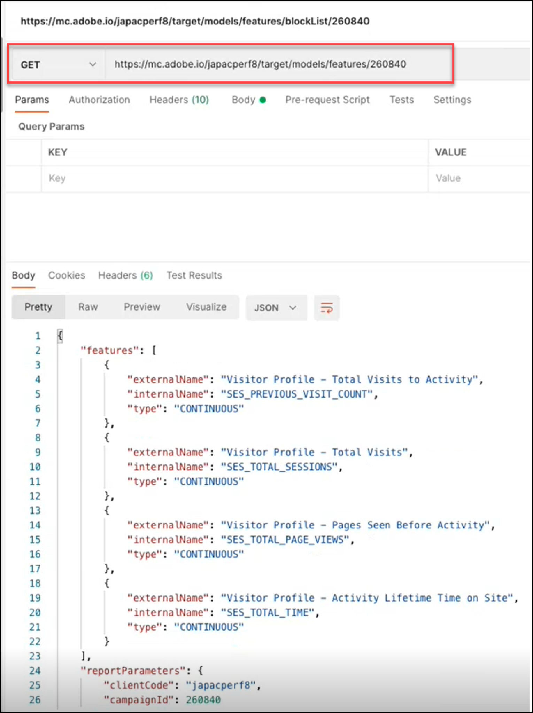

# Visão geral da API de modelos

A API de modelos, também chamada de API de Inclui na lista de bloqueios, permite que os usuários visualizem e gerenciem a lista de recursos usados em modelos de aprendizado de máquina de atividades de [!UICONTROL Automated Personalization] (AP) e [!DNL Auto-Target] (AT). Se um usuário quiser excluir um recurso de ser usado pelos modelos para atividades de AP ou AT, ele poderá usar a API de modelos para adicionar esse recurso ao &quot;incluo na lista de bloqueios&quot;.

Um **[!UICONTROL blocklist]** define o conjunto de recursos que será excluído por [!DNL Adobe Target] de seus modelos de aprendizado de máquina. Para obter mais informações sobre recursos, consulte [Dados usados por [!DNL Target] algoritmos de aprendizado de máquina](https://experienceleague.adobe.com/docs/target/using/activities/automated-personalization/ap-data.html).

As Listas de bloqueios podem ser definidas por atividade (nível de atividade) ou para todas as atividades em uma conta [!DNL Target] (nível global).

<!-- To get started with the Models API in order to create and manage your blocklist, download the Postman Collection [here](https://git.corp.adobe.com/target/ml-configuration-management-service/tree/nextRelease/rest_api_library). Note this is an Adobe internal link. Need to publish this publicly if want to share with customers. -->

## Especificação da API de modelos

Exiba a especificação da API de Modelos [aqui](../administer/models-api/models-api-overview.md).

## Pré-requisitos

Para usar a API de Modelos, você deve configurar a autenticação usando a [Adobe Developer Console](https://developer.adobe.com/console/home), da mesma forma que faria com a [API de Administrador do Target](../administer/admin-api/admin-api-overview-new.md). Para obter mais informações, consulte [Como configurar a autenticação](../before-administer/configure-authentication.md).

## Diretrizes de uso da API de modelos

Como gerenciar listas de bloqueios do

[**Etapa 1:**](#step1) Exibir lista de recursos de uma atividade

[**Etapa 2:**](#step2) verifique a inclui na lista de bloqueios da atividade

[**Etapa 3:**](#step3) adicionar recursos ao incluo na lista de bloqueios da atividade

[**Etapa 4:**](#step4) (Opcional) Desbloquear

[**Etapa 5:**](#step5) (opcional) Gerenciar a inclui na lista de bloqueios global


## Etapa 1: Exibir lista de recursos de uma atividade {#step1}

Antes de ➡ incluir na lista de bloqueios um recurso, exiba a lista de recursos que estão sendo incluídos atualmente nos modelos para essa atividade.

>[!BEGINTABS]

>[!TAB Solicitação]

```json {line-numbers="true"}
GET https://mc.adobe.io/<tenant>/target/models/features/<campaignId>
```

>[!TAB Resposta]

```json {line-numbers="true"}
{
    "features": [
        {
            "externalName": "Visitor Profile - Total Visits to Activity",
            "internalName": "SES_PREVIOUS_VISIT_COUNT",
            "type": "CONTINUOUS"
        },
        {
            "externalName": "Visitor Profile - Total Visits",
            "internalName": "SES_TOTAL_SESSIONS",
            "type": "CONTINUOUS"
        },
        {
            "externalName": "Visitor Profile - Pages Seen Before Activity",
            "internalName": "SES_PREVIOUS_VISIT_COUNT",
            "type": "CONTINUOUS"
        },
        {
            "externalName": "Visitor Profile - Activity Lifetime Time on Site",
            "internalName": "SES_TOTAL_TIME",
            "type": "CONTINUOUS"
        }
    ],
    "reportParameters": {
        "clientCode": <tenant>,
        "campaignId": <campaignId>
    }
}
```

>[!ENDTABS]

<!-- JUDY: Update codeblock above once you have the complete Response. -->

No exemplo mostrado aqui, o usuário está verificando para ver a lista de recursos que estão sendo usados no modelo para a atividade cuja ID da atividade é 260840.



>[!NOTE]
>
>Para encontrar a ID de atividade, navegue até a Lista de atividades na interface do usuário do [!DNL Target]. Clique na atividade de interesse. A ID da atividade será exibida no corpo da página Visão geral das atividades resultante, bem como no final do URL dessa página.

O **[!UICONTROL externalName]** é um nome amigável para um recurso. Foi criado por [!DNL Target], e é possível que esse valor mude com o tempo. Os usuários podem exibir esses nomes amigáveis no [relatório do Personalization Insights](https://experienceleague.adobe.com/docs/target/using/reports/insights/personalization-insights-reports.html).

O **[!UICONTROL internalName]** é o identificador real do recurso. Ele também é criado por [!DNL Target], mas não pode ser alterado. Este é o valor que você precisará referenciar para identificar os recursos que gostaria de incluir na lista de bloqueios.

Observe que para que a lista de recursos seja preenchida com valores (ou seja, para que ela seja não nula), uma atividade:

1. Deve ter o Status = Ativo ou deve ter sido ativado anteriormente
1. Deve ter sido executado por tempo suficiente para que haja atividade de campanha, para que o modelo tenha dados para serem executados.

## Etapa 2: verificar a inclui na lista de bloqueios da atividade {#step2}

Em seguida, visualize a inclui na lista de bloqueios. Em outras palavras, verifique quais recursos, se houver, estão sendo impedidos de serem incluídos nos modelos para esta atividade.

>[!ERROR]
>
>Observe que `/blockList/` diferencia maiúsculas de minúsculas na solicitação.

>[!BEGINTABS]

>[!TAB Solicitação]

```json {line-numbers="true"}
GET https://mc.adobe.io/<tenant>/target/models/features/blockList/<campaignId>
```

>[!TAB Resposta]

```json {line-numbers="true"}

```

>[!ENDTABS]

No exemplo mostrado aqui, o usuário está verificando a lista de recursos bloqueados para a atividade cuja ID de atividade é 260840. Incluir na lista de bloqueios Os resultados estão vazios, o que significa que essa atividade não tem nenhum recurso alterado no momento.


>[!NOTE]
>
>Você pode ver resultados vazios como este, na primeira vez que você verificar a inclui na lista de bloqueios completa, antes de adicionar qualquer recurso a ela. No entanto, depois de adicionar (e subsequentemente remover) recursos de um incluir na lista de bloqueios incluo na lista de bloqueios, você pode ver resultados ligeiramente diferentes, nos quais um storage de recursos vazio é retornado. Continue lendo para ver um exemplo disso em [Etapa 4](#step4).

## Etapa 3: adicionar recursos ao incluo na lista de bloqueios da atividade µ {#step3}

Para adicionar recursos à inclui na lista de bloqueios, altere a solicitação de GET para PUT e modifique o corpo da solicitação para especificar `blockedFeatureSources` ou `blockedFeatures` conforme desejado.

* O corpo da solicitação requer `blockedFeatures` ou `blockedFeatureSources`. Ambos podem ser incluídos.
* Popular `blockedFeatures` com valores identificados de `internalName`. Consulte [Etapa 1](#step1).
* Preencha `blockedFeatureSources` com valores da tabela abaixo.

Observe que `blockedFeatureSources` indica de onde veio um recurso. Para fins de incluir na lista de bloqueios, eles servem como grupos ou categorias de recursos, que permitem aos usuários bloquear conjuntos inteiros de recursos de uma só vez. Os valores de `blockedFeatureSources` correspondem aos primeiros caracteres de um identificador de recurso (valores de `blockedFeatures` ou `internalName`); portanto, eles também podem ser considerados &quot;prefixos de recurso&quot;.

### Tabela de `blockedFeatureSources` valores {#table}

| Prefixo | Descrição |
| --- | --- |
| CAIXA | Parâmetro da mbox |
| URL | Personalizado - Parâmetro de URL |
| ENV | Ambiente |
| SES | Perfil do visitante |
| GEO | Localização geográfica |
| PRO | Personalizado - Perfil |
| SEG | Personalizado - Segmento de relatórios |
| AAM | Personalizado - Segmento Experience Cloud |
| MOB | Dispositivo móvel |
| CRS | Personalizado - Atributos do cliente |
| UPA | Personalizado - Atributo de perfil RT-CDP |
| IAC | Áreas de interesse do visitante |  |

>[!BEGINTABS]

>[!TAB Solicitação]

```json {line-numbers="true"}
PUT https://mc.adobe.io/<tenant>/target/models/features/blockList/<campaignId>

{
    "blockedFeatureSources": ["AAM"],
    "blockedFeatures": ["SES_PREVIOUS_VISIT_COUNT", "SES_TOTAL_SESSIONS"]
}
```

>[!TAB Resposta]

```json {line-numbers="true"}
{
    "blockedFeatures": [
            "SES_PREVIOUS_VISIT_COUNT",
            "SES_TOTAL_SESSIONS"
        ],
    "blockedFeatureSources": [
            "AAM"
        ]
}
```

>[!ENDTABS]

No exemplo mostrado aqui, o usuário está bloqueando dois recursos, `SES_PREVIOUS_VISIT_COUNT` e `SES_TOTAL_SESSIONS`, que foram identificados anteriormente por meio de uma consulta à lista completa de recursos da atividade cuja Activity ID é 260480, conforme descrito na [Etapa 1](#step1). Eles também estão bloqueando todos os recursos provenientes de Segmentos Experience Cloud, o que é obtido ao bloquear recursos com o prefixo &quot;AAM&quot;, conforme descrito na [tabela](#table) acima.


Observe que após o cancelamento de um recurso, é recomendável verificar a incluir na lista de bloqueios inclui na lista de bloqueios atualizada executando novamente a [Etapa 2](#step2) (GET incluo na lista de bloqueios). Verifique se os resultados aparecem como esperado (verifique se os resultados incluem os recursos adicionados da solicitação de PUT mais recente).

## Etapa 4: (Opcional) Desbloquear {#step4}

Incluir na lista de bloqueios Para desbloquear todos os recursos migrados, limpe os valores de `blockedFeatureSources` ou `blockedFeatures`.

>[!BEGINTABS]

>[!TAB Solicitação]

```json {line-numbers="true"}
PUT https://mc.adobe.io/<tenant>/target/models/features/blockList/<campaignId>

{
    "blockedFeatureSources": [],
    "blockedFeatures": []
}
```

>[!TAB Resposta]

```json {line-numbers="true"}
{
    "blockedFeatures": [],
    "blockedFeatureSources": []
}
```

>[!ENDTABS]

No exemplo mostrado aqui, o usuário está limpando o incluo na lista de bloqueios para a atividade cuja ID de atividade é 260840. Observe que a resposta confirma matrizes vazias para ambos os recursos bloqueados e suas fontes—`blockedFeatureSources` e `blockedFeatures`, respectivamente.


Incluir na lista de bloqueios Como sempre, depois de modificar o arquivo de GET inclui na lista de bloqueios, recomenda-se executar novamente a [Etapa 2](#step2) (verifique se a lista inclui os recursos esperados). No exemplo mostrado aqui, o usuário está verificando se a inclui na lista de bloqueios correspondente agora está vazia.


Pergunta: Como posso excluir alguns, mas não todos, de um incluo na lista de bloqueios de navegação?

Resposta: Para remover um subconjunto distinto de recursos de uma inclui na lista de bloqueios com vários recursos, os usuários podem simplesmente enviar a lista atualizada de recursos que gostariam de bloquear na [solicitação de incluir na lista de bloqueios incluir na lista de bloqueios inclui na lista de bloqueios](#step3), em vez de limpar toda a solicitação de pesquisa e adicionar novamente os recursos desejados. Em outras palavras, envie a lista de recursos atualizada (como mostrado na [Etapa 3](#step3)), certificando-se de excluir os recursos que você deseja &quot;excluir&quot; do incluo na lista de bloqueios.

## Etapa 5: (opcional) gerenciar a inclui na lista de bloqueios global {#step5}

Os exemplos acima estavam todos no contexto de uma única atividade. Você também pode bloquear recursos para todas as atividades em um determinado cliente (locatário), em vez de precisar especificar a inclui na lista de bloqueios para cada atividade individualmente. Incluir na lista de bloqueios Para executar uma pesquisa global, use a chamada `/blockList/global`, em vez de `blockList/<campaignId>`.

>[!BEGINTABS]

>[!TAB Solicitação]

```json {line-numbers="true"}
PUT https://mc.adobe.io/<tenant>/target/models/features/blockList/global

{
    "blockedFeatureSources": ["AAM", "PRO", "ENV"],
    "blockedFeatures": ["AAM_FEATURE_1", "AAM_FEATURE_2"]
}
```

>[!TAB Resposta]

```json {line-numbers="true"}
{
    "blockedFeatures": [
        "AAM_FEATURE_1",
        "AAM_FEATURE_2"
    ],
    "blockedFeatureSources": [
        "AAM",
        "PRO",
        "ENV"
    ]
}
```

>[!ENDTABS]

Na Solicitação de exemplo mostrada acima, o usuário está bloqueando dois recursos, &quot;AAM_FEATURE_1&quot; e &quot;AAM_FEATURE_2&quot;, para todas as atividades em sua conta [!DNL Target]. Isso significa que, independentemente da atividade, &quot;AAM_FEATURE_1&quot; e &quot;AAM_FEATURE_2&quot; não serão incluídos nos modelos de aprendizado de máquina dessa conta. Além disso, o usuário também está bloqueando globalmente todos os recursos cujo prefixo é &quot;AAM&quot;, &quot;PRO&quot; ou &quot;ENV&quot;.

Pergunta: a amostra de código acima não é redundante?

Resposta: Sim. É redundante bloquear recursos com valores que começam com &quot;AAM&quot;, além de bloquear todos os recursos cuja origem é &quot;AAM&quot;. O resultado final é que todos os recursos com origem no AAM (Segmentos de Experience Cloud) serão bloqueados. Portanto, se o objetivo for bloquear todos os recursos dos Segmentos do Experience Cloud, não é necessário especificar individualmente determinados recursos que começam com &quot;AAM&quot;, no exemplo acima.

Etapa final: seja na atividade ou no nível global, é recomendável verificar sua inclui na lista de bloqueios depois de modificá-la, para garantir que ela contenha os valores esperados. Faça isso mudando o `PUT` para `GET`.

O exemplo de resposta mostrado abaixo indica que [!DNL Target] está bloqueando dois recursos individuais, além de todos os recursos com origem em &quot;AAM&quot;, &quot;PRO&quot; e &quot;ENV&quot;.


