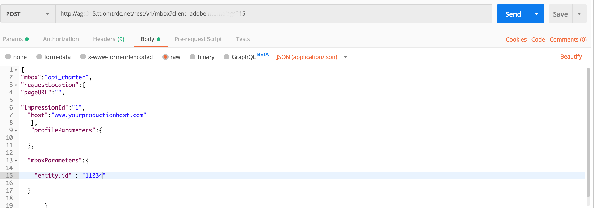

# Busca de recomendações com a API de entrega

As APIs do Adobe Target e do Adobe Target Recommendations podem ser usadas para fornecer respostas a páginas da Web, mas também podem ser usadas em experiências que não sejam baseadas no HTML, incluindo aplicativos, telas, consoles, emails, quiosques e outros dispositivos de exibição. Em outras palavras, quando as bibliotecas do Target e o JavaScript não podem ser usados, a [API de entrega do Target](/help/dev/implement/delivery-api/overview.md) ainda habilita o acesso à gama completa de funcionalidades do Target, para oferecer experiências personalizadas.

>[!NOTE]
>
>Ao solicitar conteúdo contendo recomendações reais (produtos ou itens recomendados), use a API de entrega do Target.

Para recuperar recomendações, envie uma chamada POST da API de entrega do Adobe Target com as informações contextuais apropriadas, que podem incluir uma ID de usuário (para uso com recomendações específicas do perfil, como os itens visualizados recentemente pelo usuário), nome da mbox relevante, parâmetros da mbox, parâmetros do perfil ou outros atributos. A resposta incluirá entity.ids recomendado (e pode incluir outros dados de entidade) em formato JSON ou HTML, que pode então ser exibido no dispositivo.

A [API de Entrega](/help/dev/implement/delivery-api/overview.md) para o Adobe Target expõe todos os recursos existentes fornecidos por uma solicitação padrão do Target.

A API de entrega:

* Permite recuperar experiências ou ofertas para um local e um público-alvo de maneira RESTful.
* Não requer autenticação.
* Somente POSTs.
* Não processa cookies ou chamadas de redirecionamento.
* Não exige ou reconhece &quot;funções de usuário&quot;. Ele simplesmente busca conteúdo ou relata eventos para os servidores do Target Edge.

Para usar a API de entrega para fornecer experiências do Target, incluindo recomendações, siga estas etapas:

1. Crie uma atividade do Target (A/B, XT, AP ou Recommendations) usando o Criador baseado em formulário (não o Visual Experience Composer).
1. Use a API de entrega para obter uma resposta para as solicitações geradas pela atividade do Target que você acabou de criar.

&lt;!— P: Por que ambas as etapas são necessárias para isso? Se você tiver uma recomendação baseada em formulário definida para uma mbox, qual é o ponto/benefício de TAMBÉM ter a etapa da API de entrega na para recuperar resultados? Por que você não pode apenas ter o Rec baseado em formulário entregar os resultados no dispositivo de destino...? R: Veja o caso de uso abaixo... é quando você deseja &quot;interceptar&quot; os resultados pendentes para fazer mais coisas antes de exibir os resultados. Coisas como comparações em tempo real com níveis de inventário. —>

## Criar uma recomendação usando o Experience Composer baseado em formulário

Para criar recomendações que podem ser usadas com a API de entrega, use o [Criador baseado em formulário](https://experienceleague.adobe.com/docs/target/using/experiences/form-experience-composer.html?lang=pt-BR).

1. Primeiro, crie e salve um design baseado em JSON para usar em sua recomendação. Para obter informações de JSON de exemplo, além de informações de plano de fundo sobre como as respostas JSON podem ser retornadas ao configurar uma atividade baseada em formulário, consulte a documentação em [Criação de Designs de Recomendação](https://experienceleague.adobe.com/docs/target/using/recommendations/recommendations-design/create-design.html?lang=pt-BR). Neste exemplo, o nome do design é *Simple JSON.*
   

1. No Target, navegue até **[!UICONTROL Activities]** > **[!UICONTROL Create Activity]** > **[!UICONTROL Recommendations]** e selecione **[!UICONTROL Form]**.

   

1. Selecione uma Propriedade e clique em **[!UICONTROL Next]**.
1. Defina o local em que você deseja que os usuários recebam a resposta da recomendação. O exemplo abaixo usa um local denominado *api_charter*. Selecione seu design baseado em JSON, criado anteriormente, chamado *JSON Simples.*
   
1. Salve e ative a recomendação. Ele gerará resultados. [Quando os resultados estiverem prontos](https://experienceleague.adobe.com/docs/target/using/recommendations/recommendations-activity/previewing-and-launching-your-recommendations-activity.html?lang=pt-BR), você poderá usar a API de Entrega para recuperá-los.

## Usar a API de entrega

A sintaxe da [API de Entrega](/help/dev/implement/delivery-api/overview.md) é:

`POST https://{{CLIENT_CODE}}.tt.omtrdc.net/rest/v1/delivery`

1. Observe que o código de cliente é obrigatório. Lembrando que o código de cliente pode ser encontrado no Adobe Target navegando até **[!UICONTROL Recommendations]** > **[!UICONTROL Settings]**. Anote o valor de **Código do cliente** na seção **Token de API do Recommendation**.
   
1. Depois de ter o código de cliente, crie a chamada da API de entrega. O exemplo abaixo começa com a **[!UICONTROL Web Batched Mboxes Delivery API Call]** fornecida na [coleção Postman da API de entrega](../../implement/delivery-api/overview.md#section/Getting-Started/Postman-Collection), fazendo modificações relevantes. Por exemplo:
   * os objetos **navegador** e **endereço** foram removidos do **Corpo**, pois não são necessários para casos de uso que não sejam da HTML
   * *api_charter* está listado como o nome do local neste exemplo
   * entity.id está especificada, pois esta recomendação se baseia na Similaridade de Conteúdo, que requer que uma chave de item atual seja passada para o Target.
     
Lembre-se de configurar os parâmetros de consulta corretamente. Por exemplo, certifique-se de especificar `{{CLIENT_CODE}}` conforme necessário. &lt;!— P: Na sintaxe de chamada atualizada, entity.id é listado como um profileParameter em vez de um mboxParameter como nas versões mais antigas. —> &lt;!— P: Imagem antiga  Texto de acompanhamento antigo: &quot;Observe que esta recomendação é baseada em Produtos de conteúdo semelhantes baseados em entity.id enviado via mboxParameters.&quot; —>
     
1. Envie a solicitação. Isso é executado com base no local *api_charter*, que tem uma recomendação ativa em execução, definido com seu design JSON que gerará uma lista de entidades recomendadas.
1. Receba uma resposta com base no design JSON.
   
A resposta inclui a ID de chave, bem como as IDs de entidade das entidades recomendadas.

Usar a API de entrega com o Recommendations dessa maneira permite executar etapas adicionais antes de exibir recomendações para o visitante em um dispositivo que não seja da HTML. Por exemplo, você pode obter a resposta da API de entrega para executar uma pesquisa adicional em tempo real dos detalhes do atributo da entidade (inventário, preço, classificação e assim por diante) de outro sistema (como um CMS, PIM ou plataforma de comércio eletrônico), antes de exibir os resultados finais.

Usando a abordagem descrita neste guia, você pode obter qualquer aplicativo para aproveitar a resposta do Target e fornecer recomendações personalizadas.

## Exemplo de implementações

Os recursos a seguir fornecem exemplos de várias implementações com foco na HTML. Lembre-se de que cada implementação será única, devido ao sistema e aos dispositivos envolvidos.

| Recurso | Detalhes |
| --- | --- |
| [Configurando a extensão do Target no Experience Platform Launch e implementando APIs do Target](https://developer.adobe.com/client-sdks/documentation/adobe-target/) | Etapas para configurar a extensão do Target no Experience Platform Launch, adicionar a extensão do Target ao seu aplicativo e implementar APIs do Target para solicitar atividades, realizar uma busca prévia por ofertas e entrar no modo de visualização visual. |
| [Cliente de Nó Adobe Target](https://www.npmjs.com/package/@adobe/target-nodejs-sdk) | SDK de código aberto Target Node.js v1.0 |
| [Visão geral do Server Side](../../implement/server-side/server-side-overview.md) | Informações sobre APIs de entrega do lado do servidor do Adobe Target, APIs de entrega em lote do servidor, APIs do SDK do Node.js e APIs do Adobe Target Recommendations. |
| [Recomendações de conteúdo do Adobe Campaign no email](https://medium.com/adobetech/adobe-campaign-content-recommendations-in-email-b51ced771d7f) | Blog que descreve como aproveitar as recomendações de conteúdo em emails por meio do Adobe Target e do Adobe I/O Runtime no Adobe Campaign. |

## Gerenciamento da configuração do Recommendations com APIs

Na maioria das vezes, as recomendações são configuradas na interface do usuário do Adobe Target e, em seguida, usadas ou acessadas por meio das APIs do Target, por motivos como os mencionados nas seções acima. Essa coordenação UI-API é comum. No entanto, às vezes os usuários podem querer executar todas as ações por meio das APIs, tanto a configuração quanto o uso dos resultados. Embora seja muito menos comum, os usuários podem configurar, executar, *e* de forma absoluta, aproveitar os resultados das recomendações usando inteiramente as APIs.

Aprendemos em uma [seção anterior](manage-catalog.md) a gerenciar entidades do Adobe Target Recommendations e entregá-las no lado do servidor. Da mesma forma, o [Adobe Developer Console](https://developer.adobe.com/console/home) permite gerenciar critérios, promoções, coleções e modelos de design sem precisar fazer logon no Adobe Target. Uma lista completa de todas as APIs do Recommendations pode ser encontrada [aqui](https://developer.adobe.com/target/administer/recommendations-api/), mas aqui está um resumo para referência.

| Recurso | Detalhes |
| --- | --- |
| [Coleções](https://developer.adobe.com/target/administer/recommendations-api/#tag/Collections) | Liste, crie, obtenha, edite e exclua coleções. |
| [Critérios](https://developer.adobe.com/target/administer/recommendations-api/#tag/Criteria) | Listar e obter critérios. |
| [Designs](https://developer.adobe.com/target/administer/recommendations-api/#tag/Designs) | Liste, crie, obtenha, edite, exclua e valide designs. |
| [Entidades](https://developer.adobe.com/target/administer/recommendations-api/#tag/Entities) | Salvar, excluir e obter entidades. |
| [Promoções](https://developer.adobe.com/target/administer/recommendations-api/#tag/Promotions) | Liste, crie, obtenha, edite e exclua promoções. |
| [Critério de Categoria](https://developer.adobe.com/target/administer/recommendations-api/#tag/Category-Criteria) | Liste, crie, obtenha, edite e exclua critérios de categoria. |
| [Critérios personalizados](https://developer.adobe.com/target/administer/recommendations-api/#tag/Custom-Criteria) | Liste, crie, obtenha, edite e exclua critérios personalizados. |
| [Critério de Item](https://developer.adobe.com/target/administer/recommendations-api/#tag/Item-Criteria) | Listar, criar, obter, editar e excluir critérios de item. |
| [Critério de popularidade](https://developer.adobe.com/target/administer/recommendations-api/#tag/Popularity-Criteria) | Liste, crie, obtenha, edite e exclua critérios de popularidade. |
| [Critérios de atributo de perfil](https://developer.adobe.com/target/administer/recommendations-api/#tag/Profile-Attribute-Criteria) | Liste, crie, obtenha, edite e exclua critérios de atributo de perfil. |
| [Critérios recentes](https://developer.adobe.com/target/administer/recommendations-api/#tag/Recent-Criteria) | Listar, criar, obter, editar e excluir critérios recentes. |
| [Critério de sequência](https://developer.adobe.com/target/administer/recommendations-api/#tag/Sequence-Criteria) | Liste, crie, obtenha, edite e exclua critérios de sequência. |

## Documentação de referência

* [Documentação da API de entrega do Adobe Target](/help/dev/implement/delivery-api/overview.md)
* [Integração do Recommendations ao email](https://experienceleague.adobe.com/docs/target/using/recommendations/recommendations-faq/integrating-recs-email.html?lang=pt-BR)

## Resumo e revisão

Parabéns! Ao concluir este guia, você aprendeu a:
* [Gerencie seu catálogo usando a API do Recommendations](manage-catalog.md)
* [Gerenciar critérios personalizados usando a API do Recommendations](manage-custom-criteria.md)
* [Usar a API de entrega com o Recommendations](fetch-recs-server-side-delivery-api.md)
