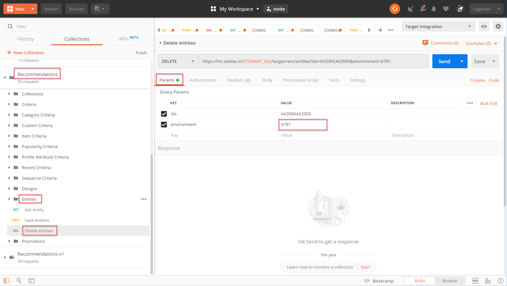

# Gerencie seu catálogo do Recommendations usando APIs

Ao garantir que você atenda aos [requisitos para usar a API do Recommendations](/help/dev/before-administer/recs-api/overview.md#prerequisites), você aprendeu a [gerar um token de acesso](/help/dev/before-administer/configure-authentication.md) usar o fluxo de autenticação JWT para usar o [!DNL Adobe Target] APIs de administrador no [Console do Adobe Developer](https://developer.adobe.com/console/home).

Agora você pode usar o [APIs do Recommendations](https://developers.adobetarget.com/api/recommendations/) para adicionar, atualizar ou excluir itens no catálogo de recomendações. Assim como no restante das APIs de administrador do Adobe Target, as APIs do Recommendations exigem autenticação.

>[!NOTE]
>
>Envie o **[!UICONTROL IMS: Geração JWT + autenticação via token de usuário]** sempre que precisar atualizar seu token de acesso para autenticação, pois ele expira após 24 horas. Consulte [Configurar a autenticação da API do Adobe](../configure-authentication.md) para obter instruções.


Antes de continuar, obtenha o [Coleção Recommendations Postman](https://developers.adobetarget.com/api/recommendations/#section/Postman).

## Criação e atualização de itens com a API Salvar entidades

Para preencher o banco de dados de produtos do Recommendations usando a API em vez de um feed de produto CSV ou de solicitações do Target que são acionadas nas páginas de produtos, use o [Salvar API de entidades](https://developers.adobetarget.com/api/recommendations/#operation/saveEntities). Esta solicitação adiciona ou atualiza um item em um único ambiente do Target. A sintaxe é:

```
POST https://mc.adobe.io/{{TENANT_ID}}/target/recs/entities
```

Por exemplo, Salvar Entidades pode ser usado para atualizar itens sempre que certos limites forem atingidos - como limites para estoque ou preço - para sinalizar esses itens e evitar que eles sejam recomendados.

1. Navegue até **[!UICONTROL Target]** > **[!UICONTROL Configuração]** > **[!UICONTROL Hosts]** > **[!UICONTROL Ambientes DE CONTROLE]** para obter a ID de ambiente de destino na qual você deseja adicionar ou atualizar um item.

   

1. Verificar `TENANT_ID` e `API_KEY` faça referência às variáveis de ambiente do Postman estabelecidas anteriormente. Use a imagem abaixo para comparação. Se necessário, modifique os cabeçalhos e o caminho na solicitação de API para corresponder aos da imagem abaixo.

   

1. Insira seu JSON como **raw** código na **Corpo**. Não se esqueça de especificar sua ID de ambiente, usando o `environment` variável. (No exemplo abaixo, a ID de ambiente é 6781.)

   

   Abaixo está um exemplo de JSON que adiciona o entity.id kit2001 com valores de entidade associados para um produto de Forno de torradeira, no ambiente 6781.

   ```
       {
       "entities": [{
               "name": "Toaster Oven",
               "id": "kit2001",
               "environment": 6781,
               "categories": [
                   "housewares:appliances"
               ],
               "attributes": {
                   "inventory": 77,
                   "margin": 23,
                   "message": "crashing helicopter",
                   "pageUrl": "www.foobar.foo.com/helicopter.html",
                   "thumbnailUrl": "www.foobar.foo.com/helicopter.jpg",
                  "value": 19.2
               }
           }]
       }
   ```

1. Clique em **[!UICONTROL Enviar]**. Você deve receber a seguinte resposta.

   

   O objeto JSON pode ser dimensionado para enviar vários produtos. Por exemplo, esse JSON especifica duas entidades.

   ```
       {
           "entities": [{
                   "name": "Toaster Oven",
                   "id": "kit2001",
                   "environment": 6781,
                   "categories": [
                       "housewares:appliances"
                   ],
                   "attributes": {
                       "inventory": 89,
                       "margin": 11,
                       "message": "Toaster Oven",
                       "pageUrl": "www.foobar.foo.com/helicopter.html",
                       "thumbnailUrl": "www.foobar.foo.com/helicopter.jpg",
                       "value": 102.5
                   }
               },
               {
                   "name": "Blender",
                   "id": "kit2002",
                   "environment": 6781,
                   "categories": [
                       "housewares:appliances"
                   ],
                   "attributes": {
                       "inventory": 36,
                       "margin": 5,
                       "message": "Blender",
                       "pageUrl": "www.foobar.foo.com/helicopter.html",
                       "thumbnailUrl": "www.foobar.foo.com/helicopter.jpg",
                       "value": 54.5
                   }
               }
           ]
       }
   ```

1. Agora é a sua vez! Use o **[!UICONTROL Salvar Entidades]** API para adicionar os seguintes itens ao catálogo. Use a amostra JSON acima como ponto de partida. (Será necessário estender o JSON para incluir entidades adicionais.)

   

Parece que esses dois últimos itens não pertencem. Vamos inspecioná-los usando o **[!UICONTROL Obter entidade]** e, se necessário, exclua-os usando a variável **[!UICONTROL Excluir Entidades]** API.

## Obter detalhes do item com a API Obter entidade

Para recuperar os detalhes de um item existente, use o [Obter API de entidade](https://developers.adobetarget.com/api/recommendations/#operation/getEntity). A sintaxe é:

```
GET https://mc.adobe.io/{{TENANT_ID}}/target/recs/entities/[entity.id]
```

Os detalhes da entidade só podem ser recuperados para uma única entidade de cada vez. Você pode usar Obter entidade para confirmar que as atualizações foram feitas no catálogo conforme esperado ou para auditar o conteúdo do catálogo de outra forma.

1. Na solicitação da API, especifique a ID da entidade usando a variável `entityId`. O exemplo a seguir retornará detalhes para a entidade cuja entityId=kit2004.

   

1. Verificar `TENANT_ID` e `API_KEY` faça referência às variáveis de ambiente do Postman estabelecidas anteriormente. Use a imagem abaixo para comparação. Se necessário, modifique os cabeçalhos e o caminho na solicitação de API para corresponder aos da imagem abaixo.

   

1. Envie a solicitação.

   
Se você receber um erro informando que a entidade não foi encontrada, como mostrado no exemplo acima, verifique se está enviando a solicitação para o ambiente correto do Target.


   >[!NOTE]
   >
   >Se nenhum ambiente for especificado explicitamente, Obter entidade tentará obter a entidade de seu [ambiente padrão](https://experienceleague.adobe.com/docs/target/using/administer/environments.html) somente. Se quiser extrair de qualquer ambiente que não seja o ambiente padrão, especifique a ID do ambiente.

1. Se necessário, adicione o `environmentId` e reenvie a solicitação.

   

1. Enviar outro **[!UICONTROL Obter entidade]** solicitação, desta vez para inspecionar a entidade cuja entityId=kit2005.

   

Suponha que você decida que essas entidades precisam ser removidas do catálogo. Vamos usar o **[!UICONTROL Excluir Entidades]** API.

## Exclusão de itens com a API Excluir entidades

Para remover itens do catálogo, use o [Excluir API de entidades](https://developers.adobetarget.com/api/recommendations/#operation/deleteEntities). A sintaxe é:

```
DELETE https://mc.adobe.io/{{TENANT_ID}}/target/recs/entities?ids=[comma-delimited-entity-ids]&environment=[environmentId]
```

>[!WARNING]
>
>A API Excluir entidades exclui entidades referenciadas pelas IDs especificadas. Se nenhuma ID de entidade for fornecida, todas as entidades em um determinado ambiente serão excluídas. Se nenhuma ID de ambiente for fornecida, as entidades serão excluídas de todos os ambientes. Use isso com cuidado!

1. Navegue até **[!UICONTROL Target]** > **[!UICONTROL Configuração]** > **[!UICONTROL Hosts]** > **[!UICONTROL Ambientes]** para obter a ID do ambiente de destino do qual deseja excluir itens.

   

1. Na solicitação da API, especifique as IDs de entidade das entidades que deseja excluir usando a sintaxe `&ids=[comma-delimited-entity-ids]` (um parâmetro de consulta). Ao excluir mais de uma entidade, separe as IDs usando vírgulas.

   

1. Especificar a ID de ambiente usando a sintaxe `&environment=[environmentId]`, caso contrário, as entidades em todos os ambientes serão excluídas.

   

1. Verificar `TENANT_ID` e `API_KEY` faça referência às variáveis de ambiente do Postman estabelecidas anteriormente. Use a imagem abaixo para comparação. Se necessário, modifique os cabeçalhos e o caminho na solicitação de API para corresponder aos da imagem abaixo.

   

1. Envie a solicitação.

   

1. Verifique os resultados usando **[!UICONTROL Obter entidade]**, que agora deve indicar as entidades excluídas não podem ser encontradas.

   

   

Parabéns! Agora você pode usar as APIs do Recommendations para criar, atualizar, excluir e obter detalhes sobre as entidades no catálogo. Na próxima seção, você aprenderá a gerenciar critérios personalizados.

&lt;!— [Próximo: &quot;Gerenciar critérios personalizados&quot; >](manage-custom-criteria.md) —>
