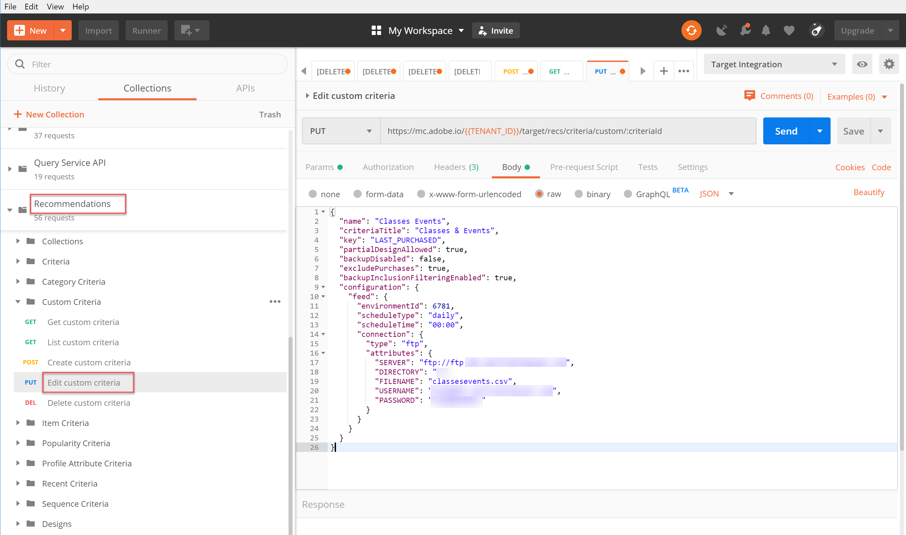
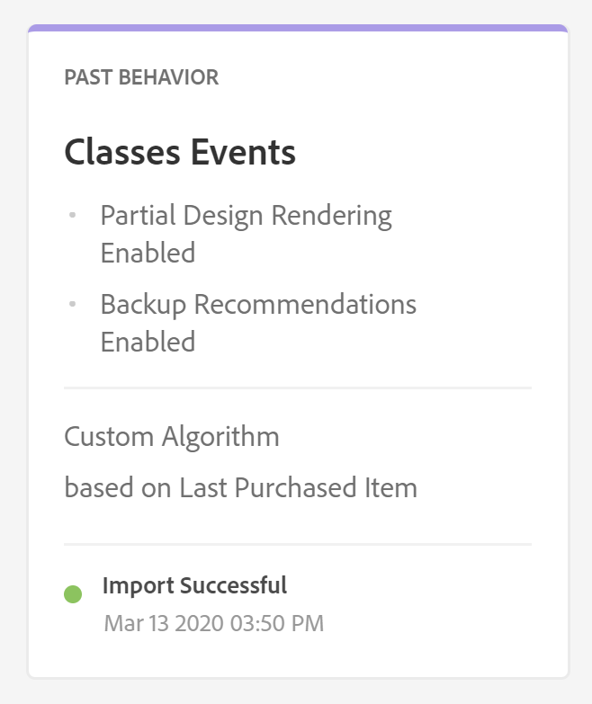

# Gerenciar critérios personalizados

Às vezes, os algoritmos fornecidos pelo Recommendations não podem exibir itens específicos que você deseja promover. Nessa situação, os critérios personalizados fornecem uma maneira de distribuir um conjunto específico de itens recomendados para um determinado item ou categoria principal.

Para criar critérios personalizados, defina e importe o mapeamento desejado entre o item ou categoria principal e os itens recomendados. Esse processo é descrito na seção [documentação de critérios personalizados](https://experienceleague.adobe.com/docs/target/using/recommendations/criteria/recommendations-csv.html). Conforme observado nessa documentação, você pode criar, editar e excluir critérios personalizados por meio da interface do usuário (UI) do Target. No entanto, o Target também fornece um conjunto de APIs de critérios personalizados que permitem o gerenciamento mais detalhado de seus critérios personalizados.

>[!WARNING]
>
>Para critérios personalizados, execute todas as ações (criar, editar, excluir) para um determinado critério personalizado usando as APIs ou execute todas as ações (criar, editar, excluir) usando a interface do usuário do. O gerenciamento de critérios personalizados por meio de uma combinação da interface do usuário e da API pode gerar informações conflitantes ou resultados inesperados. Por exemplo, criar um critério personalizado na interface do usuário, mas editá-lo por meio da API, não refletirá as atualizações na interface do usuário, embora ele seja atualizado no back-end, como visível por meio da API.

## Criar critérios personalizados

Para criar critérios personalizados usando a variável [Criar API de critérios personalizados](https://developers.adobetarget.com/api/recommendations/#operation/createCriteriaCustom), a sintaxe é:

`POST https://mc.adobe.io/{{TENANT_ID}}/target/recs/criteria/custom`

>[!WARNING]
>
>Critérios personalizados criados usando a API Criar critérios personalizados, conforme descrito neste exercício, aparecerão na interface do usuário, onde persistirão. Não será possível editá-los ou excluí-los da interface do. Você pode editá-los ou excluí-los **via API**, mas de qualquer forma, eles continuarão a aparecer na interface do usuário do Target. Para manter a opção de editar ou excluir da interface do, crie os critérios personalizados usando a interface do [a documentação](https://experienceleague.adobe.com/docs/target/using/recommendations/criteria/recommendations-csv.html), em vez de usar a API Criar critérios personalizados.

Continue com as etapas a seguir somente após ler o aviso acima e familiarizar-se com a criação de novos critérios personalizados que não podem ser excluídos subsequentemente da interface do usuário.

1. Verificar `TENANT_ID` e `API_KEY` para **[!UICONTROL Criar critérios personalizados]** faça referência às variáveis de ambiente do Postman estabelecidas anteriormente. Use a imagem abaixo para comparação.

   

1. Adicione **Corpo** as **raw** JSON que define o local do arquivo CSV de critérios personalizados. Use o exemplo fornecido na variável [Criar API de critérios personalizados](https://developers.adobetarget.com/api/recommendations/#operation/getAllCriteriaCustom) documentação como modelo, fornecendo suas `environmentId` e outros valores, conforme necessário. Neste exemplo, usamos LAST_PURCHASED como a chave.

   

1. Envie a solicitação e observe a resposta, que contém os detalhes dos critérios personalizados que você acabou de criar.

   

1. Para verificar se os critérios personalizados foram criados, navegue no Adobe Target para **[!UICONTROL Recommendations > Critérios]** e procure seus critérios por nome, ou use o **[!UICONTROL Listar API de critérios personalizados]** na próxima etapa.

   

Nesse caso, temos um erro. Vamos investigar o erro examinando os critérios personalizados mais detalhadamente, usando o **[!UICONTROL Listar API de critérios personalizados]**.

## Listar critérios personalizados

Para recuperar uma lista de todos os critérios personalizados e os detalhes de cada um deles, use o [Listar API de critérios personalizados](https://developers.adobetarget.com/api/recommendations/#operation/getAllCriteriaCustom). A sintaxe é:

`GET https://mc.adobe.io/{{TENANT_ID}}/target/recs/criteria/custom`

1. Verificar `TENANT_ID` e `API_KEY` como antes, e envie a solicitação. Na resposta, observe a ID de critério personalizada, bem como detalhes sobre a mensagem de erro anotada anteriormente.
   

Nesse caso, o erro ocorreu porque as informações do servidor estão incorretas, o que significa que o Target não pode acessar o arquivo CSV que contém a definição de critérios personalizados. Vamos editar os critérios personalizados para corrigir isso.

## Editar critérios personalizados

Para alterar os detalhes de uma definição de critério personalizado, use o [Editar API de critérios personalizados](https://developers.adobetarget.com/api/recommendations/#operation/updateCriteriaCustom). A sintaxe é:

`POST https://mc.adobe.io/{{TENANT_ID}}/target/recs/criteria/custom/:criteriaId`

1. Verificar `TENANT_ID` e `API_KEY`, como antes.
   

1. Especifique a ID dos critérios personalizados (únicos) que deseja editar.
   

1. No Corpo, forneça o JSON atualizado com as informações corretas do servidor. (Para esta etapa, especifique o acesso FTP a um servidor que você possa acessar.)
   

1. Envie a solicitação e anote a resposta.
   

Vamos verificar o sucesso dos critérios personalizados atualizados, usando o **[!UICONTROL Obter API de critérios personalizados]**.

## Obter critérios personalizados

Para exibir os detalhes dos critérios personalizados de um critério personalizado específico, use o [Obter API de critérios personalizados](https://developers.adobetarget.com/api/recommendations/#operation/getCriteriaCustom). A sintaxe é:

`GET https://mc.adobe.io/{{TENANT_ID}}/target/recs/criteria/custom/:criteriaId`

1. Especifique a ID dos critérios personalizados cujos detalhes você deseja obter. Envie a solicitação e revise a resposta.
   
1. Verificação bem-sucedida. (No nosso caso, verifique se não há mais erros no FTP.)
   
1. (Opcional) Verifique se a atualização reflete com precisão na interface do usuário.
   

## Excluir critérios personalizados

Usando a ID de critério anotada anteriormente, exclua os critérios personalizados, usando o [Excluir API de critérios personalizados](https://developers.adobetarget.com/api/recommendations/#operation/deleteCriteriaCustom). A sintaxe é:

`DELETE https://mc.adobe.io/{{TENANT_ID}}/target/recs/criteria/custom/:criteriaId`

1. Especifique a ID dos critérios personalizados (únicos) que deseja excluir. Clique em **[!UICONTROL Enviar]**.
   

1. Verifique se os critérios foram excluídos usando Obter critérios personalizados.
   
Nesse caso, o erro 404 esperado indica que os critérios excluídos não foram encontrados.

>[!NOTE]
>
>Como lembrete, os critérios não serão removidos da interface do usuário do Target mesmo que ela tenha sido excluída, pois foi criada usando a API Criar critérios personalizados.

Parabéns! Agora é possível criar, listar, editar, excluir e obter detalhes sobre critérios personalizados usando a API do Recommendations. Na próxima seção, você usará a API de entrega do Target para recuperar recomendações.

&lt;!— [Próximo: &quot;Buscar o Recommendations com a API de entrega do lado do servidor&quot; >](fetch-recs-server-side-delivery-api.md) —>
