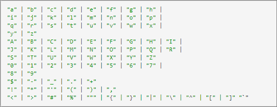

# Parâmetros da página

Parâmetros de página (também chamados de &quot;parâmetros de mbox&quot;) são pares de nome/valor passados diretamente pelo código da página que não são armazenados no perfil do visitante para uso futuro.

Os parâmetros de página são úteis para enviar dados de página para o [!DNL Adobe Target] que não precisam ser armazenadas com o perfil do visitante para uso futuro do target. Esses valores são usados para descrever a página ou a ação que o usuário fez na página específica.

## Formato

Os parâmetros da página são passados para [!DNL Target] por meio de uma chamada de servidor como um par de nome/valor da string. Os nomes e valores do parâmetro são personalizáveis (embora alguns sejam &quot;nomes reservados&quot; para usos específicos).

Estes são alguns exemplos de parâmetros de página

* `page=productPage`

* `categoryId=homeLoans`

## Exemplo de casos de uso

* **Páginas de produto**: envia informações sobre o produto específico exibido (este método é como o Recommendations funciona)
* **Detalhes do pedido**: envia a ID do pedido, orderTotal e assim por diante, para a coleção de pedidos
* **Afinidade de categorias**[!DNL Target]: envia informações visualizadas por categoria para o , gerando conhecimento da afinidade do usuário a determinadas categorias do site
* **Dados de terceiros**: envia informações de fontes de dados de terceiros, como provedores de definição de direcionamento meteorológico, dados de conta (por exemplo, DemandBase), dados demográficos (por exemplo, Experiência) e muito mais.

## Benefícios do método

Os dados são enviados para o [!DNL Target] em tempo real, e podem ser usados na mesma chamada de servidor que os dados de entrada.

## Avisos

* Precisa de atualização do código da página (diretamente ou por meio de um sistema de gerenciamento de tags).
* Se os dados precisarem ser usados para direcionamento em uma chamada de página/servidor subsequente, eles deverão ser convertidos em um script de perfil.
* As sequências de caracteres podem conter somente os caracteres, conforme o padrão [Internet Engineering Task Force (IETF)](https://www.ietf.org/rfc/rfc3986.txt).

  Além dos caracteres mencionados no site do IETF, [!DNL Target] permite os seguintes caracteres em cadeias de caracteres de consulta:

  ```< > # % " { } | \ ^ [ ] ` ``` {line-numbers=&quot;true&quot;}

  O restante deve ser codificado em url. O padrão especifica o seguinte formato ( [https://www.ietf.org/rfc/rfc1738.txt](https://www.ietf.org/rfc/rfc1738.txt) ), conforme ilustrado abaixo:

  

  Ou, a lista completa para simplicidade:

  

## Exemplos de código

targetPageParamsAll (anexa os parâmetros a todas as chamadas de mbox na página):

`function targetPageParamsAll() { return "param1=value1&param2=value2&p3=hello%20world";`

targetPageParams (anexa os parâmetros ao mbox global na página):

`function targetPageParams() { return "param1=value1&param2=value2&p3=hello%20world";`

## Links para informações relevantes

Recommendations: [implementação de acordo com o tipo de página](https://experienceleague.adobe.com/docs/target/using/recommendations/plan-implement.html)

Confirmação do pedido: [rastreia conversões](../../implement/client-side/atjs/how-to-deployatjs/implement-target-without-a-tag-manager.md#track-conversions)

Afinidade de categorias: [afinidade de categorias](https://experienceleague.adobe.com/docs/target/using/audiences/visitor-profiles/category-affinity.html)
