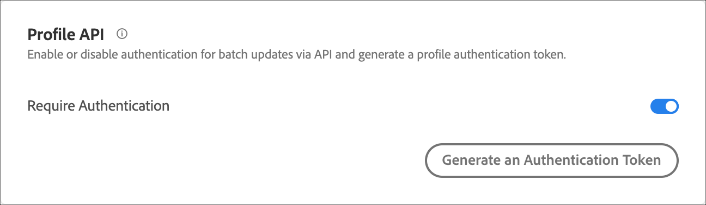
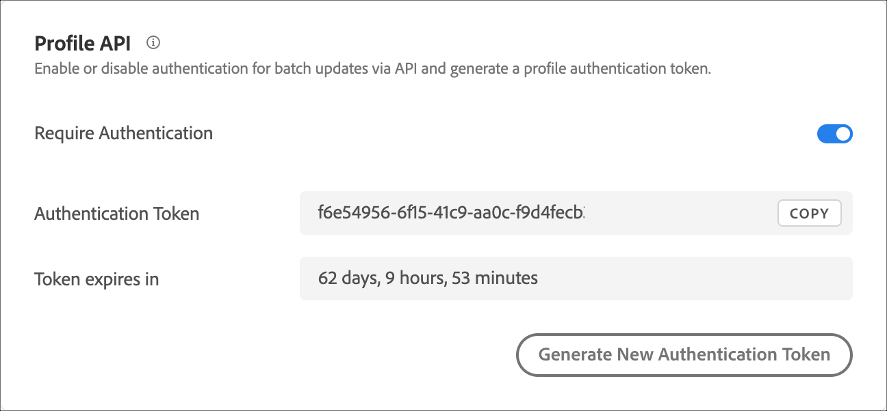

# Configurações da API de perfil

Habilite ou desabilite a autenticação para atualizações em lote via APIs do [!DNL Adobe Target] e gere um token de autenticação de perfil.

[!DNL Adobe Target] cria e mantém um perfil para cada usuário individual. Este perfil está armazenado no cluster de borda [!DNL Target] e é atualizado em tempo real após cada visita. Também é possível atualizar um perfil individualmente ou em massa por meio da API.

Para maior segurança, você pode fazer com que uma chamada de API de atualização em massa solicite um token de acesso válido a ser enviado no cabeçalho da solicitação.

**Para exigir autenticação e gerar um token de acesso usando a interface de usuário [!DNL Target]:**

1. Clique em **[!UICONTROL Administration]** > **[!UICONTROL Implementation]**.
1. Em **[!UICONTROL Profile API]**, deslize o botão **[!UICONTROL Require Authentication]** para a posição habilitada ou desabilitada.

   

1. (Condicional) Se você habilitou o requisito de autenticação, clique em **[!UICONTROL Generate New Profile Authentication Token]**.

   

   O token expira de acordo com o tempo listado na caixa Expira em.

   Você deve ter uma das seguintes permissões de usuário para gerar um token de autenticação:

   * Função de administrador ou ter pelo menos direitos de Aprovador

     Para obter mais informações para clientes do Target Standard, consulte [Especificar funções e permissões](https://experienceleague.adobe.com/docs/target/using/administer/manage-users/users/user-management.html#roles-permissions) em *Usuários*. Para obter mais informações para clientes do [!DNL Target Premium], consulte [Configurar permissões corporativas](https://experienceleague.adobe.com/docs/target/using/administer/manage-users/enterprise/properties-overview.html).

   * Função de administrador no nível de espaço de trabalho/perfil de produto

     Os espaços de trabalho estão disponíveis somente para clientes do [!DNL Target Premium]. Para obter mais informações, consulte [Configurar permissões corporativas](https://experienceleague.adobe.com/docs/target/using/administer/manage-users/enterprise/properties-overview.html).

   * Direitos de administrador (permissão de Sysadmin) no nível do produto [!DNL Adobe Target]

Também é possível gerar um token de autenticação de perfil por meio da API. Para obter mais informações, consulte &quot;Perfis&quot; no [Guia da API de perfil e administração do Adobe Target](../../administer/admin-api/admin-api-overview-new.md).

1. Copie o token e inclua-o no cabeçalho da solicitação no formato: &quot;Autorização&quot; : &quot;Portador&quot;.

1. Clique em **[!UICONTROL Generate New Profile Authentication Token]** para regenerar o token conforme necessário.

>[!WARNING]
>
>Redefinir esse token resulta em falha das chamadas de API usando o token atual. Isso necessitará da atualização de qualquer script ou aplicativo que use esse token.
