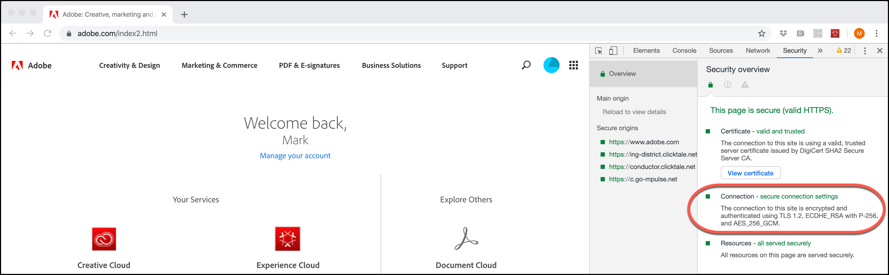

# Alterações na criptografia do TLS (Transport Layer Security)

Informações sobre alterações em como o [!DNL Adobe] e o [!DNL Adobe Target] usam a Segurança da Camada de Transporte (TLS) para manter os mais altos padrões de segurança e promover a segurança dos dados do cliente.

A Segurança da camada de transporte (TLS) é o protocolo de segurança mais amplamente implantado usado atualmente em navegadores Web e outros aplicativos que exigem dados trocados de maneira segura por meio de uma rede. O Adobe tem padrões de conformidade em segurança que exigem o fim da vida útil de protocolos mais antigos e o uso do TLS 1.2 para ter a versão mais atualizada e segura em vigor.

>[!WARNING]
>
>A partir de 1º de março de 2020, o [!DNL Target] não oferecerá mais suporte à criptografia TLS 1.1 para o Visual Experience Composer (VEC), Enhanced Experience Composer (EEC), entrega de atividades, APIs etc. Atualize para TLS 1.2 para evitar problemas.

Não esperamos que isso afete significativamente os dados ou relatórios do cliente.

## Visual Experience Composer (VEC) com o Enhanced Experience Composer (EEC) habilitado

O TLS 1.2 é o padrão a partir de 1º de março de 2020, e o TLS 1.1 não será mais compatível.

A Adobe estará movendo os clientes em fases para o TLS 1.2. Para aqueles cujos domínios já estão em conformidade com o TLS 1.2, nós os moveremos para o TLS 1.2 sem qualquer alteração necessária da sua parte. A maioria dos domínios do cliente já é compatível com TLS 1.2; no entanto, se o seu domínio não for compatível com TLS 1.2, manteremos esses domínios no TLS 1.1 como hoje (até março de 2020).

Você não deve enfrentar qualquer problema durante essa fase de migração. Se o VEC interrompeu o carregamento de um site que estava funcionando anteriormente, [abra um tíquete de Atendimento ao Cliente](https://experienceleague.adobe.com/docs/target/using/cmp-resources-and-contact-information.html?lang=pt-BR&#reference_ACA3391A00EF467B87930A450050077C) e cite essa migração como uma causa possível.

Se, no entanto, você é um desses clientes que usam o TLS 1.1 sem compatibilidade com o TLS 1.2, então você deve planejar a mudança dos seus domínios/infraestrutura para o TLS 1.2. Continuaremos a ser compatíveis com o protocolo TLS 1.1 até segunda-feira, 1 de março de 2020. A partir de 1º de março de 2020, o [!DNL Target] não oferecerá suporte ao protocolo TLS 1.1 a ser usado para o VEC por meio do recurso Enhanced Experience Composer.

Embora recomendemos fortemente a todos usar o TLS 1.2 de agora em diante, se você for um novo cliente, mas *NÃO* for compatível com o TLS 1.2, entre em contato com o Atendimento ao cliente e os informe de que você precisa usar o TLS 1.1 no Compositor de experiências avançadas. No entanto, planeje a mudança para o TLS 1.2 já que você também não terá mais compatibilidade após segunda-feira, 1 de março de 2020.

## Entrega da atividade

A partir de 1º de março de 2020, os servidores do [!DNL Target] não serão mais compatíveis com o TLS 1.1. Com esta alteração, os servidores do [!DNL Target] não aceitarão mais solicitações de visitantes com dispositivos ou navegadores da Web antigos que não sejam compatíveis com TLS 1.2 (ou posterior). Como resultado, dispositivos e navegadores mais antigos que oferecem suporte apenas para o TLS 1.1 (ou suporte ao TLS 1.1, por padrão) não receberão conteúdo de atividade do Adobe Target. O conteúdo padrão do site será renderizado.

Alguns dos dispositivos e navegadores mais antigos que serão afetados incluem:

* Google Chrome (Chrome para Android) versões 29 e anteriores
* Opera Browser (Opera Mobile) versões 12.17 e anteriores
* Mozilla Firefox (Firefox para dispositivos móveis) versões 26 e anteriores
* Android 4.3 e versões anteriores
* Internet Explorer 8 a 10 no Windows 7 e versões anteriores
* Internet Explorer 10 no Windows Phone 8.0
* Safari 6.0.4/OS X10.8.4 e versões anteriores

Conforme você se planeja para esta mudança, considere o seguinte (observe que o prazo de segunda-feira, 1 de março de 2020 afeta todos esses itens):

* Você deve assegurar que o seu site padrão esteja pronto de uma maneira que seja consumível por dispositivos e navegadores compatíveis.
* Esteja ciente de que o número de visitantes em seus relatórios do [!DNL Target] pode observar uma queda insignificante no número de visitantes.
* Talvez seja necessário alterar os públicos-alvo criados especificamente para direcionar dispositivos ou navegadores mais antigos que não são compatíveis com TLS 1.2. A entrega para esses dispositivos e navegadores não funcionará mais.

Para obter mais detalhes sobre os navegadores suportados e suas versões, consulte [Navegadores suportados](supported-browsers.md).

## [!DNL Adobe Target] APIs

A partir de 1º de março de 2020, as APIs do [!DNL Target] não serão mais compatíveis com a criptografia TLS 1.1. Clientes que acessam a API devem verificar se não serão afetados.

* Os clientes da API que usam o Java 7 com configurações padrão precisarão de modificações para terem suporte ao TLS 1.2. Para obter mais informações, consulte &quot; [Alterando a versão de protocolo TLS padrão para pontos de extremidade do cliente: TLS 1.0 para TLS 1.2](https://www.java.com/en/configure_crypto.html)&quot; no site do Java.
* Os clientes de API que usam o Java 8 não deverão ser afetados, pois a configuração padrão é TLS 1.2.
* Os clientes da API que usam outras estruturas precisarão entrar em contato com seus fornecedores para obterem detalhes sobre o suporte a TLS 1.2.

## Acesso às interfaces das soluções Experience Cloud

Como a interface do [!DNL Target] Standard/Premium já requer um [navegador moderno](supported-browsers.md), não prevemos problemas. Caso não seja possível se conectar ao Target, será necessário atualizar seu navegador para a versão mais recente.

## Como verificar qual versão do TLS seu navegador usa

Para verificar a versão TLS no seu site usando o Google Chrome:

1. Abra o site afetado no Chrome.
1. No menu Chrome (as três elipses verticais), clique em Mais ferramentas > Ferramentas do desenvolvedor.

   

1. Abra a guia Segurança e examine as informações da versão TLS em Conexão:

   

>[!NOTE]
>
>Estas instruções estão atualizadas a partir da publicação e estão sujeitas a alterações. Uma pesquisa rápida na Internet deve ajudar se essas instruções forem alteradas. Outros navegadores têm etapas semelhantes.

## Comportamento esperado com navegadores compatíveis com versões TLS anteriores a 1.2

Esta seção descreve o que esperar de navegadores que suportam versões TLS anteriores à 1.2 apenas ao usar uma implementação at.js. Para fins de comparação, esta seção também descreve o que esperar de navegadores compatíveis com TLS 1.2.

### Endpoints centrais

| Implementação do JavaScript [!DNL Target] | Detalhes |
|--- |--- |
| at.js | Com TLS 1.0 ou TLS 1.1 ativado:<ul><li>Com as ferramentas dev do navegador, na guia Rede, você verá &quot;200 OK.&quot; Isso significa que a solicitação foi bem-sucedida.</li><li>O usuário vê a mensagem &quot;Não foi possível se conectar com segurança a essa página&quot;. A mensagem explica que isso pode ser causado porque o site usa configurações de segurança TLS desatualizadas ou inseguras.</li><li>Nenhum erro de console é exibido.</li></ul>Com o TLS 1.2 habilitado:<ul><li>O arquivo at.js é baixado.</li></ul> |

### Endpoints do Edge

| Implementação do JavaScript [!DNL Target] | Detalhes |
|--- |--- |
| Adobe Experience Platform Web SDK | Com TLS 1.0 ou TLS 1.1 ativado:<ul><li>Com as ferramentas dev do navegador, na guia Rede, você verá &quot;200 OK.&quot; Isso significa que a solicitação foi bem-sucedida.</li><li>O usuário vê a mensagem &quot;Não foi possível se conectar com segurança a essa página&quot;. A mensagem explica que isso pode ser causado porque o site usa configurações de segurança TLS desatualizadas ou inseguras.</li><li>Nenhum erro de console é exibido.</li><li>O conteúdo padrão é distribuído.</li></ul>Com o TLS 1.2 habilitado:<ul><li>O conteúdo da oferta é distribuído.</li></ul> |
| at.js | Com TLS 1.0 ou TLS 1.1 ativado:<ul><li>Com as ferramentas dev do navegador, na guia Rede, você verá &quot;200 OK.&quot; Isso significa que a solicitação foi bem-sucedida.</li><li>O usuário vê a mensagem &quot;Não foi possível se conectar com segurança a essa página&quot;. A mensagem explica que isso pode ser causado porque o site usa configurações de segurança TLS desatualizadas ou inseguras.</li><li>Nenhum erro de console é exibido.</li><li>O conteúdo padrão é distribuído.</li></ul>Com o TLS 1.2 habilitado:<ul><li>O conteúdo da oferta é distribuído.</li></ul> |

### Atividade direcionada com público-alvo versão do navegador (Internet Explorer, Versões 6, 7 ou 8)

Os públicos-alvo param de funcionar.

| Implementação do JavaScript [!DNL Target] | Detalhes |
|--- |--- |
| Adobe Experience Platform Web SDK | O SDK da Platform não é compatível com versões do Internet Explorer anteriores à versão 10. |
| at.js | at.js não é compatível nas versões do Internet Explorer mais antigas que a versão 10. |
