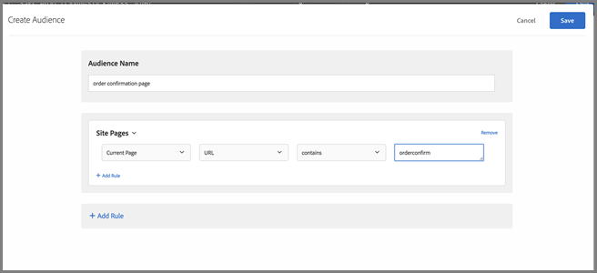

# Perguntas frequentes sobre a Mbox global

Lista de perguntas frequentes sobre as mboxes globais.

## Posso ter mais de uma mbox global, se minha conta [!DNL Target] estiver configurada em vários domínios?

Somente uma mbox global é suportada na sua conta.

Você pode limitar o local de execução das atividades, ao adicionar as regras de URL às suas atividades. Para obter mais informações, consulte [Incluir a mesma experiência em páginas semelhantes](https://experienceleague.adobe.com/docs/target/using/experiences/vec/temtest.html).

Você também pode passar um parâmetro para a página usando [targetPageParams](/help/dev/implement/client-side/atjs/atjs-functions/targetpageparams.md) e depois selecionar esses parâmetros na seção &quot;configurar URL&quot; no [!UICONTROL Visual Experience Composer] (VEC) ou adicionar os parâmetros como &quot;refinamentos&quot; no [!UICONTROL Form-Based Experience Composer].

## Como transfiro os dados de receita em uma mbox global [!DNL Target]?

Para coletar informações de receita e pedido da target-global-mbox, os &quot;parâmetros da mbox&quot; devem ser enviados para [!DNL Target]. Esses parâmetros são pares nome/valor usados para enviar mais informações para [!DNL Target]. [!DNL Target] procura automaticamente por esses parâmetros (nomes reservados) para preencher dados de receita.

Para o `orderConfirmPage`, você deve passar em `orderTotal`, `orderId` e `productPurchasedId`.

Esses parâmetros devem ser enviados para o target-global-mbox via `targetPageParams()`. Para obter mais informações, consulte [Passar parâmetros para uma mbox global](/help/dev/implement/client-side/atjs/global-mbox/pass-parameters-to-global-mbox.md).

Você também adicionará o direcionamento ao componente de conversão, para que [!DNL Target] conte somente as conversões no target-global-mbox quando a página de confirmação do pedido for exibida, conforme mostrado abaixo:

A seção Páginas do site ilustradas acima contém as seguintes seções: Página atual, URL, contém, orderconfirm.

As opções na ilustração acima incluem as configurações a seguir:

* **O que você deseja medir com essa atividade:** Receita
* **Exibição padrão para geração de relatório:** Receita por visitante (RPV)
* **Que ação foi realizada pelo seu público-alvo para indicar que a sua meta foi alcançada?** Visualizada uma mbox, target-global-mbox
