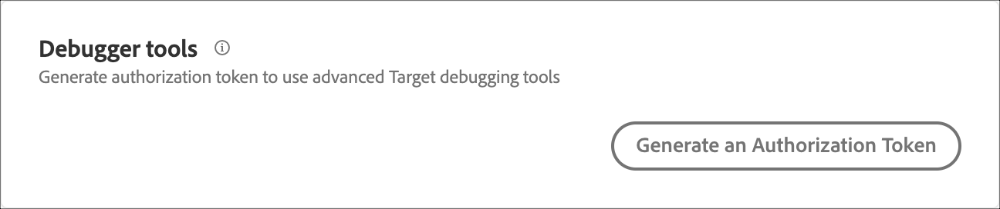

# Implementar o [!DNL Target] sem um gerenciador de tags

Informações sobre como implementar o [!DNL Adobe Target] sem usar um gerenciador de tags ou tags no [!DNL Adobe Experience Platform].

>[!NOTE]
>
>As marcas no [Adobe Experience Platform](/help/dev/implement/client-side/atjs/how-to-deployatjs/implement-target-using-adobe-launch.md) são o método preferido para implementar o [!DNL Target] e a biblioteca at.js. As informações a seguir não são aplicáveis ao usar marcas em [!DNL Adobe Experience Platform] para implementar [!DNL Target].

Para acessar a página de Implementação, clique em **[!UICONTROL Administration]** > **[!UICONTROL Implementation]**.

Você pode especificar as seguintes configurações nesta página:

* Detalhes da conta
* Métodos de implementação
* API de perfil
* Ferramentas de depuração
* Privacidade

>[!NOTE]
>
>Você pode substituir as configurações na biblioteca at.js, em vez de configurá-las na interface do usuário do [!DNL Target] Standard/Premium ou usar APIs REST. Para obter mais informações, consulte [targetGlobalSettings()](/help/dev/implement/client-side/atjs/atjs-functions/targetglobalsettings.md).

## Detalhes da conta

Você pode visualizar os seguintes detalhes da conta. Estas configurações não podem ser alteradas.

| Configuração | Descrição |
| --- | --- |
| [!UICONTROL Client Code] | O código do cliente é uma sequência específica do cliente de caracteres frequentemente necessários ao usar as APIs [!DNL Target]. |
| [!UICONTROL IMS Organization ID] | Essa ID vincula sua implementação à sua conta da Adobe Experience Cloud. |
| [!UICONTROL On-Device Decisioning] | Para ativar a tomada de decisão no dispositivo, deslize o botão para a posição &quot;ligado&quot;.<p>A decisão no dispositivo permite armazenar em cache as campanhas A/B e de Direcionamento de experiência (XT) no servidor e executar a decisão na memória com latência próxima a zero. Para obter mais informações, consulte [Introdução à decisão no dispositivo](../../../server-side/sdk-guides/on-device-decisioning/overview.md). |
| [!UICONTROL Include all existing on-device decisioning qualified activities in the artifact] | (Condicional) Essa opção será exibida se você ativar a decisão no dispositivo.<p>Deslize o botão para a posição &quot;ligado&quot; se desejar que todas as atividades [!DNL Target] ativas qualificadas para decisões no dispositivo sejam incluídas automaticamente no artefato.<p>Deixar essa opção desativada significa que você deve recriar e ativar atividades de decisão no dispositivo para que elas sejam incluídas no artefato de regras gerado. |

## Métodos de implementação

As seguintes configurações podem ser definidas no painel Métodos de implementação:

### Configurações globais

>[!NOTE]
>
>Estas configurações são aplicadas a todas as [!DNL Target] bibliotecas .js. Depois de executar as alterações na seção Métodos de implementação, você deve baixar a biblioteca e atualizá-la na implementação.

| Configuração | Descrição |
| --- | --- |
| [!UICONTROL Page load enabled (Auto-create global mbox)] | Selecione se a chamada mbox global no arquivo at.js deve ser acionada automaticamente em cada carregamento de página. |
| [!UICONTROL Global mbox] | Selecione um nome para a mbox global. Como padrão, esse nome é target-global-mbox.<p>Caracteres especiais, incluindo o sinal gráfico (&amp;), podem ser usados em nomes de mbox com a at.js. |
| [!UICONTROL Timeout (seconds)] | Se o [!DNL Target] não responder ao conteúdo no período definido, o tempo limite da chamada do servidor acaba e o conteúdo padrão é exibido. Ainda há tentativas de chamadas adicionais durante a sessão do visitante. O limite padrão é de 5 segundos.<p>A biblioteca at.js usa a configuração de tempo limite em `XMLHttpRequest`. O tempo limite começa quando a solicitação é acionada e para quando [!DNL Target] recebe uma resposta do servidor. Para obter mais informações, consulte [XMLHttpRequest.timeout](https://developer.mozilla.org/en-US/docs/Web/API/XMLHttpRequest/timeout) no Mozilla Developer Network.<p>Se o tempo limite especificado ocorrer antes de receber uma resposta, o conteúdo padrão é mostrado e o visitante pode ser contabilizado como um participante em uma atividade, pois toda a coleta de dados acontece na borda [!DNL Target]. Se a solicitação alcançar a borda [!DNL Target], o visitante será contado.<p>Leve em consideração o seguinte ao configurar o tempo limite:<ul><li>Se o valor for muito baixo, os usuários podem visualizar o conteúdo padrão na maioria das vezes, embora o visitante possa ser contabilizado como participante na atividade.</li><li>Se o valor for muito alto, os visitantes podem ver regiões em branco na sua página da Web, ou páginas em branco se você ocultar o corpo por períodos prolongados.</li></ul>Para obter uma compreensão melhor dos tempos de resposta do mbox, olhe a guia Rede nas Ferramentas de desenvolvedor do navegador. Você também pode usar ferramentas de monitoramento de desempenho na Web de terceiros, como Catchpoint.<p>**Observação**: a configuração [visitorApiTimeout](/help/dev/implement/client-side/atjs/atjs-functions/targetglobalsettings.md#visitorapitimeout) garante que [!DNL Target] não espere a resposta da API do visitante por muito tempo. Essa configuração e a configuração de Tempo limite para at.js descrita aqui não são conflitantes. |
| [!UICONTROL Profile Lifetime] | Essa configuração determina a duração de armazenamento do perfil do visitante. Por padrão, os perfis são armazenados por duas semanas. Essa configuração pode ser aumentada para até 90 dias.<p>Para alterar a configuração Tempo de Vida do Perfil, contate o [Atendimento ao Cliente](https://experienceleague.adobe.com/docs/target/using/cmp-resources-and-contact-information.html#reference_ACA3391A00EF467B87930A450050077C). |

### Principal método de implementação

>[!NOTE]
>
>[!DNL Adobe Target] dá suporte a at.js 1.*x* e at.js 2.*x*. Atualize para a atualização mais recente de qualquer versão principal do at.js para garantir que você esteja executando uma versão compatível.

Para baixar a versão desejada do at.js, clique no botão **Baixar** apropriado.

Para editar a configuração do at.js, clique em **[!UICONTROL Edit]** ao lado da versão do at.js desejada.

>[!WARNING]
>
>Antes de alterar essas configurações padrão, consulte o [Atendimento ao cliente](https://experienceleague.adobe.com/docs/target/using/cmp-resources-and-contact-information.html#reference_ACA3391A00EF467B87930A450050077C) para não afetar a implementação atual.

Além das configurações explicadas acima, as seguintes configurações específicas da at.js também estão disponíveis:

| Configuração | Descrição |
|--- |--- |
| Domínio cruzado | Para at.js v1.*x*, especifique se os recursos entre domínios são `disabled` (navegadores definem cookies somente no seu domínio (cookies próprios)), `x only` (navegadores definem cookies somente no domínio do Target), ou ambos, selecionando `enabled` (navegadores definem cookies próprios e de terceiros). Para at.js v2.10 e posterior, especifique se os recursos entre domínios são `enabled` (os navegadores definem cookies próprios e de terceiros) ou `disabled` (os navegadores não definem cookies de terceiros). |
| Cabeçalho de biblioteca personalizado | Adicione qualquer JavaScript personalizado para incluir na parte superior da biblioteca. |
| Rodapé de biblioteca personalizado | Adicione qualquer JavaScript personalizado para incluir na parte inferior da biblioteca. |

### API de perfil

Ative ou desative a autenticação para atualizações em lote pela API e gere um token de autenticação de perfil.

Para obter mais informações, consulte [Configurações da API de perfil](/help/dev/before-implement/methods-to-get-data-into-target/profile-api-settings.md).

### Ferramentas de depuração

Gerar um token de autorização para usar as ferramentas de depuração [!DNL Target] avançadas. Clique em **[!UICONTROL Generate New Authentication Token]**.



### Privacidade

Essas configurações permitem que você use o [!DNL Target] em conformidade com as leis de privacidade de dados aplicáveis.

Escolha a configuração desejada na lista suspensa Ofuscar endereço IP do visitante:

* Ofuscação do último octeto
* Ofuscação de IP inteiro
* None

Para obter mais informações, consulte [Privacidade](/help/dev/before-implement/privacy/privacy.md).

>[!NOTE]
>
>A opção Suporte a navegador herdado estava disponível na at.js versão 0.9.3 e posteriores. Essa opção foi removida na at.js versão 0.9.4. Para obter uma lista de navegadores suportados at.js, consulte [Navegadores suportados](/help/dev/before-implement/supported-browsers.md)<p>Os navegadores herdados são navegadores antigos que não suportam completamente CORS (Cross Origin Resource Sharing). Esses navegadores incluem: Internet Explorer em versão anterior a 11 e Safari versões 6 e anteriores. Se o Suporte a Navegador Herdado estava desabilitado, [!DNL Target] não forneceu conteúdo ou não contou visitantes nos relatórios desses navegadores. Se essa opção estiver ativada, é recomendável garantir a qualidade em navegadores mais antigos para garantir uma boa experiência do cliente.

## Baixar at.js

Instruções para baixar a biblioteca usando a interface [!DNL Target] ou a API de Download.

>[!NOTE]
>
>[Adobe Experience Platform](/help/dev/implement/client-side/atjs/how-to-deployatjs/implement-target-using-adobe-launch.md) é o método preferido para implementar o [!DNL Target] e a biblioteca at.js. As informações a seguir não são aplicáveis ao usar marcas em [!DNL Adobe Experience Platform] para implementar [!DNL Target].
>
>[!DNL Adobe Target] dá suporte a at.js 1.*x* e at.js 2.*x*. Atualize para a atualização mais recente de qualquer versão principal do at.js para garantir que você esteja executando uma versão compatível. Para obter mais informações sobre o que há de novo em cada versão, consulte [Detalhes da versão da at.js](/help/dev/implement/client-side/atjs/target-atjs-versions.md).

### Baixar at.js usando a interface [!DNL Target]

Para baixar a at.js na interface [!DNL Target]:

1. Clique em **[!UICONTROL Administration]** > **[!UICONTROL Implementation]**.
1. Na seção Métodos de implementação, clique no botão **[!UICONTROL Download]** ao lado da versão desejada do at.js.

### Baixar at.js usando a API de download [!DNL Target]

Para baixar a at.js usando a API.

1. Obtenha o seu código de cliente.

   O código de cliente está disponível na parte superior da página **[!UICONTROL Administration]** > **[!UICONTROL Implementation]** da interface [!DNL Target].

1. Obtenha o seu número de administrador.

   Carregue este URL:

   ```
   https://admin.testandtarget.omniture.com/rest/v1/endpoint/<varname>client code</varname>
   ```

   Substitua `client code` com o código de cliente da Etapa 1.

   O resultado do carregamento deste URL deve ser semelhante ao seguinte exemplo:

   ```
   { 
     "api": "https://admin6.testandtarget.omniture.com/admin/rest/v1" 
   }
   ```

   Neste exemplo, &quot;6&quot; é o número do administrador.

1. Baixe a at.js.

   Carregue esse URL com a seguinte estrutura. O carregamento desse URL inicia o download do arquivo at.js personalizado.

   ```
   https://admin<varname>admin number</varname>.testandtarget.omniture.com/admin/rest/v1/libraries/atjs/download?client=<varname>client code</varname>&version=<version number>
   ```

   * Substitua `admin number` pelo seu número de administrador.
   * Substitua `client code` com o código de cliente da Etapa 1.
   * Substitua `version number` pelo número de versão da at.js desejado (por exemplo, 2.2).

>[!WARNING]
>
>A equipe do [!DNL Target] mantém apenas duas versões do at.js—a versão atual e a segunda versão mais recente. Atualize o at.js conforme necessário para garantir que você esteja executando uma versão compatível. Para obter mais informações sobre o que há de novo em cada versão, consulte [Detalhes da versão da at.js](/help/dev/implement/client-side/atjs/target-atjs-versions.md).

## Implementação da at.js

A at.js deve ser implementada no elemento `<head>` de cada página do site.

Uma implementação típica do [!DNL Target] que não usa um gerenciador de tags, como tags na [Adobe Experience Platform](/help/dev/implement/client-side/atjs/how-to-deployatjs/implement-target-using-adobe-launch.md), é semelhante a:

```
<!doctype html> 
<html> 
<head> 
    <meta charset="utf-8"> 
    <title>Title of the Page</title> 
    <!--Preconnect and DNS-Prefetch to improve page load time--> 
    <link rel="preconnect" href="//<client code>.tt.omtrdc.net"> 
    <link rel="dns-prefetch" href="//<client code>.tt.omtrdc.net"> 
    <!--/Preconnect and DNS-Prefetch--> 
    <!--Data Layer to enable rich data collection and targeting--> 
    <script> 
        var digitalData = { 
            "page": { 
                "pageInfo": { 
                    "pageName": "Home" 
                } 
            } 
        }; 
    </script> 
    <!--/Data Layer--> 
    <!-- targetPageParams(), targetPageParamsAll(), Data Providers or targetGlobalSettings() functions to enrich the visitor profile or modify the library settings--> 
    <script> 
        targetPageParams = function() { 
            return { 
                "a": 1, 
                "b": 2, 
                "pageName": digitalData.page.pageInfo.pageName, 
                "profile": { 
                    "age": 26, 
                    "country": { 
                        "city": "San Francisco" 
                    } 
                } 
            }; 
        }; 
    </script> 
    <!--/targetPageParams()--> 
 
    <!--jQuery or other helper libraries should be implemented before at.js if you would like to use their methods in Target--> 
    <script src="jquery-3.3.1.min.js"></script> 
    <!--/jQuery--> 
    <!--Target's JavaScript SDK, at.js--> 
    <script src="at.js"></script> 
    <!--/at.js--> 
</head>
<body> 
    The default content of the page 
</body> 
</html>
```

Considere as informações importantes a seguir:

* O Doctype HTML5 (por exemplo, `<!doctype html>`) deve ser usado. Tipos de documento incompatíveis ou mais antigos podem resultar na incapacidade de [!DNL Target] fazer uma solicitação.
* Pré-conectar e Buscar previamente são opções que podem auxiliar no carregamento mais rápido das páginas da Web. Se você usa essas configurações, substitua `<client code>` pelo seu próprio código de cliente, que pode ser obtido na página **[!UICONTROL Administration]** > **[!UICONTROL Implementation]**.
* Se você tiver uma camada de dados, é ideal definir o máximo dela possível em `<head>` das suas páginas, antes dos carregamentos da at.js. Este posicionamento fornece a capacidade máxima de usar essas informações no [!DNL Target] para personalização.
* As funções especiais [!DNL Target], como `targetPageParams()`, `targetPageParamsAll()`, Provedores de dados e `targetGlobalSettings()` devem ser definidas após a camada de dados e antes dos carregamentos da at.js. Como alternativa, essas funções podem ser salvas na seção Cabeçalho da biblioteca da página Editar configurações da at.js e salvas como parte da própria biblioteca at.js. Para obter mais informações sobre essas funções, consulte [funções da at.js](/help/dev/implement/client-side/atjs/atjs-functions/atjs-functions.md).
* Se você usar as bibliotecas auxiliares do JavaScript, como jQuery, inclua-as antes de [!DNL Target], para que possa usar sua sintaxe e métodos ao criar experiências de [!DNL Target].
* Inclua a at.js no `<head>` das suas páginas.

## Rastrear conversões

A mbox de confirmação de pedido registra detalhes sobre pedidos no seu site e permite a geração de relatórios baseados em receita e pedidos. A mbox de confirmação de pedido também pode impulsionar algoritmos de recomendação, como &quot;Pessoas que compraram o produto x também compraram o produto y&quot;.

>[!NOTE]
>
>Se usuários fazem compras no seu site, a Adobe recomenda implementar uma mbox de confirmação de pedido mesmo se você usar o Analytics for [!DNL Target] (A4T) para seus relatórios.

1. Na página de detalhes do pedido, insira o script da mbox seguindo o modelo abaixo.
1. Substitua as PALAVRAS EM LETRAS MAIÚSCULAS por valores dinâmicos ou estáticos do seu catálogo.

   >[!TIP]
   >
   >Você também pode passar informações de pedido em qualquer mbox (ela não precisa ser chamada `orderConfirmPage`). Também é possível passar informações de pedidos em várias mboxes dentro da mesma campanha.

   ```
   <script type="text/javascript"> 
   adobe.target.trackEvent({ 
       "mbox": "orderConfirmPage", 
       "params":{  
           "orderId": "ORDER ID FROM YOUR ORDER PAGE",  
           "orderTotal": "ORDER TOTAL FROM YOUR ORDER PAGE",  
           "productPurchasedId": "PRODUCT ID FROM YOUR ORDER PAGE, PRODUCT ID2, PRODUCT ID3"  
       } 
   }); 
   </script> 
   ```

>[!NOTE]
>
>Na mbox Confirmação de pedido, use delimitação por vírgulas para separar várias IDs de produto.

A mbox de confirmação de pedido utiliza os seguintes parâmetros:

| Parâmetro | Descrição |
|--- |--- |
| orderId | Valor único para identificar um pedido de contagem de conversão.<p>O `orderId` deve ser exclusivo. Pedidos duplicados são ignorados em relatórios. |
| orderTotal | Valor monetário para a compra.<p>Não transmita o símbolo de moeda. Use um ponto (não uma vírgula) para indicar valores decimais. |
| productPurchasedId (Opcional) | Lista separada por vírgula de IDs de produtos comprados no pedido.<p>Essas IDs de produto são exibidas no relatório de auditoria para oferecer suporte às análises de relatório adicionais. |
