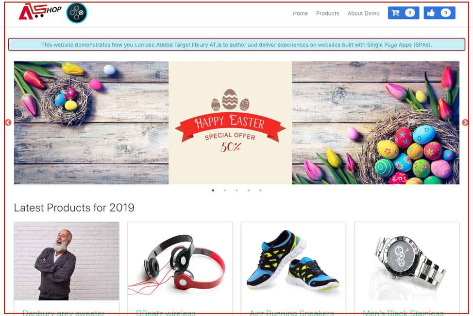

# Implementação do aplicativo de página única

Os sites tradicionais funcionavam em modelos de navegação de &quot;página para página&quot;, conhecidos como Aplicativos de várias páginas, em que os designs de site eram totalmente combinados com URLs e as transições de uma página da Web para outra exigiam um carregamento de página. Aplicativos da Web modernos, como Aplicativos de página única (SPAs), em vez disso adotam um modelo que impulsiona o uso rápido da renderização da interface do usuário do navegador, que geralmente é independente dos recarregamentos de página. Essas experiências são frequentemente acionadas por interações do cliente, como rolagens, cliques e movimentos de cursor. À medida que os paradigmas da Web moderna evoluíram, a relevância dos eventos genéricos tradicionais, como o carregamento de página, para implantar a personalização e a experimentação não funciona mais.


A at.js 2.x fornece recursos avançados para a sua empresa personalizar tecnologias de próxima geração no lado do cliente. O foco dessa versão é melhorar o at.js para fazer interações harmoniosas com SPAs.

Estes são alguns benefícios do uso da at.js 2.x que não estão disponíveis nas versões anteriores:

* Capacidade de armazenar em cache todas as ofertas no carregamento da página para reduzir várias chamadas do servidor a uma única chamada de servidor.
* Melhore bastante as experiências dos usuários finais em seu site, pois as ofertas são mostradas imediatamente pelo cache, sem o tempo de atraso introduzido pelas chamadas do servidor tradicional.
* Uma linha de código simples e uma configuração de desenvolvedor única para permitir que seus profissionais de marketing criem e executem atividades A/B e Direcionamento de experiência (XT) por meio do VEC em seu SPA.

## [!DNL Adobe Target] Exibições e Aplicativos de Página Única

O VEC do [!DNL Adobe Target] para SPA aproveita um novo conceito chamado Exibições: um grupo lógico de elementos visuais que juntos constituem uma experiência de SPA. Por isso, uma SPA pode ser considerada como uma transição entre exibições, em vez das URLs, com base nas interações do usuário. Uma Exibição geralmente pode representar um site inteiro ou elementos visuais agrupados dentro de um site.

Para explicar mais sobre o que são Exibições, vamos navegar neste site de comércio eletrônico online hipotético implementado no React e explorar alguns exemplos de Exibições. Clique nos links abaixo para abrir este site em uma nova aba do navegador.

**Link: [Site Residencial](https://target.enablementadobe.com/react/demo/#/)**



Quando navegamos para o site inicial, podemos visualizar imediatamente uma imagem principal que promove uma venda de Páscoa e os produtos mais recentes que estão sendo vendidos no site. Nesse caso, uma Exibição pode ser definida como todo o site inicial. Isso é útil para observar como expandiremos mais isso na seção Implementação de [!DNL Adobe Target] Exibições abaixo.

**Link: [Site do Produto](https://target.enablementadobe.com/react/demo/#/products)**


À medida que nos interessamos mais pelos produtos que a empresa está vendendo, decidimos clicar no link Produtos. Assim como o site inicial, a totalidade do site de produtos pode ser definida como uma Exibição. É possível nomear os &quot;produtos&quot; dessa exibição como o nome do caminho em `https://target.enablementadobe.com/react/demo/#/products)`.


No início desta seção, definimos Exibições como o site inteiro ou até mesmo um grupo de elementos visuais no site. Como mostrado acima, os quatro produtos mostrados no site também podem ser agrupados e considerados como uma Exibição. Se quisermos nomear essa Exibição, podemos chamá-la de &quot;Produtos&quot;.


Decidimos clicar no botão Carregar mais para explorar mais produtos no site. Nesse caso, o URL do site não é alterado. Entretanto, uma Exibição aqui pode representar apenas a segunda linha de produtos mostrados acima. O nome da Exibição pode ser chamado de &quot;PRODUCTS-PAGE-2&quot;.

**Link: [Check-out](https://target.enablementadobe.com/react/demo/#/checkout)**


Como curtimos alguns produtos mostrados no site, decidimos comprar alguns deles. Agora, no site de checkout, recebemos algumas opções para escolher a entrega normal ou a expressa. Como uma Exibição pode ser qualquer grupo de elementos visuais em um site, podemos nomeá-la como &quot;Exibir preferências de entrega&quot;.

Além disso, o conceito de Exibições pode ser estendido muito além disso. Se os profissionais de marketing quiserem personalizar o conteúdo no site, dependendo da preferência de entrega selecionada, é possível criar uma exibição para cada preferência de entrega. Nesse caso, quando selecionamos Entrega normal, a Exibição pode se chamar &quot;Entrega normal&quot;. Se a opção Express Delivery estiver selecionada, a Exibição pode se chamar &quot;Entrega expressa&quot;.

Agora, os profissionais de marketing podem executar um teste A/B para ver se a alteração da cor de azul para vermelho, quando a opção Entrega expressa é selecionada, pode aumentar as conversões, em vez de manter a cor do botão azul para ambas as opções de entrega.

## Implementando [!DNL Adobe Target] Exibições

Agora que cobrimos o que são Exibições do [!DNL Adobe Target], podemos aproveitar esse conceito no [!DNL Target] para que os profissionais de marketing executem testes A/B e XT no SPA por meio do VEC. Isso exigirá uma configuração de desenvolvedor única. Vamos analisar as etapas de configuração.

1. Instale o at.js 2.*x*.

   Primeiro, precisamos instalar o at.js 2.*x*. Essa versão da at.js foi desenvolvida com o SPA em mente. As versões anteriores da at.js não oferecem suporte a [!DNL Adobe Target] Exibições e ao VEC para SPA.

   Baixe o at.js 2.*x* por meio da interface do usuário [!DNL Adobe Target] localizada em **[!UICONTROL Administration]** > **[!UICONTROL Implementation]**. at.js 2.*x* também pode ser implantado por meio de marcas em [!DNL Adobe Experience Platform].

1. Implemente o at.js 2.Função *x*, `[triggerView()](/help/dev/implement/client-side/atjs/atjs-functions/adobe-target-triggerview-atjs-2.md)` em seus sites.

   Depois de definir as Exibições do SPA onde você deseja executar um teste A/B ou XT, implemente o at.js 2.Função *x* `triggerView()` com os Modos de Exibição passados como parâmetro. Isso permite que os profissionais de marketing usem o VEC para projetar e executar os testes A/B e XT para essas Exibições definidas. Se a função `triggerView()` não estiver definida para essas Exibições, o VEC não detectará as Exibições e, portanto, os profissionais de marketing não poderão usar o VEC para projetar e executar testes A/B.

   >[!NOTE]
   >
   >Para suporte de exibição no at.js, [viewsEnabled](/help/dev/implement/client-side/atjs/atjs-functions/targetglobalsettings.md#viewsenbabled) deve ser definido como verdadeiro, caso contrário, todas as funcionalidades de exibição serão desabilitadas.

   **`adobe.target.triggerView(viewName, options)`**

   | Parâmetro | Tipo | Obrigatório? | Validação | Descrição |
   | --- | --- | --- | --- | --- |
   | viewName | String | Sim | 1. Sem espaços à direita.<br />2. Não pode estar em branco.<br />3. O nome da exibição deve ser exclusivo para todas as páginas.<br />4. **Aviso**: O nome da Exibição não deve iniciar ou terminar com &#39;`/`&#39;. Isso ocorre porque o cliente normalmente extrai o nome da Exibição do caminho do URL. Para nós, &quot;home&quot; e &quot;`/home`&quot; são diferentes.<br />5. **Aviso**: A mesma exibição não deve ser acionada consecutivamente várias vezes com a opção `{page: true}`. | Transmita qualquer nome como um tipo de sequência de caracteres que você deseja representar sua exibição. Esse nome de exibição é mostrado no painel **[!UICONTROL Modifications]** do VEC para que os profissionais de marketing criem ações e executem suas atividades A/B e XT. |
   | opções | Objeto | Não |  |  |
   | opções > página | Booleano | Não |  | **TRUE**: O valor padrão da página é true. Quando `page=true`, as notificações serão enviadas aos servidores Edge para aumentar a contagem de impressões.<br />**FALSE**: quando `page=false`, as notificações não serão enviadas para aumentar a contagem de impressões. Isso deve ser usado quando você deseja apenas renderizar novamente um componente em uma página com uma oferta. |

   Agora vamos analisar alguns exemplos de casos de uso de como invocar a função `triggerView()` no React para nosso SPA hipotético de comércio eletrônico:

   **Link: [Site Residencial](https://target.enablementadobe.com/react/demo/#/)**

   

   Como profissionais de marketing, se desejarmos executar testes A/B em todo o site inicial, talvez queiramos nomear a exibição &quot;inicial&quot;:

```
 function targetView() {
   var viewName = window.location.hash; // or use window.location.pathName if router works on path and not hash

   viewName = viewName || 'home'; // view name cannot be empty

   // Sanitize viewName to get rid of any trailing symbols derived from URL
   if (viewName.startsWith('#') || viewName.startsWith('/')) {
     viewName = viewName.substr(1);
   }

   // Validate if the Target Libraries are available on your website
   if (typeof adobe != 'undefined' && adobe.target && typeof adobe.target.triggerView === 'function') {
     adobe.target.triggerView(viewName);
   }
 }

 // react router v4
 const history = syncHistoryWithStore(createBrowserHistory(), store);
 history.listen(targetView);

 // react router v3
 <Router history={hashHistory} onUpdate={targetView} >
```

**Link: [Site de Produtos](https://target.enablementadobe.com/react/demo/#/products)**

Agora, vejamos um exemplo que é um pouco mais complicado. Digamos que, como profissionais de marketing, queremos personalizar a segunda linha dos produtos alterando a cor do rótulo de &quot;Preço&quot; para vermelho, depois que um usuário clicou no botão Carregar mais.


```
 function targetView(viewName) {
   // Validate if the Target Libraries are available on your website
   if (typeof adobe != 'undefined' && adobe.target && typeof adobe.target.triggerView === 'function') {
     adobe.target.triggerView(viewName);
   }
 }

 class Products extends Component {
   render() {
     return (
       <button type="button" onClick={this.handleLoadMoreClicked}>Load more</button>
     );
   }

   handleLoadMoreClicked() {
     var page = this.state.page + 1; // assuming page number is derived from component's state
     this.setState({page: page});
     targetView('PRODUCTS-PAGE-' + page);
   }
 }
```

**Link: [Check-out](https://target.enablementadobe.com/react/demo/#/checkout)**


Se os profissionais de marketing quiserem personalizar o conteúdo no site, dependendo da preferência de entrega selecionada, é possível criar uma exibição para cada preferência de entrega. Nesse caso, quando selecionamos Entrega normal, a Exibição pode se chamar &quot;Entrega normal&quot;. Se a opção Express Delivery estiver selecionada, a Exibição pode se chamar &quot;Entrega expressa&quot;.

Agora, os profissionais de marketing podem executar um teste A/B para ver se a alteração da cor de azul para vermelho quando a opção Entrega expressa está selecionada pode aumentar as conversões em vez de manter a cor do botão azul para ambas as opções de entrega.

```
 function targetView(viewName) {
   // Validate if the Target Libraries are available on your website
   if (typeof adobe != 'undefined' && adobe.target && typeof adobe.target.triggerView === 'function') {
     adobe.target.triggerView(viewName);
   }
 }

 class Checkout extends Component {
   render() {
     return (
       <div onChange={this.onDeliveryPreferenceChanged}>
         <label>
           <input type="radio" id="normal" name="deliveryPreference" value={"Normal Delivery"} defaultChecked={true}/>
           <span> Normal Delivery (7-10 business days)</span>
         </label>

         <label>
           <input type="radio" id="express" name="deliveryPreference" value={"Express Delivery"}/>
           <span> Express Delivery* (2-3 business days)</span>
         </label>
       </div>
     );
   }
   onDeliveryPreferenceChanged(evt) {
     var selectedPreferenceValue = evt.target.value;
     targetView(selectedPreferenceValue);
   }
 }
```

## diagramas de sistema da at.js 2.x

Os diagramas a seguir ajudam a entender o fluxo de trabalho da at.js 2.x com Exibições e como isso melhora a integração de SPA. Para obter uma mais detalhes sobre os conceitos usados na Noções básicas sobre o funcionamento da at.js 2.x, consulte [Implementação de aplicativos de página única](/help/dev/implement/client-side/atjs/how-to-deployatjs/target-atjs-single-page-application.md).


| Etapa | Detalhes |
| --- | --- |
| 1 | A chamada retorna a ID de Experience Cloud se o usuário estiver autenticado; outra chamada sincroniza a ID do cliente. |
| 2 | A biblioteca at.js é carregada de modo síncrono e oculta o corpo do documento.<br />O at.js também pode ser carregado de forma assíncrona com uma opção que oculta previamente o trecho implementado na página. |
| 3 | Uma solicitação de carregamento de página é feita, incluindo todos os parâmetros configurados (MCID, SDID e ID do cliente). |
| 4 | Os scripts de perfil executam e, em seguida, fazem o feed na Loja do perfil. A Loja solicita que os públicos-alvos qualificados da Biblioteca de público-alvos (por exemplo, públicos alvos compartilhados do Adobe Analytics, Gerenciamento de público-alvo etc.).<br />Os atributos do cliente são enviados à Loja de perfis em um processo em lote. |
| 5 | Com base nos parâmetros de solicitação de URL e dados de perfil, [!DNL Target] decide quais atividades e experiências retornarão ao visitante para a página atual e para as exibições futuras. |
| 6 | O conteúdo direcionado é enviado de volta para a página, incluindo, opcionalmente, valores de perfil para personalização adicional.<br />O conteúdo direcionado na página atual é revelado o mais rápido possível sem cintilação do conteúdo padrão.<br />Conteúdo direcionado para exibições que são mostradas como resultado das ações do usuário em um SPA, que é armazenado em cache no navegador para que possa ser aplicado instantaneamente, sem uma chamada de servidor adicional, quando as exibições forem acionadas `triggerView()`. |
| 7 | Os dados do Analytics são enviados ao servidores de Coleção de dados. |
| 8 | Os dados de destino correspondem aos dados de [!DNL Analytics] por meio da SDID e são processados no armazenamento de relatórios [!DNL Analytics].<br />Os dados do Analytics podem ser exibidos no [!DNL Analytics] e no [!DNL Target] via [!DNL Analytics] para os relatórios do [!DNL Target] (A4T). |

Agora, onde quer `triggerView()` que seja implementada em seu SPA, as Exibições e as ações são recuperadas do cache e mostradas ao usuário, sem uma chamada de servidor. `triggerView()` também faz uma solicitação de notificações ao [!DNL Target] backend para aumentar e registrar contagens de impressão.


| Etapa | Detalhes |
| --- | --- |
| 1 | `triggerView()` é chamado no SPA para renderizar a Exibição e aplicar ações para modificar elementos visuais. |
| 2 | O conteúdo direcionado para a exibição é lido do cache. |
| 3 | O conteúdo direcionado é revelado o mais rápido possível sem oscilação do conteúdo padrão. |
| 4 | A solicitação de notificação é enviada para a [!DNL Target] Loja de perfil para contar o visitante nas métricas de atividade e incremento. |
| 5 | Os dados do Analytics são enviados aos Servidores de coleta de dados. |
| 6 | Os dados de destino são correspondidos aos dados de [!DNL Analytics] pela SDID e processados no armazenamento de relatórios [!DNL Analytics]. Os dados do [!DNL Analytics] podem ser exibidos em [!DNL Analytics] e [!DNL Target] pelos relatórios do A4T. |

## Aplicativo de página única no Visual Experience Composer

Após concluir a instalação da at.js 2.x e adicionar `triggerView()` ao seu site, use o VEC para executar atividades A/B e XT. Para obter mais informações, consulte [Aplicativo de página única (SPA) Visual Experience Composer](https://experienceleague.adobe.com/docs/target/using/experiences/spa-visual-experience-composer.html?lang=pt-BR).

>[!NOTE]
>
>O VEC for SPAs é, na verdade, o mesmo VEC que você usa nas páginas da Web regulares, mas com alguns recursos adicionais disponíveis ao abrir um aplicativo de página única com implementação de `triggerView()`.

## Use o TriggerView para garantir que o A4T funcione corretamente com at.js 2.x e SPA

Para garantir que o [Analytics for Target](https://experienceleague.adobe.com/docs/target/using/integrate/a4t/a4t.html?lang=pt-BR) (A4T) funcione corretamente com a at.js 2.x, certifique-se de enviar a mesma SDID na solicitação [!DNL Target] e na solicitação [!DNL Analytics].

Como práticas recomendadas relacionadas a SPAs:

* Use eventos personalizados para notificar se algo interessante acontecer no aplicativo
* Acione um evento personalizado antes que a exibição inicie a renderização
* Acione um evento personalizado quando a exibição terminar a renderização

A at.js 2.x adicionou uma nova função [triggerView()](/help/dev/implement/client-side/atjs/atjs-functions/adobe-target-triggerview-atjs-2.md) de API. Você deve usar `triggerView()` para notificar à at.js que uma exibição iniciará a renderização.

Veja um exemplo de como combinar eventos personalizados, a at.js 2.x e o Analytics. Esse exemplo assume que a página HTML contém a API de visitante, a at.js 2.x e o AppMeasurement.

Vamos supor que os seguintes eventos personalizados existem:

* `at-view-start` - Quando a exibição inicia a renderização
* `at-view-end` - Quando a exibição termina a renderização

Para certificar-se de que o A4T funciona com a at.js 2.x,

O manipulador de início da exibição deve ser semelhante ao seguinte:

```jsx {line-numbers="true"}
document.addEventListener("at-view-start", function(e) {
  var visitor = Visitor.getInstance("<your Adobe Org ID>");
  
  visitor.resetState();
  adobe.target.triggerView("<view name>");
});
```

O manipulador de término da exibição deve ser semelhante ao seguinte:

```jsx {line-numbers="true"}
document.addEventListener("at-view-end", function(e) {
  // s - is the AppMeasurement tracker object
  s.t();
});
```

>[!NOTE]
>
>Você deve acionar os eventos `at-view-start` e `at-view-end`. Esses eventos não fazem parte dos eventos personalizados da at.js.

Embora esses exemplos usem código JavaScript, tudo isso pode ser simplificado se você estiver usando um gerenciador de tags, como tags na [Adobe Experience Platform](/help/dev/implement/client-side/atjs/how-to-deployatjs/implement-target-using-adobe-launch.md).

Se as etapas anteriores forem seguidas, você terá uma solução A4T robusta para SPAs.

## Práticas recomendadas de implementação

As APIs da at.js 2.x permitem personalizar a implementação do [!DNL Target] de várias maneiras, mas é importante seguir a ordem correta das operações durante esse processo.

As informações a seguir descrevem a ordem de operações que você deve seguir ao carregar um Aplicativo de página única pela primeira vez em um navegador e para qualquer alteração de exibição que ocorra posteriormente.

### Ordem de operação do carregamento inicial da página {#order}

| Etapa  | Ação | Detalhes |
| --- | --- | --- |
| 1 | Carregar JS da VisitorAPI | Essa biblioteca é responsável por atribuir uma ECID ao visitante. Essa ID é consumida posteriormente por outras soluções Adobe na página da Web. |
| 2 | Carregar at.js 2.x | A at.js 2.x carrega todas as APIs necessárias que você usa para implementar solicitações e exibições do [!DNL Target]. |
| 3 | Executar solicitação [!DNL Target] | Se você tiver uma camada de dados, recomendamos carregar dados críticos que sejam necessários para enviar a [!DNL Target] antes de executar a solicitação [!DNL Target]. Isso permite que você use o `targetPageParams` para incluir os dados que deseja usar para direcionamento.<P>Quando `pageLoadEnabled` e `viewsEnabled` estão definidos como verdadeiros em [targetGlobalSettings](/help/dev/implement/client-side/atjs/atjs-functions/targetglobalsettings.md), a at.js solicita automaticamente todas as ofertas do VEC [!DNL Target] para você na etapa 2.<P>Observe que `getOffers` também pode ser usado para obter ofertas de VEC após o carregamento da página. Para fazer isso, verifique se a solicitação inclui `execute>pageLoad` e `prefetch>views` na chamada da API. |
| 4 | Ligar para `triggerView()` | Como a solicitação [!DNL Target] iniciada na Etapa 3 pode retornar experiências para a execução do Carregamento de página e para os Modos de Exibição, verifique se `triggerView()` é chamado depois que a solicitação [!DNL Target] é retornada e conclui a aplicação das ofertas ao cache. Você deve executar essa etapa apenas uma vez por visualização. |
| 5 | Chamar o sinal de exibição de página [!DNL Analytics] | Esse beacon envia a SDID associada às Etapas 3 e 4 para o [!DNL Analytics] para compilação de dados. |
| 6 | Chamada adicional `triggerView({"page": false})` | Essa é uma etapa opcional para estruturas SPA que poderiam renderizar novamente determinados componentes na página sem que ocorresse uma alteração de exibição. Nessas ocasiões, é importante chamar essa API para garantir que as experiências [!DNL Target] sejam reaplicadas depois que a estrutura do SPA renderizar novamente os componentes. Você pode executar essa etapa quantas vezes quiser para garantir que as experiências do [!DNL Target] persistam nos seus modos de exibição SPA. |

### Ordem de operação para alteração de exibição do SPA (sem recarregamento de página inteira)

| Etapa  | Ação | Detalhes |
| --- | --- | --- |
| 1 | Ligar para `visitor.resetState()` | Essa API garante que a SDID seja gerada novamente para a nova visualização à medida que é carregada. |
| 2 | Atualizar cache chamando a API `getOffers()` | Esta é uma etapa opcional a ser realizada se essa alteração de exibição tiver o potencial de qualificar o visitante atual para mais [!DNL Target] atividades ou desqualificá-lo das atividades. Neste ponto, você também pode optar por enviar dados adicionais para [!DNL Target] para habilitar outros recursos de direcionamento. |
| 3 | Ligar para `triggerView()` | Se você executou a Etapa 2, aguarde a solicitação [!DNL Target] e aplique as ofertas ao cache antes de executar esta etapa. Você deve executar essa etapa apenas uma vez por visualização. |
| 4 | Ligar para `triggerView()` | Se você não tiver executado a Etapa 2, poderá executar essa etapa assim que concluir a Etapa 1. Se você executou a Etapa 2 e a Etapa 3, ignore esta etapa. Você deve executar essa etapa apenas uma vez por visualização. |
| 5 | Chamar o sinal de exibição de página [!DNL Analytics] | Esse beacon envia a SDID associada às etapas 2, 3 e 4 para o [!DNL Analytics] para compilação de dados. |
| 6 | Chamada adicional `triggerView({"page": false})` | Essa é uma etapa opcional para estruturas SPA que poderiam renderizar novamente determinados componentes na página sem que ocorresse uma alteração de exibição. Nessas ocasiões, é importante chamar essa API para garantir que as experiências [!DNL Target] sejam reaplicadas depois que a estrutura do SPA renderizar novamente os componentes. Você pode executar essa etapa quantas vezes quiser para garantir que as experiências do [!DNL Target] persistam nos seus modos de exibição SPA. |

## Vídeos de treinamento

Os seguintes vídeos contêm mais informações:

### Noções básicas sobre o funcionamento da at.js 2.x

>[!VIDEO](https://video.tv.adobe.com/v/26250/?quality=12)

Consulte [Noções básicas sobre o funcionamento da at.js 2.x](https://experienceleague.adobe.com/docs/target-learn/tutorials/implementation/understanding-how-atjs-20-works.html?lang=pt-BR) para obter mais informações.

### Implementar a at.js 2.x em um SPA

>[!VIDEO](https://video.tv.adobe.com/v/34798/?quality=12&captions=por_br)

Consulte [Implementar a at.js 2.x da Adobe Target em um aplicativo de página única (SPA)](https://experienceleague.adobe.com/docs/target-learn/tutorials/experiences/use-the-visual-experience-composer-for-single-page-applications.html?lang=pt-BR) para obter mais informações.

### Uso do VEC para SPA em [!DNL Adobe Target]

>[!VIDEO](https://video.tv.adobe.com/v/34802/?quality=12&captions=por_br)

Consulte [Uso do Visual Experience Composer para Single Page Application (SPA VEC) no Adobe Target](https://experienceleague.adobe.com/docs/target-learn/tutorials/experiences/use-the-visual-experience-composer-for-single-page-applications.html?lang=pt-BR) para obter mais informações.
