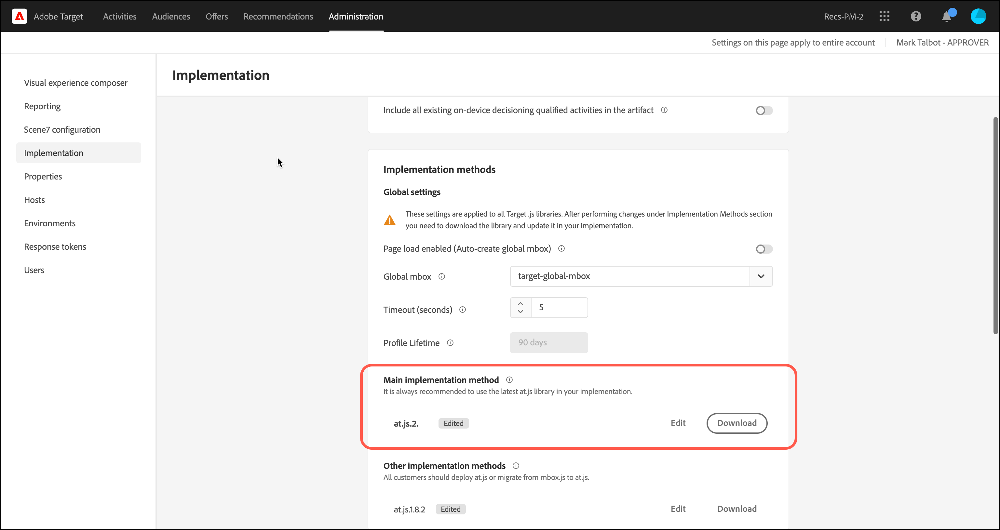

# [!UICONTROL On-device decisioning] para at.js

A partir da versão 2.5.0, a at.js oferece [!UICONTROL on-device decisioning]. O [!UICONTROL On-device decisioning] permite que você armazene em cache suas atividades de [Teste A/B](https://experienceleague.adobe.com/docs/target/using/activities/abtest/test-ab.html?lang=pt-BR) e [Direcionamento de experiência](https://experienceleague.adobe.com/docs/target/using/activities/experience-targeting/experience-target.html?lang=pt-BR) (XT) no navegador para executar a decisão na memória sem uma solicitação de bloqueio de rede para o Edge Network [!DNL Adobe Target].

>[!NOTE]
>
>[!UICONTROL On-device decisioning] está disponível para implementações do lado do cliente e do lado do servidor. Este artigo descreve o [!UICONTROL on-device decisioning] para o lado do cliente. Para obter informações sobre [!UICONTROL on-device decisioning] para o lado do servidor, consulte a documentação de implementação do lado do servidor [aqui](../../../server-side/sdk-guides/on-device-decisioning/overview.md).

O [!DNL Target] também oferece a flexibilidade de fornecer a experiência mais relevante e atualizada de suas atividades de experimentação e personalização orientada por aprendizado de máquina (orientado por aprendizado de máquina) por meio de uma chamada de servidor em tempo real. Em outras palavras, quando o desempenho é mais importante, você pode optar por usar [!UICONTROL on-device decisioning]. No entanto, quando a experiência mais relevante, atualizada e orientada por aprendizado de máquina for necessária, uma chamada de servidor poderá ser feita.

## Quais são os benefícios do [!UICONTROL on-device decisioning]?

Os benefícios do [!UICONTROL on-device decisioning] incluem:

* **Proporcione decisões e experiências extremamente rápidas.** A classificação e a decisão são executadas na memória e no navegador para evitar o bloqueio de solicitações de rede.
* **Aprimorar o desempenho do aplicativo.** Execute experimentos e forneça personalização aos seus clientes e usuários sem comprometer as experiências do usuário final.
* **Melhore A Pontuação De Qualidade Do Site Do Google.** Com as decisões ocorrendo na memória, melhore a pontuação da Qualidade do Site do Google da sua empresa online para torná-la mais visível aos consumidores.
* **Aprenda com a análise em tempo real.** Obtenha insights do desempenho da sua atividade em tempo real através dos relatórios do [Analytics for Target](https://experienceleague.adobe.com/docs/target/using/integrate/a4t/a4t.html?lang=pt-BR) (A4T). O A4T permite que você mude sua estratégia em momentos críticos.

## Recursos compatíveis

O SDK JS do [!DNL Adobe Target] oferece aos clientes flexibilidade para escolher entre desempenho e atualização de dados para decisões. Em outras palavras, se o fornecimento do conteúdo personalizado mais relevante e envolvente por meio do aprendizado de máquina for mais importante para você, uma chamada de servidor em tempo real deverá ser feita. Mas quando o desempenho é mais crítico, uma decisão no dispositivo e na memória deve ser tomada. Para que o [!UICONTROL on-device decisioning] funcione, consulte a lista de recursos compatíveis:

* Tipos de atividades 
* Direcionamento de público
* Método de alocação

Para obter mais informações, consulte [Recursos com suporte para [!UICONTROL on-device decisioning]](/help/dev/implement/client-side/atjs/on-device-decisioning/supported-features.md).

## Como o [!UICONTROL on-device decisioning] funciona?

Quando você implanta e inicializa o at.js com o [!UICONTROL on-device decisioning] ativado, um [artefato de regra](/help/dev/implement/client-side/atjs/on-device-decisioning/rule-artifact.md) que inclui seu [!UICONTROL on-device decisioning] para atividades, públicos-alvo e ativos de A/B e XT é baixado do Akamai CDN mais próximo do seu visitante e armazenado em cache localmente no navegador do visitante. Quando uma solicitação é feita pela at.js para recuperar uma experiência, a decisão sobre qual experiência retornar é tomada na memória, com base nos metadados codificados no artefato de regra em cache.

## Método de decisão

Com [!UICONTROL on-device decisioning], [!DNL Target] introduz uma nova configuração chamada Método de Decisão. A configuração Método de decisão determina como a at.js fornece suas experiências. O Método de decisão tem três valores:

* Somente no lado do servidor
* Somente no dispositivo
* Híbrido

### Somente no lado do servidor

Somente no lado do servidor é o método de decisão padrão definido imediatamente quando a at.js 2.5.0+ é implementada e implantada em suas propriedades da Web.

Usar somente no lado do servidor como configuração padrão significa que todas as decisões são tomadas na rede de borda [!DNL Target], o que envolve uma chamada de servidor de bloqueio. Essa abordagem pode apresentar latência incremental, mas também oferece benefícios significativos, como a capacidade de aplicar os recursos de aprendizado de máquina do [!DNL Target], que incluem as atividades de [Recomendações](https://experienceleague.adobe.com/docs/target/using/recommendations/recommendations.html?lang=pt-BR), [Automated Personalization](https://experienceleague.adobe.com/docs/target/using/activities/automated-personalization/automated-personalization.html?lang=pt-BR) (AP) e [Direcionamento automático](https://experienceleague.adobe.com/docs/target/using/activities/auto-target/auto-target-to-optimize.html?lang=pt-BR).

Além disso, aprimorar suas experiências personalizadas usando o perfil de usuário do [!DNL Target], que é mantido em sessões e canais, pode trazer resultados significativos para sua empresa.

Por fim, somente no lado do servidor permite usar o Adobe Experience Cloud e refinar públicos-alvo que podem ser direcionados por meio de segmentos do Audience Manager e do Adobe Analytics.

O diagrama a seguir ilustra a interação entre seu visitante, o navegador, a at.js 2.5.0+ e a rede Edge [!DNL Adobe Target]. Este diagrama de fluxo captura novos visitantes e visitantes recorrentes.

(Clique na imagem para expandir até a largura total.)

{zoomable="yes"}

A lista a seguir corresponde aos números no diagrama:

| Etapa | Descrição |
| --- | --- |
| 1 | A ID de visitante da Experience Cloud foi recuperada do [Adobe Experience Cloud Identity Service](https://experienceleague.adobe.com/docs/id-service/using/home.html?lang=pt-BR&). |
| 2 | A biblioteca at.js é carregada de modo síncrono e oculta o corpo do documento.<br />   A biblioteca at.js também pode ser carregada de forma assíncrona com uma opção que oculta previamente o trecho implementado na página. |
| 3 | A biblioteca at.js oculta o corpo para evitar cintilação. |
| 4 | É feita uma solicitação de carregamento de página que inclui todos os parâmetros configurados, como (ECID, ID do cliente, Parâmetros personalizados, Perfil do usuário e assim por diante). |
| 5 | Os scripts de perfil executam e, em seguida, fazem o feed na Loja do perfil.<br />A Loja de Perfis solicita públicos qualificados da Biblioteca de Públicos (por exemplo, públicos compartilhados da Adobe Analytics, Adobe Audience Manager e assim por diante).<br />Os atributos do cliente são enviados à Loja de perfis em um processo em lote. |
| 6 | A Loja de perfis é usada para qualificação de público-alvo e classificação para filtrar atividades. |
| 7 | O conteúdo resultante é selecionado depois que a experiência é determinada a partir das atividades [!DNL Target] ativas. |
| 8 | A biblioteca at.js oculta os elementos correspondentes na página que estão associados à experiência que deve ser renderizada. |
| 9 | A biblioteca at.js exibe o corpo da página para que o restante da página possa ser carregado para que o visitante a visualize. |
| 10 | A biblioteca at.js manipula o DOM para renderizar a experiência do Edge Network [!DNL Target]. |
| 11 | A experiência é renderizada para o visitante. |
| 12 | A página da Web inteira é carregada. |
| 13 | Os dados do Analytics são enviados ao servidores de Coleção de dados. |
| 14 | Os dados direcionados correspondem aos dados do Analytics por meio da SDID e são processados no armazenamento de relatórios do Analytics. Em seguida, os dados do Analytics podem ser exibidos no Analytics e no [!DNL Target] pelos relatórios do [!UICONTROL Analytics for Target] (A4T). |

### Somente no dispositivo

Somente no dispositivo é o método de decisão que deve ser definido na at.js 2.5.0+ quando [!UICONTROL on-device decisioning] deve ser usado somente em suas páginas da Web.

O [!UICONTROL On-device decisioning] pode entregar suas experiências e atividades de personalização em uma velocidade extremamente rápida, pois as decisões são tomadas a partir de um artefato de regras em cache que contém todas as suas atividades qualificadas para [!UICONTROL on-device decisioning].

Para saber mais sobre quais atividades se qualificam para [!UICONTROL on-device decisioning], consulte [Recursos com suporte no [!UICONTROL on-device decisioning]](/help/dev/implement/client-side/atjs/on-device-decisioning/supported-features.md).

Esse método de decisão deve ser usado somente se o desempenho for altamente crítico em todas as páginas que exigem decisões do Target. Além disso, lembre-se de que, quando esse método de decisão é selecionado, as atividades do [!DNL Target] que não se qualificam para [!UICONTROL on-device decisioning] não são entregues ou executadas. A biblioteca at.js 2.5.0+ está configurada para procurar somente pelo artefato de regras em cache para tomar decisões.

O diagrama a seguir ilustra a interação entre seu visitante, o navegador, a at.js 2.5.0+ e o Akamai CDN. O Akamai CDN armazena em cache o artefato de regras da primeira visita. Para a primeira visita de página de um novo visitante, o artefato de regras JSON deve ser baixado do Akamai CDN para ser armazenado em cache localmente no navegador do visitante. Após o download do artefato de regras JSON, a decisão é tomada imediatamente, sem uma chamada de rede de bloqueio. O diagrama de fluxo a seguir captura novos visitantes.

(Clique na imagem para expandir até a largura total.)

{zoomable="yes"}

A lista a seguir corresponde aos números no diagrama:

>[!NOTE]
>
>[!DNL Adobe Target] Os servidores de administração qualificam todas as suas atividades qualificadas para [!UICONTROL on-device decisioning], geram o artefato de regras JSON e o propagam para o Akamai CDN. Suas atividades são continuamente monitoradas em busca de atualizações para produzir um novo artefato de regras JSON que será propagado para o Akamai CDN.

| Etapa | Descrição |
| --- | --- |
| 1 | A ID de visitante da Experience Cloud foi recuperada do [Adobe Experience Cloud Identity Service](https://experienceleague.adobe.com/docs/id-service/using/home.html?lang=pt-BR). |
| 2 | A biblioteca at.js é carregada de modo síncrono e oculta o corpo do documento.<br />A biblioteca at.js também pode ser carregada de forma assíncrona com uma opção que oculta previamente o trecho implementado na página. |
| 3 | A biblioteca at.js oculta o corpo para evitar cintilação. |
| 4 | A biblioteca at.js faz uma solicitação para recuperar o artefato de regra JSON do CDN Akamai mais próximo para o visitante. |
| 5 | O Akamai CDN responde com o artefato de regra JSON. |
| 6 | O artefato da regra JSON é armazenado em cache localmente no navegador do visitante. |
| 7 | A biblioteca at.js interpreta o artefato da regra JSON e executa a decisão de recuperar a experiência e oculta os elementos testados. |
| 8 | A biblioteca at.js exibe o corpo da página para que o restante da página possa ser carregado para que o visitante a visualize. |
| 9 | A biblioteca at.js manipula o DOM para renderizar a experiência do artefato de regra JSON em cache. |
| 10 | A experiência é renderizada para o visitante. |
| 11 | A página da Web inteira é carregada. |
| 12 | Os dados do Analytics são enviados para os servidores de Coleção de dados. Os dados direcionados correspondem aos dados do Analytics por meio da SDID e são processados no armazenamento de relatórios do Analytics. Em seguida, os dados do Analytics podem ser exibidos no Analytics e no [!DNL Target] pelos relatórios do [!UICONTROL Analytics for Target] (A4T). |

O diagrama a seguir ilustra a interação entre seu visitante, o navegador, a at.js 2.5.0+ e o artefato de regra JSON em cache para a próxima ocorrência de página ou visita recorrente do visitante. Como o artefato de regras JSON já está armazenado em cache e disponível no navegador, a decisão é tomada imediatamente, sem uma chamada de rede de bloqueio. Este diagrama de fluxo captura a navegação de página subsequente ou os visitantes recorrentes.

(Clique na imagem para expandir até a largura total.)

{zoomable="yes"}

A lista a seguir corresponde aos números no diagrama:

>[!NOTE]
>
>[!DNL Adobe Target] Os servidores de administração qualificam todas as suas atividades qualificadas para [!UICONTROL on-device decisioning], geram o artefato de regras JSON e o propagam para o Akamai CDN. Suas atividades são continuamente monitoradas em busca de atualizações para produzir um novo artefato de regras JSON que será propagado para o Akamai CDN.

| Etapa | Descrição |
| --- | --- |
| 1 | A ID de visitante da Experience Cloud foi recuperada do [Adobe Experience Cloud Identity Service](https://experienceleague.adobe.com/docs/id-service/using/home.html?lang=pt-BR). |
| 2 | A biblioteca at.js é carregada de modo síncrono e oculta o corpo do documento.<br />A biblioteca at.js também pode ser carregada de forma assíncrona com uma opção que oculta previamente o trecho implementado na página. |
| 3 | A biblioteca at.js oculta o corpo para evitar cintilação. |
| 4 | A biblioteca at.js interpreta o artefato da regra JSON e executa a decisão na memória para recuperar a experiência. |
| 5 | Os elementos testados estão ocultos. |
| 6 | A biblioteca at.js exibe o corpo da página para que o restante da página possa ser carregado para que o visitante a visualize. |
| 7 | A biblioteca at.js manipula o DOM para renderizar a experiência do artefato de regra JSON em cache. |
| 8 | A experiência é renderizada para o visitante. |
| 9 | A página da Web inteira é carregada. |
| 10 | Os dados do Analytics são enviados para os servidores de Coleção de dados. Os dados direcionados correspondem aos dados do Analytics por meio da SDID e são processados no armazenamento de relatórios do Analytics. Em seguida, os dados do Analytics podem ser exibidos no Analytics e no [!DNL Target] pelos relatórios do [!UICONTROL Analytics for Target] (A4T). |

### Híbrido

O método de decisão híbrido é o que deve ser definido na at.js 2.5.0+, quando [!UICONTROL on-device decisioning] e as atividades que exigem uma chamada de rede para a rede Edge [!DNL Adobe Target] precisam ser executadas.

Ao gerenciar atividades do [!UICONTROL on-device decisioning] e atividades do lado do servidor, você pode achar complicado e cansativo pensar em como implantar e provisionar o [!DNL Target] em suas páginas. Com o método de decisão híbrido, o [!DNL Target] sabe quando deve fazer uma chamada de servidor para a rede Edge [!DNL Adobe Target], no caso de atividades que exigem execução no lado do servidor, e quando deve apenas executar decisões no dispositivo.

O artefato de regras JSON inclui metadados para informar à at.js se uma mbox tem uma atividade do lado do servidor em execução ou uma atividade [!UICONTROL on-device decisioning]. Esse método de decisão garante que as atividades que você pretende entregar rapidamente sejam realizadas por meio do [!UICONTROL on-device decisioning] e, para atividades que exigem personalização mais avançada orientada por aprendizado de máquina, essas atividades são realizadas por meio da rede Edge [!DNL Adobe Target].

O diagrama a seguir ilustra a interação entre seu visitante, o navegador, a at.js 2.5.0+, o Akamai CDN e a Edge Network [!DNL Adobe Target] para um novo visitante que visita sua página pela primeira vez. O argumento deste diagrama é que o artefato de regras JSON é baixado de forma assíncrona enquanto as decisões são tomadas por meio da rede Edge [!DNL Adobe Target].

Essa abordagem garante que o tamanho do artefato, que pode incluir muitas atividades, não influencie negativamente a latência da decisão. Baixar o artefato de regras JSON de forma síncrona e tomar a decisão posteriormente também pode ter efeitos adversos na latência e pode ser inconsistente. Portanto, o método de decisão híbrido é uma recomendação de prática recomendada para sempre fazer uma chamada do lado do servidor para a decisão de um novo visitante e, como o artefato de regras JSON, é armazenado em cache em paralelo. Para qualquer visita de página subsequente e visita de retorno, as decisões são tomadas a partir do cache e na memória por meio do artefato de regras JSON.

(Clique na imagem para expandir até a largura total.)

{zoomable="yes"}

A lista a seguir corresponde aos números no diagrama:

>[!NOTE]
>
>[!DNL Adobe Target] Os servidores de administração qualificam todas as suas atividades qualificadas para [!UICONTROL on-device decisioning], geram o artefato de regras JSON e o propagam para o Akamai CDN. Suas atividades são continuamente monitoradas em busca de atualizações para produzir um novo artefato de regras JSON que será propagado para o Akamai CDN.

| Etapa | Descrição |
| --- | --- |
| 1 | A ID de visitante da Experience Cloud foi recuperada do [Adobe Experience Cloud Identity Service](https://experienceleague.adobe.com/docs/id-service/using/home.html?lang=pt-BR). |
| 2 | A biblioteca at.js é carregada de modo síncrono e oculta o corpo do documento.<br />A biblioteca at.js também pode ser carregada de forma assíncrona com uma opção que oculta previamente o trecho implementado na página. |
| 3 | A biblioteca at.js oculta o corpo para evitar cintilação. |
| 4 | Uma solicitação de carregamento de página é feita ao Edge Network [!DNL Adobe Target], incluindo todos os parâmetros configurados, como (ECID, ID do cliente, Parâmetros personalizados, Perfil do usuário e assim por diante). |
| 5 | Em paralelo, a at.js faz uma solicitação para recuperar o artefato de regra JSON do CDN do Akamai mais próximo para o visitante. |
| 6 | ([!DNL Adobe Target] Edge Network) Os scripts de perfil executam e, em seguida, fazem o feed no Repositório de Perfis. A Loja de perfis solicita públicos qualificados da Biblioteca de públicos-alvo (por exemplo, públicos-alvo compartilhados da Adobe Analytics, da Adobe Audience Manager e assim por diante). |
| 7 | O Akamai CDN responde com o artefato de regra JSON. |
| 8 | A Loja de perfis é usada para qualificação de público-alvo e classificação para filtrar atividades. |
| 9 | O conteúdo resultante é selecionado depois que a experiência é determinada a partir das atividades [!DNL Target] ativas. |
| 10 | A biblioteca at.js oculta os elementos correspondentes na página que estão associados à experiência que deve ser renderizada. |
| 11 | A biblioteca at.js exibe o corpo da página para que o restante da página possa ser carregado para que o visitante a visualize. |
| 12 | A biblioteca at.js manipula o DOM para renderizar a experiência do Edge Network [!DNL Target]. |
| 13 | A experiência é renderizada para o visitante. |
| 14 | A página da Web inteira é carregada. |
| 15 | Os dados do Analytics são enviados para os servidores de Coleção de dados. Os dados direcionados correspondem aos dados do Analytics por meio da SDID e são processados no armazenamento de relatórios do Analytics. Em seguida, os dados do Analytics podem ser exibidos no Analytics e no [!DNL Target] pelos relatórios do [!UICONTROL Analytics for Target] (A4T). |

O diagrama a seguir ilustra a interação entre seu visitante, o navegador, a at.js 2.5.0+ e o artefato de regras JSON em cache para uma navegação de página subsequente ou uma visita de retorno. Neste diagrama, concentre-se somente no caso de uso em que uma decisão no dispositivo é tomada para a navegação da página subsequente ou para a visita de retorno. Lembre-se de que, dependendo de quais atividades estão ativas para determinadas páginas, uma chamada do lado do servidor pode ser feita para executar decisões do lado do servidor.

(Clique na imagem para expandir até a largura total.)

{zoomable="yes"}

A lista a seguir corresponde aos números no diagrama:

>[!NOTE]
>
>[!DNL Adobe Target] Os servidores de administração qualificam todas as suas atividades qualificadas para [!UICONTROL on-device decisioning], geram o artefato de regras JSON e o propagam para o Akamai CDN. Suas atividades são continuamente monitoradas em busca de atualizações para produzir um novo artefato de regras JSON que será propagado para o Akamai CDN.

| Etapa | Descrição |
| --- | --- |
| 1 | A ID de visitante da Experience Cloud foi recuperada do [Adobe Experience Cloud Identity Service](https://experienceleague.adobe.com/docs/id-service/using/home.html?lang=pt-BR). |
| 2 | A biblioteca at.js é carregada de modo síncrono e oculta o corpo do documento.<br />A biblioteca at.js também pode ser carregada de forma assíncrona com uma opção que oculta previamente o trecho implementado na página. |
| 3 | A biblioteca at.js oculta o corpo para evitar cintilação. |
| 4 | Uma solicitação é feita para recuperar uma experiência. |
| 5 | A biblioteca at.js confirma que o artefato de regra JSON já foi armazenado em cache e executa a decisão na memória para recuperar a experiência. |
| 6 | Os elementos testados estão ocultos. |
| 7 | A biblioteca at.js exibe o corpo da página para que o restante da página possa ser carregado para que o visitante a visualize. |
| 8 | A biblioteca at.js manipula o DOM para renderizar a experiência do artefato de regra JSON em cache. |
| 9 | A experiência é renderizada para o visitante. |
| 10 | A página da Web inteira é carregada. |
| 11 | Os dados do Analytics são enviados para os servidores de Coleção de dados. Os dados direcionados correspondem aos dados do Analytics por meio da SDID e são processados no armazenamento de relatórios do Analytics. Em seguida, os dados do Analytics podem ser exibidos no Analytics e no [!DNL Target] pelos relatórios do [!UICONTROL Analytics for Target] (A4T). |

## Como habilitar o [!UICONTROL on-device decisioning]?

O [!UICONTROL On-device decisioning] está disponível para todos os clientes do [!DNL Target] que usam o At.js 2.5.0+.

Para habilitar [!UICONTROL on-device decisioning]:

>[!NOTE]
>
>Você deve ter a [função de usuário](https://experienceleague.adobe.com/docs/target/using/administer/manage-users/user-management.html?lang=pt-BR) de Administrador ou Aprovador para habilitar ou desabilitar a opção On-Device Decisioning.

1. Clique em **[!UICONTROL Administration]** > **[!UICONTROL Implementation]** > **[!UICONTROL Account details]**.
1. Em **[!UICONTROL Account details]**, deslize o botão **[!UICONTROL On-Device Decisioning]** para a posição &quot;ligado&quot;.

   ![[!UICONTROL On-device decisioning] alternância](assets/on-device-decisioning-toggle.png)

   A opção &quot;Incluir todas as atividades qualificadas [!UICONTROL on-device decisioning] existentes no artefato&quot; será exibida se você habilitar [!UICONTROL on-device decisioning].
1. (Condicional) Deslize o botão de alternância para a posição &quot;ligado&quot; se desejar que todas as suas atividades [!DNL Target] ativas qualificadas para [!UICONTROL on-device decisioning] sejam incluídas automaticamente no artefato.

   Deixar essa opção desativada significa que você deve recriar e ativar quaisquer atividades do [!UICONTROL on-device decisioning] para que elas sejam incluídas no artefato de regras gerado. Em outras palavras, qualquer atividade no estado ativo antes de ativar o botão Decisão no dispositivo não é incluída no artefato de regras.

Depois de habilitar a opção Decisão no Dispositivo, o [!DNL Target] começa a gerar e propagar [artefatos de regras](/help/dev/implement/client-side/atjs/on-device-decisioning/rule-artifact.md) para o seu cliente.

>[!WARNING]
>
>Habilite o botão de alternância antes de inicializar o SDK [!DNL Adobe Target] para usar o [!UICONTROL on-device decisioning]. Os artefatos de regra precisam primeiro ser gerados e propagados para os CDNs do Akamai para que [!UICONTROL on-device decisioning] funcionem. A propagação pode levar de cinco a dez minutos para que o primeiro artefato de regra seja gerado e propagado para o CDN do Akamai.

## Como configurar o at.js 2.5.0+ para usar o [!UICONTROL on-device decisioning]?

1. Clique em **[!UICONTROL Administration]** > **[!UICONTROL Implementation]** > **[!UICONTROL Account details]**.
1. Em **[!UICONTROL Implementation Methods]** > **[!UICONTROL Main Implementation Method]**, clique em **[!UICONTROL Edit]** ao lado da sua versão do at.js (deve ser o at.js 2.5.0 ou posterior).

   

   >[!WARNING]
   >
   >Antes de alterar essas configurações padrão, consulte o Atendimento ao cliente para não afetar a implementação atual.

1. Selecione o método de decisão desejado:

   * Somente no lado do servidor
   * Somente no dispositivo
   * Híbrido

   

### Configurações globais

Você pode configurar um Método de decisão padrão para todas as [!DNL Target] decisões. Os vários métodos de decisão são somente no lado do servidor, somente no dispositivo e híbrido. O método de decisão selecionado na interface do usuário [!DNL Target] está configurado em `window.targetGlobalSettings` no campo `decisioningMethod`. Saiba mais sobre o `decisioningMethod` em [targetGlobalSettings()](/help/dev/implement/client-side/atjs/atjs-functions/targetglobalsettings.md#decisioningmethod).

```javascript {line-numbers="true"}
<head> 
    <script type="text/javascript">

        window.targetGlobalSettings = { 
            clientCode: "yourClientCodeHere", 
            imsOrgId: "imsOrgId@AdobeOrg", 
            decisioningMethod: "on-device"

        }; 
    </script>

    <script type="text/javascript" src="at.js"></script> 
</head>
```

### Configuração personalizada

Se você definir o `decisioningMethod` em `window.targetGlobalSettings`, mas quiser substituir o `decisioningMethod` para cada decisão do [!DNL Adobe Target] de acordo com o caso de uso, é possível fazer esse procedimento especificando `decisioningMethod` na chamada [getOffers()](/help/dev/implement/client-side/atjs/atjs-functions/adobe-target-getoffers-atjs-2.md) da At.js2.5.0+.

```javascript {line-numbers="true"}
adobe.target.getOffers({ 

  decisioningMethod:"on-device", 
  request: { 
    execute: { 
      mboxes: [ 
        { 
          index: 0, 
          name: "homepage" 
        } 
      ] 
    } 
 } 
});
```

>[!NOTE]
>
>Para usar &quot;no dispositivo&quot; ou &quot;híbrido&quot; como um método de decisão na chamada getOffers(), verifique se a configuração global tem `decisioningMethod` como &quot;no dispositivo&quot; ou &quot;híbrido&quot;. A biblioteca at.js 2.5.0+ deve saber se o artefato de regras JSON deve ser baixado e armazenado em cache imediatamente após o carregamento na página. Se o método de decisão da configuração global estiver definido como &quot;lado do servidor&quot;, e o método de decisão &quot;no dispositivo&quot; ou &quot;híbrido&quot; for transmitido para a chamada getOffers(), a at.js 2.5.0+ não terá o artefato de regra JSON armazenado em cache para executar suas decisões no dispositivo.

### TTL de cache de artefato

O Target representa suas atividades qualificadas para [!UICONTROL on-device decisioning] como um artefato que consiste em metadados, regras e condições. Esse artefato é armazenado em cache no Akamai CDN. Durante a primeira visita do usuário, o navegador do usuário baixa e armazena em cache o artefato que representa suas atividades do [!UICONTROL on-device decisioning].

Em visitas subsequentes ao site, o navegador verifica automaticamente se deve baixar uma versão mais recente do artefato. Essa verificação adiciona latência. O TTL de cache do artefato define o número de minutos que você não deseja que o navegador verifique se há um artefato atualizado desde o último download bem-sucedido. Quanto maior o período de tempo, melhor o desempenho. Quanto menor o período, melhor a atualização dos dados, mas à custa de latência adicional.

## Como saber se uma atividade está qualificada para [!UICONTROL on-device decisioning]?

Depois de criar uma atividade qualificada para [!UICONTROL on-device decisioning], um rótulo com a Elegibilidade para a Decisão no dispositivo ficará visível na página Visão geral.


Este rótulo não significa que a atividade sempre será entregue via [!UICONTROL on-device decisioning]. Somente quando a at.js 2.5.0+ estiver configurada para usar [!UICONTROL on-device decisioning] essa atividade será executada no dispositivo. Se a at.js 2.5.0+ não estiver configurada para usar no dispositivo, essa atividade ainda será entregue por uma chamada de servidor feita da at.js.

Você pode filtrar todas as atividades que são [!UICONTROL on-device decisioning] qualificadas na página Atividades por meio do filtro Qualificado para Decisão no Dispositivo.


>[!NOTE]
>
>Depois de criar e ativar uma atividade qualificada para [!UICONTROL on-device decisioning], pode levar de cinco a dez minutos para que ela seja incluída no artefato de regras gerado e propagado para o ponto de presença da CDN da Akamai.

## Resumo das etapas para garantir que minhas atividades [!UICONTROL on-device decisioning] sejam entregues via At.js 2.5.0+?

1. Acesse a interface do usuário do [!DNL Adobe Target] e navegue até **[!UICONTROL Administration]** > **[!UICONTROL Implementation]** > **[!UICONTROL Account Details]** para habilitar a alternância **[!UICONTROL On-Device Decisioning]**.
1. Habilite a alternância **[!UICONTROL "Include all existing [!UICONTROL on-device decisioning] qualified activities in the artifact"]**.

   A primeira geração de artefatos de regras JSON pode levar até 10 minutos.

1. Crie e ative um tipo de atividade [&#x200B; compatível com [!UICONTROL on-device decisioning]](/help/dev/implement/client-side/atjs/on-device-decisioning/supported-features.md) e verifique se ele é qualificado para [!UICONTROL on-device decisioning].
1. Defina o **[!UICONTROL Decisioning Method]** como **[!UICONTROL "Hybrid"]** ou **[!UICONTROL "On-device only"]** por meio da interface do usuário de configurações do at.js.
1. Baixe e implante o At.js 2.5.0+ em suas páginas.
