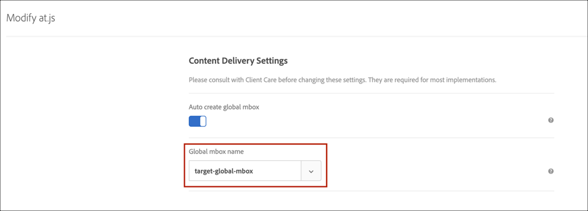

# Atualização da at.js 1.*x* para at.js 2.*x*

A versão mais recente da at.js no [!DNL Adobe Target] fornece conjuntos de recursos avançados para sua empresa personalizar tecnologias de próxima geração no lado do cliente. Essa nova versão tem como foco a atualização da at.js para ter interações harmoniosas com aplicativos de página única (SPAs).

Estes são alguns benefícios do uso de at.js 2.*x* que não estão disponíveis nas versões anteriores:

* A capacidade de armazenar em cache todas as ofertas no carregamento da página para reduzir várias chamadas do servidor a uma única chamada de servidor.
* Melhore bastante as experiências dos usuários finais em seu site, uma vez que as ofertas são exibidas imediatamente por meio do cache, sem o atraso imposto pelas chamadas tradicionais do servidor.
* Uma linha de código simples e uma configuração de desenvolvedor única para permitir que seus comerciantes criem e executem atividades de [!UICONTROL Teste A/B] e [!UICONTROL Direcionamento de experiência] (XT) por meio do VEC em seus SPAs.

## Diagramas do sistema at.js 2.*x*

Os diagramas a seguir ajudam a entender o fluxo de trabalho da at.js 2.*x* com Exibições e como isso melhora a integração de SPA. Para obter uma melhor introdução dos conceitos usados no at.js 2.*x*, consulte [Implementação de aplicativos de página única](/help/dev/implement/client-side/atjs/how-to-deployatjs/target-atjs-single-page-application.md).

(Clique na imagem para expandir até a largura total.)

{zoomable="yes"}

| Chama | Detalhes |
| --- | --- |
| 1 | A chamada retornará a [!UICONTROL Experience Cloud ID] se o usuário estiver autenticado; outra chamada sincroniza a ID do cliente. |
| 2 | A biblioteca at.js é carregada de modo síncrono e oculta o corpo do documento.<P>O at.js também pode ser carregado de forma assíncrona com uma opção que oculta previamente o trecho implementado na página. |
| 3 | Uma solicitação de carregamento de página é feita, incluindo todos os parâmetros configurados (MCID, SDID e ID do cliente). |
| 4 | Os scripts de perfil executam e, em seguida, fazem o feed na Loja do perfil. A Loja solicita públicos qualificados da Biblioteca de Público-Alvo (por exemplo, públicos-alvo compartilhados de [!DNL Adobe Analytics], [!DNL Audience Manager], etc.).<P>Os atributos do cliente são enviados à Loja de perfis em um processo em lote. |
| 5 | Com base nos parâmetros de solicitação de URL e dados de perfil, [!DNL Target] decide quais atividades e experiências retornarão ao visitante para a página atual e para as exibições futuras. |
| 6 | O conteúdo direcionado é enviado de volta para a página, incluindo, opcionalmente, valores de perfil para personalização adicional.<P>O conteúdo direcionado na página atual é revelado o mais rápido possível sem cintilação do conteúdo padrão.<P>Conteúdo direcionado para exibições que são mostradas como resultado das ações do usuário em um SPA que é armazenado em cache no navegador para que ele possa ser aplicado instantaneamente, sem uma chamada de servidor adicional, quando as exibições forem acionadas por meio de `triggerView()`. |
| 7 | Os dados do [!UICONTROL Analytics] são enviados ao servidores de Coleção de dados. |
| 8 | Os dados de destino correspondem aos dados do [!UICONTROL Analytics] por meio da SDID e são processados no armazenamento de relatórios do [!UICONTROL Analytics].<P>Os dados do [!UICONTROL Analytics] podem ser exibidos no [!UICONTROL Analytics] e no [!DNL Target] pelos relatórios do [!UICONTROL Analytics for Target] (A4T). |

Agora, onde quer `triggerView()` que seja implementada em seu SPA, as Exibições e as ações são recuperadas do cache e mostradas ao usuário, sem uma chamada de servidor. `triggerView()` também faz uma solicitação de notificações ao [!DNL Target] backend para aumentar e registrar contagens de impressão.

(Clique na imagem para expandir até a largura total.)

{zoomable="yes"}

| Chama | Detalhes |
| --- | --- |
| 1 | `triggerView()` é chamado no SPA para renderizar a Exibição e aplicar ações para modificar elementos visuais. |
| 2 | O conteúdo direcionado para a exibição é lido do cache. |
| 3 | O conteúdo direcionado é revelado o mais rápido possível sem oscilação do conteúdo padrão. |
| 4 | A solicitação de notificação é enviada para a [!DNL Target] Loja de perfil para contar o visitante nas métricas de atividade e incremento. |
| 5 | Dados do [!UICONTROL Analytics] enviados para os Servidores de Coleta de Dados. |
| 6 | Os dados do [!DNL Target] são correspondidos aos dados do [!UICONTROL Analytics] pela SDID e processados no armazenamento de relatórios do [!UICONTROL Analytics]. Os dados do [!UICONTROL Analytics] podem ser exibidos no [!UICONTROL Analytics] e no [!DNL Target] pelos relatórios do A4T. |

## Implantar at.js 2.*x*

Implantar at.js 2.*x* por meio de tags na extensão [Adobe Experience Platform](/help/dev/implement/client-side/atjs/how-to-deployatjs/implement-target-using-adobe-launch.md).

>[!NOTE]
>
>O melhor método para implantar a at.js é usando tags na [!DNL Adobe Experience Platform].
>
>Ou
>
>Baixe manualmente a at.js 2.*x* usando a interface do usuário do [!DNL Target] e implante-a usando o método [de sua escolha](/help/dev/implement/client-side/atjs/how-to-deployatjs/how-to-deployatjs.md).

## Funções obsoletas da at.js

Há várias funções que foram descontinuadas no at.js 2.*x*.

>[!WARNING]
>
>Se essas funções obsoletas ainda forem usadas no site quando o at.js 2.*x* for implantado, serão exibidos avisos no console. A abordagem recomendada durante a atualização é testar a implantação da at.js 2.*x* em um ambiente de preparo, analisar cada um dos avisos registrados no console e substituir as funções obsoletas por novas funções introduzidas na at.js 2.*x*.

Você pode encontrar as funções obsoletas e a contraparte abaixo. Para obter uma lista completa das funções, consulte [funções da at.js](/help/dev/implement/client-side/atjs/atjs-functions/atjs-functions.md).

>[!NOTE]
>
>O at.js 2.*x* não oculta automaticamente os elementos marcados `mboxDefault`. Os clientes devem, portanto, acomodar a lógica de pré-ocultação manualmente no site ou por meio de um gerenciador de tags.

### mboxCreate(mbox,params)

**Descrição**:

Executa uma solicitação e aplica a oferta ao DIV mais próximo com o nome de classe `mboxDefault`.

**Exemplo**:

```html {line-numbers="true"}
<div class="mboxDefault">
  default content to replace by offer
</div>
<script>
  mboxCreate('mboxName','param1=value1','param2=value2');
</script>
```

**equivalente a at.js 2.*x***

Uma alternativa para `mboxCreate(mbox, params)` é `getOffer()` e `applyOffer()`.

**Exemplo**:

```html {line-numbers="true"}
<div class="mboxDefault"> 
  default content to replace by offer 
</div> 
<script> 
  var el = document.currentScript.previousElementSibling;
  adobe.target.getOffer({
    mbox: "mboxName",
    params: {
      param1: "value1",
      param2: "value2"
    },
    success: function(offer) {
      adobe.target.applyOffer({
        mbox: "mboxName",
        selector: el,
        offer: offer
      });
    },
    error: function(error) {
      console.error(error);
      el.style.visibility = "visible";
    }
  });
</script> 
```

### mboxDefine() e mboxUpdate()

**Descrição**:

Cria um mapeamento interno entre um elemento e um nome de mbox, mas não executa a solicitação. Usada em conjunto com `mboxUpdate()`, que executa a solicitação e aplica a oferta ao elemento identificado pelo nodeId em `mboxDefine()`. Também pose ser usada para atualizar uma mbox iniciada por `mboxCreate`.

**Exemplo**:

```html {line-numbers="true"}
<div id="someId" class="mboxDefault"></div>
<script>
 mboxDefine('someId','mboxName','param1=value1','param2=value2');
 mboxUpdate('mboxName','param3=value3','param4=value4');
</script>
```

**equivalente a at.js 2.*x***:

Uma alternativa para `mboxDefine()` e `mboxUpdate` é `getOffer()` e `applyOffer()`, com a opção do seletor usada em `applyOffer()`. Essa abordagem permite mapear a oferta para um elemento usando qualquer seletor de CSS, não apenas um com uma ID.

**Exemplo**:

```html {line-numbers="true"}
<div id="someId" class="mboxDefault"> 
  default content to replace by offer 
</div> 
<script> 
  adobe.target.getOffer({
    mbox: "mboxName",
    params: {
      param1: "value1",
      param2: "value2",
      param3: "value3",
      param4: "value4" 
    },
    success: function(offer) {
      adobe.target.applyOffer({
        mbox: "mboxName",
        selector: "#someId",
        offer: offer
      });
    },
    error: function(error) {
      console.error(error);
      var el = document.getElementById("someId");
      el.style.visibility = "visible";
    }
  });
</script>
```

### adobe.target.registerExtension()

**Descrição**:

Fornece uma forma padrão de registrar uma extensão específica.

Isso não é mais suportado e não deve ser usado.

## Resumo das funções obsoletas, novas e suportadas at.js em 2.*x*

| Método | Suportado? | Novo? | Obsoleto?<P>(O conteúdo padrão será exibido) |
| --- | --- | --- | --- |
| `getOffer()` | Sim |  |  |
| `getOffers()` |  | Sim |  |
| `applyOffer()` | Sim |  |  |
| `applyOffers()` |  | Sim |  |
| `triggerView()` |  | Sim |  |
| `trackEvent()` | Sim |  |  |
| `mboxCreate()` |  |  | Sim |
| `mboxDefine()`<P>`mboxUpdate()` |  |  | Sim |
| `targetGlobalSettings()` | Sim |  |  |
| `Data Providers` | Sim |  |  |
| `targetPageParams()` | Sim |  |  |
| `targetPageParamsAll()` | Sim |  |  |
| `registerExtension()` |  |  | Sim |
| `At.js Custom Events` | Sim |  |  |

## Limitações e chamadas de retorno

Esteja ciente das seguintes limitações e chamadas de retorno:

### Rastreamento de conversão

Os clientes que usam `mboxCreate()` para rastreamento de conversão devem usar `trackEvent()` ou `getOffer()`.

### Entrega de oferta

Os clientes que não substituírem `mboxCreate()` por `getOffer()` ou `applyOffer()` correm o risco de não ter ofertas entregues.

### A at.js 2.*x* pode ser usada em algumas páginas enquanto a at.js 1.*x* estiver em outras páginas?

Sim, o perfil do visitante é preservado nas páginas usando diferentes versões e bibliotecas. O formato de cookie é o mesmo.

### Nova API usada em at.js 2.*x*

O at.js 2.*x* usa uma nova API, que chamamos a API de entrega. Para depurar se o at.js está chamando o servidor de borda do [!DNL Target] corretamente, você pode filtrar a guia Rede das Ferramentas do Desenvolvedor do seu navegador para &quot;entrega&quot;, &quot;`tt.omtrdc.net`&quot;, ou seu código de cliente. Você também notará que [!DNL Target] envia uma carga JSON em vez de pares de valores-chave.

### [!DNL Target] A mbox global não é mais usada

Na at.js 2.*x*, &quot;`target-global-mbox`&quot; não estará mais visível nas chamadas de rede. Em vez disso, substituímos a sintaxe &quot;`target-global-mbox`&quot; por &quot;`execute > pageLoad`&quot; na carga JSON enviada aos servidores [!DNL Target], como observado a seguir:

```json {line-numbers="true"}
{
  "id": {
    // ...
  },
  "context": {
    "channel": "web",
    // ...
  },
  "execute": {
    "pageLoad": {}
  }
}
```

Basicamente, o conceito global de mbox foi apresentado para [!DNL Target] informar se recupera ofertas e conteúdo no carregamento de página. Dessa forma, deixamos isso mais explícito na versão mais recente.

### O nome da mbox global no at.js não importa mais?

Os clientes podem especificar um nome de mbox global por meio de **[!UICONTROL Target]** > **[!UICONTROL Administração]** > **[!UICONTROL Implementação]** > **[!UICONTROL Editar configurações da at.js]**. Essa configuração é usada pelos servidores de borda [!DNL Target] para traduzir execute > pageLoad para o nome da mbox global que aparece na interface do [!DNL Target]. Isso permite que os clientes continuem a usar APIs do lado do servidor, o compositor baseado em formulário, scripts de perfil e criar públicos-alvo usando o nome global da mbox. Recomendamos que você também verifique se o mesmo nome global da mbox está configurado na página **[!UICONTROL Administração]** > **[!UICONTROL Visual Experience Composer]**, caso ainda tenha páginas que usam o at.js 1.*x*, conforme mostrado nas ilustrações a seguir.



e


### A configuração de mbox global de criação automática precisa ser ativada para o at.js 2.*x*?

Na maioria dos casos, sim. Esta configuração informa à at.js 2.*x* para disparar uma solicitação nos servidores de borda [!DNL Target] ao carregar a página. Como a mbox global é traduzida para executar o > pageLoad e se você quiser acionar uma solicitação no carregamento da página, essa configuração deve estar ativada.

### As atividades existentes do VEC continuarão a funcionar, mesmo que o nome da mbox global do Target não seja especificado no at.js 2.*x*?

Sim, porque executar > carga é tratado no [!DNL Target] backend como `target-global-mbox`.

### Se minhas atividades baseadas em formulário forem direcionadas para o `target-global-mbox`, essas atividades continuarão funcionando?

Sim, porque executar > carga é tratado nos servidores [!DNL Target] de borda como `target-global-mbox`.

### Configurações compatíveis e não compatíveis no at.js 2.*x*

| Configuração | Suportado? |
| --- | --- |
| Domínio X | Não |
| Criar automaticamente mbox global | Sim |
| Nome da mbox global | Sim |

### Suporte de rastreamento entre domínios no at.js 2.x

O rastreamento entre domínios possibilita unir visitantes em diferentes domínios. Como um novo cookie deve ser criado para cada domínio, é difícil rastrear os visitantes quando eles navegam de um domínio para outro. Para realizar o rastreamento entre domínios, o [!DNL Target] usa um cookie de terceiros para rastrear visitantes entre domínios. Isso permite criar uma atividade do [!DNL Target] que abrange o `siteA.com` e o `siteB.com`, e os visitantes permanecem na mesma experiência quando navegam entre domínios únicos. Esta funcionalidade se associa ao comportamento de cookies de terceiros e próprios de [!DNL Target].

>[!NOTE]
>
>O rastreamento entre domínios é compatível a partir da at.js 2.10, mas não é compatível imediatamente na at.js 2.*x* anterior à 2.10. O rastreamento entre domínios é compatível com o at.js 2.*x* por meio da biblioteca Experience Cloud ID (ECID) v4.3.0+.

Em [!DNL Target], o cookie de terceiros é armazenado em `<CLIENTCODE>.tt.omtrdc.net`. O cookie próprio é armazenado no `clientdomain.com`. A primeira solicitação retorna cabeçalhos de resposta HTTP que tentam instalar cookies de terceiros chamados `mboxSession` e `mboxPC`, enquanto uma solicitação de redirecionamento é enviada de volta com um parâmetro extra (`mboxXDomainCheck=true`). Se o navegador aceitar cookies de terceiros, a solicitação de redirecionamento vai inclui-los, e a experiência será retornada. Esse fluxo de trabalho é possível porque usamos o método HTTP GET.

No entanto, no at.js 2.*x*, o HTTP GET não é usado. Em vez disso, o HTTP POST é usado via at.js 2.*x* para enviar cargas JSON para [!DNL Target] servidores Edge. Usar HTTP POST significa que a solicitação de redirecionamento para verificar se um navegador suporta cookies de terceiros será interrompida. Isso ocorre porque as solicitações HTTP GET são transações idempotentes, enquanto HTTP POST é não idempotente e não deve ser repetido arbitrariamente. Portanto, o rastreamento entre domínios no at.js 2.*x* (anterior ao 2.10) não é compatível imediatamente. Somente a at.js 1.*x* tem suporte pronto para uso para rastreamento entre domínios.

Para usar o rastreamento entre domínios para a at.js v2.10 ou posterior, você pode executar um dos seguintes procedimentos:

1. Instale a [biblioteca da ECID v4.3.0+](https://experienceleague.adobe.com/docs/id-service/using/release-notes/release-notes.html?lang=pt-BR) juntamente com o at.js 2.*x*. A biblioteca da ECID existe para gerenciar IDs persistentes usadas para identificar um visitante, mesmo entre domínios. Depois de instalar a biblioteca da ECID v4.3.0+ e o at.js 2.*x*, você poderá criar atividades que abrangem domínios exclusivos e rastrear usuários. É importante observar que essa funcionalidade funciona somente após a sessão expirar.

1. Em vez de instalar a biblioteca ECID, se você tiver o at.js v2.10 ou posterior, poderá habilitar a configuração Entre Domínios na interface do usuário [!DNL Target] em **[!UICONTROL Administração]** > **[!UICONTROL Implementação]**. (Como alternativa, você pode definir a opção _crossDomain_ como _enabled_ no código at.js.)

Para usar o rastreamento entre domínios para versões do at.js v2.*x* anteriores a 2.10, você pode implementar a opção #1 acima (instalar a biblioteca ECID).

### Criar automaticamente mbox global é compatível

Esta configuração informa à at.js 2.*x* para disparar uma solicitação nos servidores de borda [!DNL Target] no carregamento da página. Como a mbox global é traduzida para executar > carga, e isso é interpretado pelos servidores [!DNL Target] de borda, os clientes devem ativar esse recurso se quiserem acionar uma solicitação no carregamento da página.

### O nome da mbox global é compatível

Os clientes podem especificar um nome de mbox global por meio de **[!UICONTROL Target]** > **[!UICONTROL Administração]** > **[!UICONTROL Implementação]** > **[!UICONTROL Edição]**. Essa configuração é usada pelos [!DNL Target] servidores de borda para traduzir executar > carga para o nome da mbox global inserido. Isso permite que os clientes continuem a usar APIs do lado do servidor, o compositor baseado em formulário, scripts de perfil e criar públicos-alvo que direcionem a mbox global.

### Os eventos personalizados da at.js abaixo são aplicáveis a `triggerView()` ou são somente para `applyOffer()` ou `applyOffers()`?

* `adobe.target.event.CONTENT_RENDERING_FAILED`
* `adobe.target.event.CONTENT_RENDERING_SUCCEEDED`
* `adobe.target.event.CONTENT_RENDERING_NO_OFFERS`
* `adobe.target.event.CONTENT_RENDERING_REDIRECT`

Sim, os eventos personalizados da at.js `triggerView()` também se aplicam.

### Ele informa quando eu chamo `triggerView()` com &lbrace;`"page" : "true"`&rbrace;, enviará uma notificação para o back-end do [!DNL Target] e aumentará a impressão. Também faz com que os scripts de perfil sejam executados?

Quando uma chamada de pré-busca é feita no [!DNL Target] backend, os scripts de perfil são executados. Consequentemente, os dados de perfil afetados serão criptografados e enviados para o lado do cliente. Após invocar `triggerView()` com `{"page": "true"}`, uma notificação é enviada juntamente com os dados de perfil criptografados. Isso ocorre quando o [!DNL Target] backend descriptografa os dados do perfil e armazena nos bancos de dados.

### Precisamos adicionar um código que oculta previamente antes da chamada `triggerView()` a fim de gerenciar a cintilação?

Não, não é necessário adicionar código de pré-ocultação antes de chamar `triggerView()`. O at.js 2.*x* gerencia a lógica de pré-ocultação e cintilação antes da exibição e aplicação da exibição.

### Quais parâmetros da at.js 1.*x* para criar públicos-alvo não são compatíveis com a at.js 2.*x*?

Os seguintes parâmetros da at.js 1.x *NÃO* são suportados no momento para a criação de públicos-alvo ao usar a at.js 2.*x*:

* browserHeight
* browserWidth
* browserTimeOffset
* screenHeight
* screenWidth
* screenOrientation
* colorDepth
* devicePixelRatio
* parâmetros vst.* (veja abaixo)

### O at.js 2.*x* não oferece suporte à criação de públicos-alvo usando parâmetros vst.*

Os clientes na at.js 1.*x* puderam usar os parâmetros de mbox vst.* para criar públicos-alvo. Este foi um efeito colateral não intencional de como o at.js 1.*x* enviou parâmetros de mbox para o back-end do [!DNL Target]. Depois de migrar para o at.js 2.*x*, não é mais possível criar públicos-alvo usando esses parâmetros, pois o at.js 2.*x* envia parâmetros de mbox de forma diferente.

## compatibilidade com o at.js

As tabelas a seguir explicam o at.js. 2.*x* compatibilidade com diferentes tipos de atividades, integrações, recursos e funções da at.js.

### Tipos de atividade

| Tipo | Suportado? |
| --- | --- |
| [!UICONTROL Teste A/B] | Sim |
| [!UICONTROL Alocação automática] | Sim |
| [!UICONTROL Direcionamento automático] | Sim |
| [!UICONTROL Direcionamento de experiência] | Sim |
| [!UICONTROL Teste multivariado] | Sim |
| [!UICONTROL Personalização automatizada] | Sim |
| [!DNL Recommendations] | Sim |

>[!NOTE]
>
>As atividades de [!UICONTROL Direcionamento automático] são compatíveis por meio da at.js 2.*x* e do VEC quando todas as modificações são aplicadas ao `Page Load Event`. Quando modificações são adicionadas a exibições específicas, somente as atividades de [!UICONTROL Teste A/B], [!UICONTROL Alocação automática] e [!UICONTROL Direcionamento de experiência] (XT) são suportadas.

### Integrações

| Tipo | Suportado? |
| --- | --- |
| [!UICONTROL Analytics for Target] (A4T) | Sim |
| Públicos-alvo | Sim |
| Atributos do cliente | Sim |
| Fragmentos de experiência do AEM | Sim |
| [Extensão do Adobe Experience Platform](/help/dev/implement/client-side/atjs/how-to-deployatjs/implement-target-using-adobe-launch.md) | Sim |
| Depurador | Sim |
| Auditor | As regras ainda não foram atualizadas para at.js 2.*x* |
| Suporte de Opt-in para o [GDPR](/help/dev/before-implement/privacy/cmp-privacy-and-general-data-protection-regulation.md) | Isto é suportado na [at.js versão 2.1.0](/help/dev/implement/client-side/atjs/target-atjs-versions.md#atjs-version-210-june-3-2019) ou posterior. |
| AEM Enhanced Personalization desenvolvido por [!DNL Adobe Target] | Não |

### Recursos

| Recurso | Suportado? |
| --- | --- |
| Domínio X | Não |
| Propriedades/espaços de trabalho | Sim |
| Links de Controle de qualidade | Sim |
| Experience Composer baseado em formulário | Sim |
| Visual Experience Composer (VEC) | Sim |
| Código personalizado | Sim |
| [Tokens de resposta](#response-tokens) | Sim |
| Rastreamento de cliques | Sim |
| Disponibilização de várias atividades | Sim |
| targetGlobalSettings | Sim (mas não domínio x) |
| Métodos da at.js | Há suporte para tudo, exceto para<P>`mboxCreate()`<P>`mboxUpdate()`<P>`mboxDefine()`<P>que exibirá o conteúdo padrão. |

### Parâmetros da string de consulta

| Parâmetro | Suportado? |
| --- | --- |
| `?mboxDisable` | Sim |
| `?mboxDisable` | Sim |
| `?mboxTrace` | Sim |
| `?mboxSession` | Não |
| `?mboxOverride.browserIp` | Sim |

## Tokens de resposta

at.js 2.*x*, como at.js 1.*x*, usa o evento personalizado `at-request-succeeded` para acionar tokens de resposta. Para obter exemplos de código usando o evento personalizado do `at-request-succeeded`, consulte [Tokens de resposta](https://experienceleague.adobe.com/docs/target/using/administer/response-tokens.html?lang=pt-BR).

## Parâmetros da at.js 1.*x* para o mapeamento de carga da at.js 2.*x*

Esta seção descreve os mapeamentos entre at.js 1.*x* e at.js 2.*x*.

Antes de analisar o mapeamento de parâmetros, os endpoints usados por essas versões de biblioteca foram alterados:

* at.js 1.*x* - `http://<client code>.tt.omtrdc.net/m2/<client code>/mbox/json`
* at.js 2.*x* - `http://<client code>.tt.omtrdc.net/rest/v1/delivery`

Outra diferença significativa é que:

* at.js 1.*x* - O código do cliente faz parte do caminho
* at.js 2.*x* - O código do cliente é enviado como um parâmetro de sequência de consulta, como:
  `http://<client code>.tt.omtrdc.net/rest/v1/delivery?client=democlient`

As seções a seguir listam cada parâmetro da at.js 1.*x*, sua descrição e a carga JSON 2.*x* correspondente (se aplicável):

### at_property

(parâmetro da at.js 1.*x*)

Usado para [Permissões de usuário do Enterprise](https://experienceleague.adobe.com/docs/target/using/administer/manage-users/enterprise/property-channel.html?lang=pt-BR).

```json {line-numbers="true"}
{
  ....
  "property": {
    "token": "1213213123122313121"
  }
  ....
}
```

### mboxHost

(parâmetro da at.js 1.*x*)

O domínio da página em que a biblioteca [!DNL Target] é executada.

Carga JSON do at.js 2.*x*:

```json {line-numbers="true"}
{
  "context": {
    "browser": {
       "host": "test.com"
    }
  }
}
```

### webGLRenderer

(parâmetro da at.js 1.*x*)

Os recursos de renderização da Web GL do navegador. Isso é usado pelo nosso mecanismo de detecção de dispositivo para determinar se o dispositivo do visitante é um desktop, iPhone, dispositivo Android, etc.

Carga JSON do at.js 2.*x*:

```json {line-numbers="true"}
{
  "context": {
    "browser": {
       "webGLRenderer": "AMD Radeon Pro 560X OpenGL Engine"
    }
  }
}
```

### mboxURL

(parâmetro da at.js 1.*x*)

O URL da página.

Carga JSON do at.js 2.*x*:

```json {line-numbers="true"}
{
  "context": {
    "address": {
       "url": "http://test.com"
    }
  }
}
```

### mboxReferrer

(parâmetro da at.js 1.*x*)

O referenciador de página.

Carga JSON do at.js 2.*x*:

```json {line-numbers="true"}
{
  "context": {
    "address": {
       "referringUrl": "http://google.com"
    }
  }
}
```

### mbox (o nome) igual à mbox global

(parâmetro da at.js 1.*x*)

A API de entrega não tem mais um conceito de mbox global. Na carga JSON, você deve usar `execute > pageLoad`.

Carga JSON do at.js 2.*x*:

```json {line-numbers="true"}
{
  "execute": {
    "pageLoad": {
       "parameters": ....
       "profileParameters": ...
       .....
    }
  }
}
```

### mbox (o nome) *não* é igual à mbox global

(parâmetro da at.js 1.*x*)

Para usar um nome de mbox, passe-o para `execute > mboxes`. Uma mbox exige um índice e um nome.

Carga JSON do at.js 2.*x*:

```json {line-numbers="true"}
{
  "execute": {
    "mboxes": [{
       "index": 0,
       "name": "some-mbox",
       "parameters": ....
       "profileParameters": ...
       .....
    }]
  }
}
```

### mboxId

(parâmetro da at.js 1.*x*)

Não está mais em uso.

### mboxCount

(parâmetro da at.js 1.*x*)

Não está mais em uso.

### mboxRid

(parâmetro da at.js 1.*x*)

A ID de solicitação usada por sistemas de downstream para ajudar na depuração.

Carga JSON do at.js 2.*x*:

```json {line-numbers="true"}
{
  "requestId": "2412234442342"
  ....
}
```

### mboxTime

(parâmetro da at.js 1.*x*)

Não está mais em uso.

### mboxSession

(parâmetro da at.js 1.*x*)

A ID da sessão é enviada como parâmetro de sequência de consulta (`sessionId`) para o endpoint da API de entrega.

### mboxPC

(parâmetro da at.js 1.*x*)

A ID de TNT é passada para `id > tntId`.

Carga JSON do at.js 2.*x*:

```json {line-numbers="true"}
{
  "id": {
    "tntId": "ca5ddd7e33504c58b70d45d0368bcc70.21_3"
  }
  ....
}
```

### mboxMCGVID

(parâmetro da at.js 1.*x*)

A ID de visitante da Experience Cloud é passada para `id > marketingCloudVisitorId`.

Carga JSON do at.js 2.*x*:

```json {line-numbers="true"}
{
  "id": {
    "marketingCloudVisitorId": "797110122341429343505"
  }
  ....
}
```

### `vst.aaaa.id` e `vst.aaaa.authState`

(parâmetros de at.js 1.*x*)

As IDs do cliente devem ser passadas para `id > customerIds`.

Carga JSON do at.js 2.*x*:

```json {line-numbers="true"}
{
  "id": {
    "customerIds": [{
       "id": "1232131",
       "integrationCode": "aaaa",
       "authenticatedState": "....."
     }]
  }
  ....
}
```

### mbox3rdPartyId

(parâmetro da at.js 1.*x*)

A ID de terceiros do cliente usada para vincular [!DNL Target] IDs diferentes.

Carga JSON do at.js 2.*x*:

```json {line-numbers="true"}
{
  "id": {
    "thirdPartyId": "1232312323123"
  }
  ....
}
```

### mboxMCSDID

(parâmetro da at.js 1.*x*)

SDID, também conhecida como ID de dados complementares. Deve ser passado para `experienceCloud > analytics > supplementalDataId`.

Carga JSON do at.js 2.*x*:

```json {line-numbers="true"}
{
  "experienceCloud": {
    "analytics": {
      "supplementalDataId": "1212321132123131"
    }
  }
  ....
}
```

### vst.trk

(parâmetro da at.js 1.*x*)

Servidor de rastreamento do [!UICONTROL Analytics]. Deve ser passado para `experienceCloud > analytics > trackingServer`.

Carga JSON do at.js 2.*x*:

```json {line-numbers="true"}
{
  "experienceCloud": {
    "analytics": {
      "trackingServer": "analytics.test.com"
    }
  }
  ....
}
```

### vst.trks

(parâmetro da at.js 1.*x*)

Servidor de rastreamento do Analytics seguro. Deve ser passado para `experienceCloud > analytics > trackingServerSecure`.

Carga JSON do at.js 2.*x*:

```json {line-numbers="true"}
{
  "experienceCloud": {
    "analytics": {
      "trackingServerSecure": "secure-analytics.test.com"
    }
  }
  ....
}
```

### mboxMCGLH

(parâmetro da at.js 1.*x*)

Dica de localização do Audience Manager. Deve ser passado para `experienceCloud > audienceManager > locationHint`.

Carga JSON do at.js 2.*x*:

```json {line-numbers="true"}
{
  "experienceCloud": {
    "audienceManager": {
      "locationHint": 9
    }
  }
  ....
}
```

### mboxAAMB

(parâmetro da at.js 1.*x*)

Blob do Audience Manager. Deve ser passado para `experienceCloud > audienceManager > blob`.

Carga JSON do at.js 2.*x*:

```json {line-numbers="true"}
{
  "experienceCloud": {
    "audienceManager": {
      "blob": "2142342343242342"
    }
  }
  ....
}
```

### mboxVersion

(parâmetro da at.js 1.*x*)

A versão é enviada como um parâmetro de sequência de consulta por meio do parâmetro da versão.

## Vídeo de treinamento: at.js 2.*x* diagrama de arquitetura 

A at.js 2.*x* aprimora o suporte do Adobe [!DNL Target] para SPAs e integra-se com outras soluções da Experience Cloud. Este vídeo explica como tudo se une.

>[!VIDEO](https://video.tv.adobe.com/v/26250/?quality=12)

Consulte [Noções básicas sobre o funcionamento do at.js 2.*x*](https://experienceleague.adobe.com/docs/target-learn/tutorials/implementation/understanding-how-atjs-20-works.html?lang=pt-BR) para obter mais informações.

