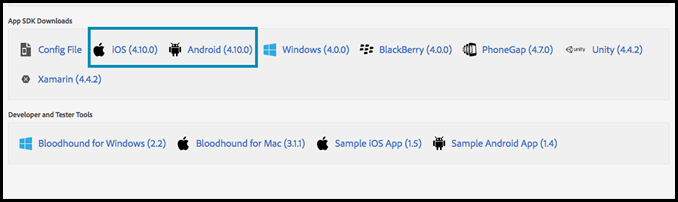

# Ativar [!DNL Target] no SDK

Adicione o [!UICONTROL SDK do Adobe Mobile Services] ao seu aplicativo.

>[!IMPORTANT]
>
>Suporte para o [!DNL Adobe Mobile] versão 4.*x* Os SDKs terminaram em 31 de agosto de 2021 e não são mais recomendados para [!DNL Adobe Target] usuários de dispositivos móveis.
>
>A variável [Adobe Experience Platform SDK para aplicativos móveis](https://developer.adobe.com/client-sdks/documentation/){target=_blank} é a solução recomendada para [!DNL Adobe Experience Cloud] soluções e serviços em seus aplicativos móveis.

1. Se ainda não tiver instalado o SDK do Adobe Mobile Services no aplicativo, use suas credenciais do Analytics ou da Experience Cloud e baixe o SDK do site do [Adobe Mobile Services](https://mobilemarketing.adobe.com/).

1. Adicione o [!DNL Adobe Mobile Services SDK] ao seu aplicativo.

   Você encontrará instruções em [Implementação principal e ciclo de vida](https://experienceleague.adobe.com/docs/mobile-services/ios/getting-started-ios/dev-qs.html).

1. Adicione o código do cliente, tempo limite e habilite o SSL.

   Na Experience Cloud, abra o Mobile Services, depois vá para **[!UICONTROL Administrar configurações do aplicativo]** > **[!UICONTROL Opções do SDK do Target]**.

   Adicione [!DNL Target] clientcode e tempo limite. O código do cliente é único para sua conta e empresa. O tempo limite é o tempo em número de segundos até o qual [!DNL Target] aguardará uma resposta antes de mostrar o conteúdo padrão. Certifique-se de que a opção **[!UICONTROL Usar HTTPS]** está marcada na página Administrar configurações do aplicativo no Adobe Mobile Services. Se o HTTPS não estiver ativado, todas as chamadas no iOS9+ serão bloqueadas, a menos que você inclua na lista de permissões a [!DNL Target] servidor.

   

1. Depois de criar/localizar seu aplicativo, encontre as configurações do aplicativo e baixe o SDK desejado.

   

>[!WARNING]
>
> Se você não tiver acesso à interface de marketing para dispositivos móveis, poderá fazer alterações diretamente no arquivo de configuração no código do aplicativo; no entanto, não estará sincronizado com a página de configurações na interface do usuário.
