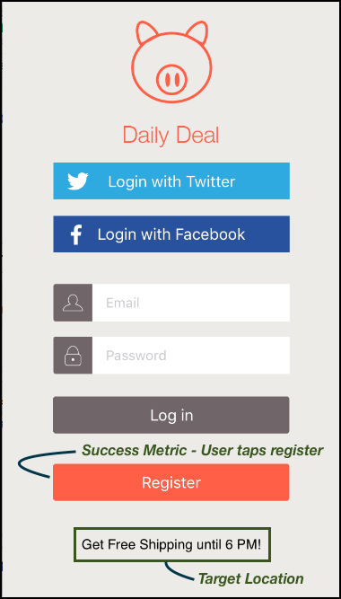

# Como o [!DNL Target] funciona em aplicativos móveis

O [!DNL Adobe Mobile SDK] contata o servidor [!DNL Target] para obter o conteúdo junto com outros pontos de dados para mostrar a experiência correta ao usuário.

>[!IMPORTANT]
>
>Suporte para o [!DNL Adobe Mobile] versão 4.Os SDKs do *x* terminaram em 31 de agosto de 2021 e não são mais recomendados para usuários móveis do [!DNL Adobe Target].
>
>O [Adobe Experience Platform SDK para Aplicativos para Dispositivos Móveis](https://developer.adobe.com/client-sdks/documentation/){target=_blank} é a solução recomendada para habilitar soluções e serviços do [!DNL Adobe Experience Cloud] em seus aplicativos para dispositivos móveis.

## [!DNL Target] locais e métricas de sucesso

Um *local de destino* também é chamado de mbox. Uma localização identificada no aplicativo é ativada para teste ou personalização (por exemplo, mensagem de boas vindas na tela inicial). Essas localizações são identificadas durante o processo de criação de teste.

Uma *[métrica de sucesso](https://experienceleague.adobe.com/docs/target/using/activities/success-metrics/success-metrics.html?lang=pt-BR)* é uma ação executada pelo usuário que identifica se uma atividade específica foi bem-sucedida (como se conectar, fazer uma compra, reservar uma passagem e assim por diante).

* **[!DNL Target]local:** O conteúdo que aparece abaixo do botão de registro.

  Esse usuário específico tem frete grátis até às 18h. Este local pode ser reutilizado em várias atividades [!DNL Target] para executar testes A/B e personalização.

* **Métrica de sucesso:** a ação executada pelo usuário em que o usuário toca no botão Registrar.

**Entenda como o [!DNL Target] funciona no SDK**

