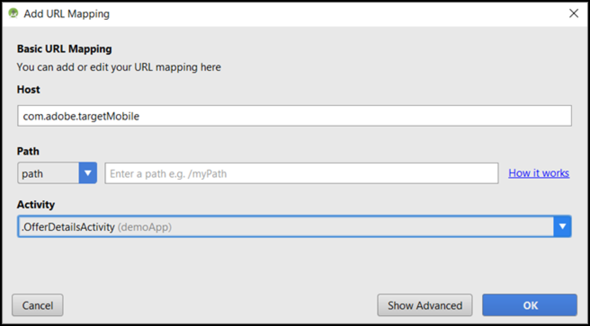

# [!DNL Target] visualização móvel

Use o link de visualização móvel para realizar facilmente tarefas completas de controle da qualidade e participar de experiências diferentes diretamente do dispositivo, sem dispositivos de teste especiais.

>[!NOTE]
>
>O recurso de visualização móvel exige que você baixe e instale a versão 4.14 (ou posterior) apropriada do SDK do Adobe Mobile.

## Visão geral

A funcionalidade visualização móvel permite que você teste completamente suas atividades no aplicativo móvel antes de inicializá-las.

## Pré-requisitos

1. **Use uma versão suportada do SDK:** o recurso visualização móvel exige que você baixe e instale a versão 4.14 (ou posterior) apropriada do SDK do Adobe Mobile em seus aplicativos correspondentes.

   Para instruções de como baixar o SDK apropriado, consulte:

   * **iOS:** [Antes de começar](https://experienceleague.adobe.com/docs/mobile-services/ios/getting-started-ios/requirements.html) no *Ajuda do Mobile Services para iOS*.
   * **Android:** [Antes de começar](https://experienceleague.adobe.com/docs/mobile-services/android/getting-started-android/requirements.html) no *Ajuda do Mobile Services para Android*.

1. **Defina um esquema de URL:** o link de visualização usa um esquema de URL para abrir seu aplicativo. Você deve especificar um esquema de URL único para a visualização.

   A ilustração a seguir é um exemplo no iOS:

   

   A ilustração a seguir é um exemplo no Android:

   

1. **Rastrear Adobe DeepLink**

   **iOS:** no delegar do aplicativo, chame `[ADBMobile trackAdobeDeepLink:url` quando o delegar pedir para abrir o recurso com o esquema de URL que foi especificado no passo anterior.

   O fragmento de código a seguir é um exemplo:

   ```javascript {line-numbers="true"}
   - (BOOL) application:(UIApplication *)app openURL:(NSURL *)url 
                options:(NSDictionary<NSString *,id> *)options { 
   
       if ([[url scheme] isEqualToString:@"com.adobe.targetmobile"]) { 
           [ADBMobile trackAdobeDeepLink:url]; 
           return YES; 
       } 
       return NO; 
   } 
   ```

   **Android:** no aplicativo, chame `Config.trackAdobeDeepLink(URL);`; quando o chamado pedir para abrir o recurso com o esquema de URL que foi especificado no passo anterior.

   ```javascript {line-numbers="true"}
    private Boolean shouldOpenDeeplinkUrl() { 
        Intent appLinkIntent = getIntent(); 
        String appLinkAction = appLinkIntent.getAction(); 
        Uri appLinkData = appLinkIntent.getData; 
        if (appLinkData.toString().startsWith("com.adobe.targetmobile")) { 
            Config.trackAdobeDeepLink(appLinkData); 
            return true; 
        } 
        return false; 
     }
   ```

   Para fazer a visualização móvel funcionar no Android, você também deve adicionar o seguinte trecho de código no AndroidManifest.xml, se estiver usando a versão 5 do SDK do Adobe Mobile:

   ```javascript {line-numbers="true"}
   <activity android:name="com.adobe.marketing.mobile.FullscreenMessageActivity" />
   ```

   Se você estiver usando a versão 4 do SDK do Adobe Mobile, use o seguinte trecho de código:

   ```javascript {line-numbers="true"}
   <activity android:name="com.adobe.mobile.MessageFullScreenActivity" />
   ```

## Gerar um link de visualização

1. No [!DNL Target] clique no link **[!UICONTROL Mais opções]** (três elipses verticais), selecione **[!UICONTROL Criar visualização móvel]**.

   

1. Selecione as atividades que deseja visualizar e clique em **[!UICONTROL Gerar link de visualização móvel]**.

   >[!NOTE]
   >
   >Somente atividades baseadas em formulário AB e XT podem ser selecionadas.

   

1. Especifique o esquema de URL do seu aplicativo.

   Isso precisa ser o mesmo que está presente no seu aplicativo iOS ou Android. Repita este processo separadamente para iOS e Android, se necessário.

   

1. Clique em **[!UICONTROL Gerar link de visualização móvel]**, depois copie o link.

   

## Visualizar no seu dispositivo

Abra o link em um navegador móvel em um dispositivo onde você tem seu aplicativo instalado. Este aplicativo pode ser o aplicativo de produção que você baixou da App store da Apple ou Google Play. Ele não precisa ser uma versão especial. Se você tem um link de visualização ativo, você poderá ver as experiência em seu dispositivo.

1. Abra o link no seu navegador móvel.

   Compartilhar o link copiado na etapa anterior do [!DNL Target] Use a interface do usuário do seu dispositivo móvel de maneira conveniente, por exemplo, usando texto, email ou Slack.

   |||

   Seu aplicativo abre e inicia o [!DNL Target] Modo de visualização móvel.

1. Selecione a combinação de experiências que deseja ver e clique em **[!UICONTROL Executar experiências]**.

   ||||
||||

## Limitações

* A visualização deve carregar novamente para que o novo conteúdo seja exibido após o botão **[!UICONTROL Executar experiências]** é clicado. O modo mais fácil é mudar para uma tela diferente e voltar para a tela onde você esperava a mudança acontecer.
* A visualização móvel não é suportada em versões do Android anteriores a API-19 (KitKat).
