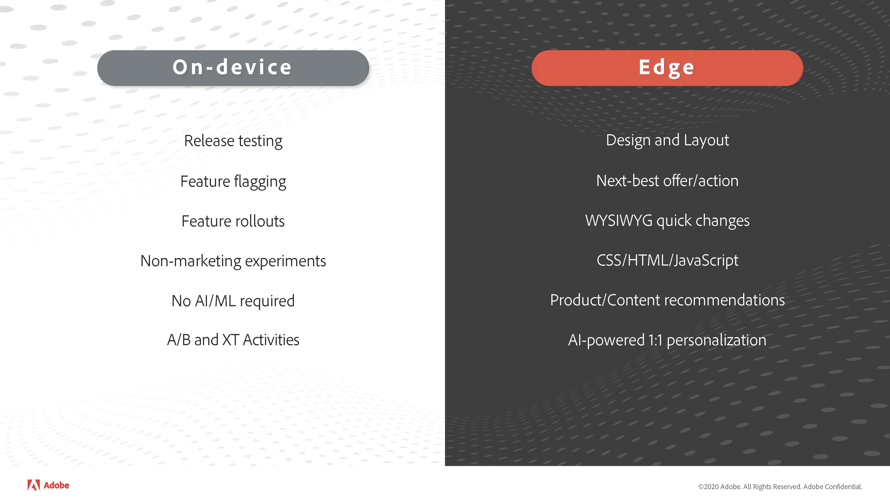

# Quando usar a decisão no dispositivo ou na borda

## Considere casos de uso ao decidir se usará a decisão no dispositivo

A principal diferença entre a decisão *no dispositivo* e a decisão na borda é que a decisão no dispositivo executa decisões localmente em seus servidores, enquanto as decisões na borda são tomadas na rede Edge da Adobe Target. A decisão no dispositivo deve ser usada para qualquer atividade A/B ou XT que precise ser entregue em páginas altamente traficadas, onde o desempenho afeta muito seus KPIs de negócios, como conversão, receita e retenção. Por exemplo, suponha que sua equipe de marketing esteja executando campanhas publicitárias para atrair prospetos para sua página inicial. Executar campanhas de publicidade em redes de editores requer pagamento, portanto, qualquer prospecto que chegue à sua página inicial indica um valor em dólar. Ao mesmo tempo, suponha que você esteja executando experimentos A/B para ver qual imagem principal captura melhor a atenção do consumidor. Se a entrega desses experimentos A/B levar mais 2 segundos, há uma alta probabilidade de o consumidor se tornar impaciente e se rejeitar. Lá vão seus dólares de marketing e experimentos A/B! Perder esse cliente potencial conquistado com muito esforço é difícil, já que qualquer oportunidade de convertê-lo em um cliente fiel ou repetido será perdida. Portanto, executar uma atividade de decisão no dispositivo para esse caso de uso pode evitar qualquer impacto negativo que a latência possa causar.

Por outro lado, o Edge Decisioning requer uma chamada de bloqueio de rede para recuperar uma experiência, mas isso pode ser altamente benéfico, já que dados em tempo real e aprendizado de máquina podem ser usados para tornar a experiência do usuário final altamente envolvente. Uma chamada de bloqueio de rede apresentará latência adicional ao fornecer a experiência; no entanto, em alguns cenários, essa compensação pode fazer sentido. Por exemplo, considere um cenário em que um cliente esteja navegando pelo catálogo de produtos e suponha que ele navegue até uma página de detalhes do produto. Se essa página mostrar uma lista recomendada de produtos, juntamente com o produto que o cliente está visualizando no momento, isso poderá aumentar o engajamento e, posteriormente, a conversão e a receita. Embora mostrar a lista recomendada de produtos dessa maneira exigisse uma decisão de borda influenciada pelo algoritmo de aprendizado de máquina do Adobe Target, o que significa que haveria latência adicional, essa latência adicional não seria significativa o suficiente para o usuário final rejeitar. Além disso, uma lista recomendada de produtos resulta em uma taxa de conversão mais alta. Portanto, nesse caso, uma decisão de borda fornece a sua empresa o maior valor.

## Recursos suportados

Além de avaliar seus casos de uso e metas comerciais, analise quais recursos a decisão no dispositivo [suporta](../on-device-decisioning/supported-features.md) antes de decidir se usará a decisão no dispositivo ou a decisão na borda. Atualmente, o Edge Decisioning é compatível com todos os tipos de atividade, direcionamento de público e métodos de alocação.