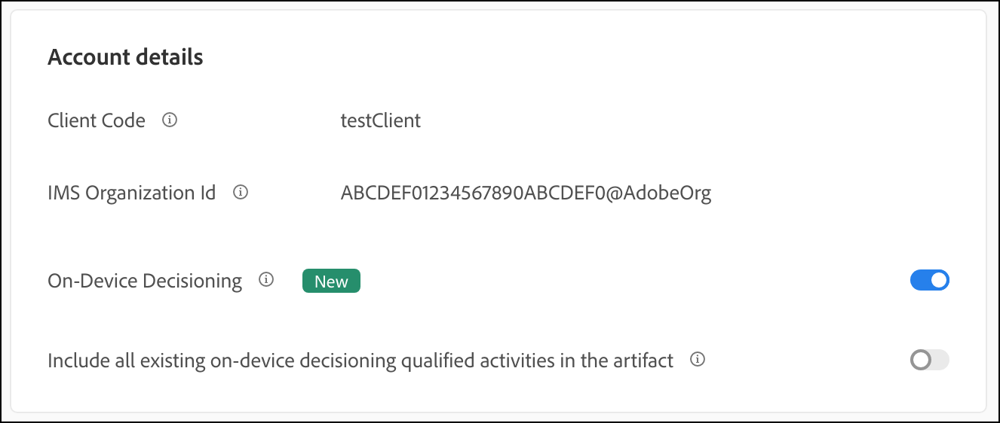
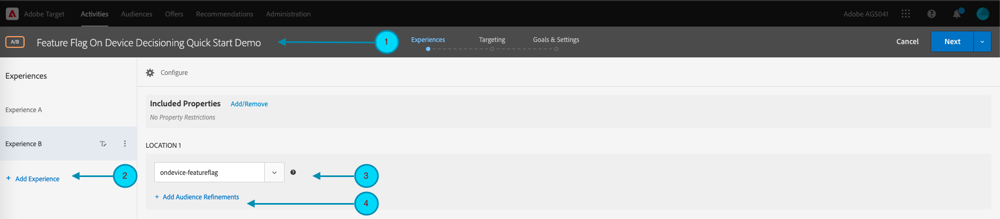
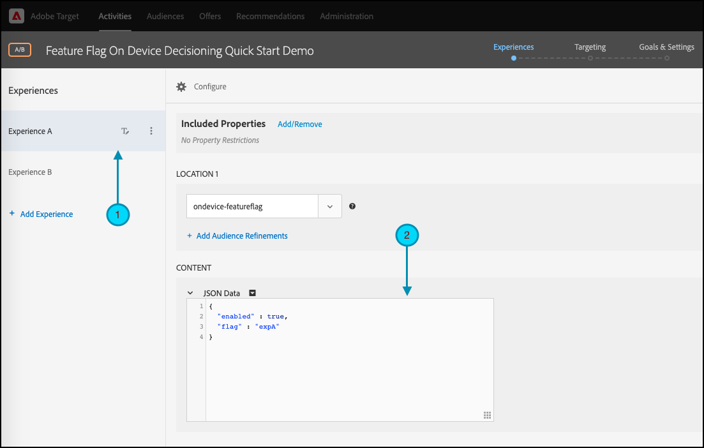
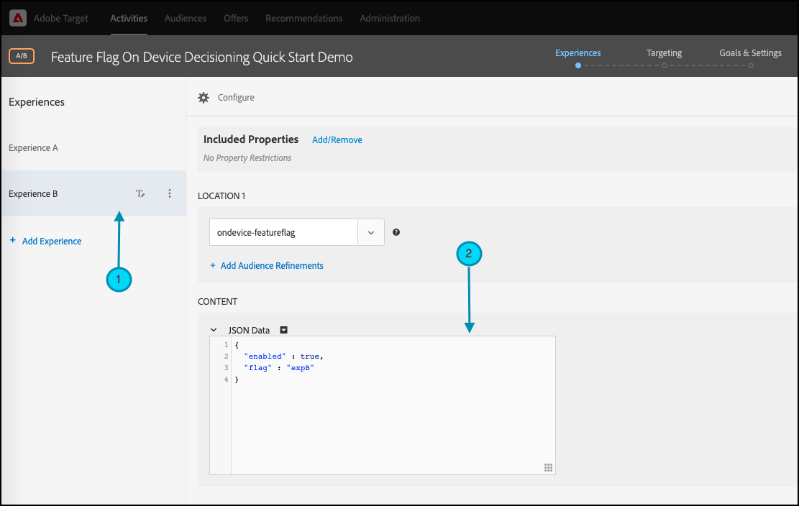
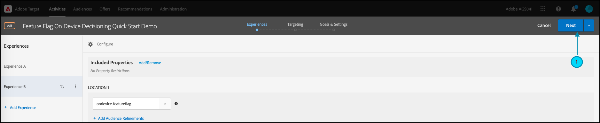
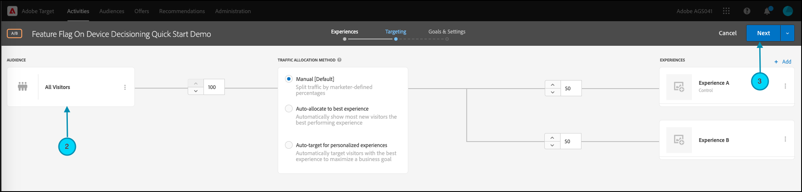
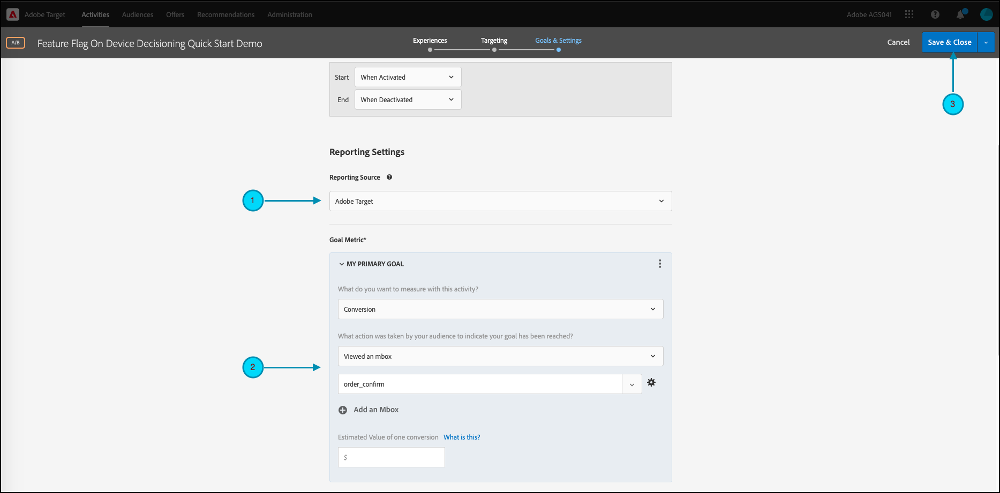
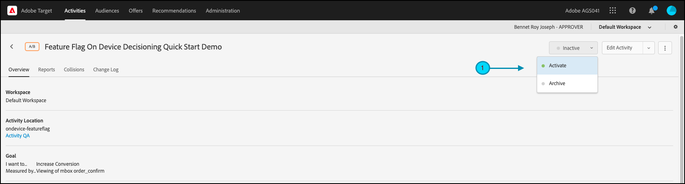

# Introdução aos [!DNL Target] SDKs

Para começar a usar o, recomendamos que você crie sua primeira atividade de sinalizador de recursos [decisão no dispositivo](../on-device-decisioning/overview.md) no idioma de sua escolha:

* Node.js
* Java
* .NET
* Python

## Resumo das etapas

1. Ativar a decisão no dispositivo para sua organização
1. Instalar o SDK
1. Inicializar o SDK
1. Configurar os sinalizadores de recursos em uma atividade de [!DNL Adobe Target] [!UICONTROL Teste A/B]
1. Implementar e renderizar o recurso em seu aplicativo
1. Implementar o rastreamento de eventos no aplicativo
1. Ativar sua atividade [!UICONTROL Teste A/B]

## &#x200B;1. Ativar a decisão no dispositivo para sua organização

A habilitação da decisão no dispositivo garante que uma atividade de [!UICONTROL Teste A/B] seja executada com latência próxima a zero. Para habilitar este recurso, navegue até **[!UICONTROL Administração]** > **[!UICONTROL Implementação]** > **[!UICONTROL Detalhes da conta]** e habilite a opção **[!UICONTROL Decisão no Dispositivo]**.



>[!NOTE]
>
>Você deve ter a **[!UICONTROL função de Administrador]** ou **[!UICONTROL Aprovador]** [função de usuário](https://experienceleague.adobe.com/docs/target/using/administer/manage-users/user-management.html) para habilitar ou desabilitar a opção **[!UICONTROL Decisão no Dispositivo]**.

Depois de habilitar a opção **[!UICONTROL Decisão no Dispositivo]**, o [!DNL Adobe Target] começa a gerar [artefatos de regra](../on-device-decisioning/rule-artifact-overview.md) para o seu cliente.

## &#x200B;2. Instalar o SDK

Para Node.js, Java e Python, execute o comando a seguir no diretório do projeto no terminal. Para .NET, adicione-o como uma dependência [instalando do NuGet](https://www.nuget.org/packages/Adobe.Target.Client).

>[!BEGINTABS]

>[!TAB Node.js (NPM)]

```js {line-numbers="true"}
npm i @adobe/target-nodejs-sdk -P
```

>[!TAB Java (Maven)]

```javascript {line-numbers="true"}
<dependency>
   <groupId>com.adobe.target</groupId>
   <artifactId>java-sdk</artifactId>
   <version>2.0</version>
</dependency>
```

>[!TAB .NET (Bash)]

```bash {line-numbers="true"}
dotnet add package Adobe.Target.Client
```

>[!TAB Python (pip)]

```python {line-numbers="true"}
pip install target-python-sdk
```

>[!ENDTABS]

## &#x200B;3. Inicializar o SDK

O artefato da regra é baixado durante a etapa de inicialização do SDK. Você pode personalizar a etapa de inicialização para determinar como o artefato é baixado e usado.

>[!BEGINTABS]

>[!TAB Node.js]

```js {line-numbers="true"}
const TargetClient = require("@adobe/target-nodejs-sdk");

const CONFIG = {
   client: "<your target client code>",
   organizationId: "your EC org id",
   decisioningMethod: "on-device",
   events: {
      clientReady: targetClientReady
      }
};

const tClient = TargetClient.create(CONFIG);

function targetClientReady() {
   //Adobe Target SDK has now downloaded the JSON artifact locally, which contains the activity details.
   //We will see how to use the artifact here very soon.
}
```

>[!TAB Java (Maven)]

```javascript {line-numbers="true"}
ClientConfig config = ClientConfig.builder()
   .client("testClient")
   .organizationId("ABCDEF012345677890ABCDEF0@AdobeOrg")
   .build();
TargetClient targetClient = TargetClient.create(config);
```

>[!TAB .NET (C#)]

```csharp {line-numbers="true"}
var targetClientConfig = new TargetClientConfig.Builder("testClient", "ABCDEF012345677890ABCDEF0@AdobeOrg")
   .Build();
this.targetClient.Initialize(targetClientConfig);
```

>[!TAB Python]

```python {line-numbers="true"}
from target_python_sdk import TargetClient

def target_client_ready():
   # Adobe Target SDK has now downloaded the JSON artifact locally, which contains the activity details.
   # We will see how to use the artifact here very soon.

CONFIG = {
   "client": "<your target client code>",
   "organization_id": "your EC org id",
   "decisioning_method": "on-device",
   "events": {
      "client_ready": target_client_ready
   }
}

target_client = TargetClient.create(CONFIG)
```

>[!ENDTABS]

## &#x200B;4. Configurar os sinalizadores de recursos em uma atividade de [!DNL Adobe Target] [!UICONTROL Teste A/B]

1. Em [!DNL Target], navegue até a página **[!UICONTROL Atividades]** e selecione **[!UICONTROL Criar atividade]** > **[!UICONTROL Teste A/B]**.

   

1. No modal **[!UICONTROL Criar Atividade de Teste A/B]**, deixe a opção padrão da Web selecionada (1), selecione **[!UICONTROL Formulário]** como seu compositor de experiência (2), selecione **[!UICONTROL Workspace Padrão]** com **[!UICONTROL Sem Restrições de Propriedade]**(3) e clique em **[!UICONTROL Avançar]** (4).

   

1. Na etapa de criação da atividade **[!UICONTROL Experiências]**, forneça um nome para a atividade (1) e adicione uma segunda experiência, Experiência B, clicando em **[!UICONTROL Adicionar Experiência]** (2). Digite o nome do local de sua escolha (3). Por exemplo, `ondevice-featureflag` ou `homepage-addtocart-featureflag` são nomes de localização indicando os destinos para teste de sinalizador de recursos.  No exemplo mostrado abaixo, `ondevice-featureflag` é o local definido para a Experiência B. Como opção, você pode adicionar Refinamentos de público-alvo (4) para restringir a qualificação à atividade.

   

1. Na seção **[!UICONTROL CONTENT]** da mesma página, selecione **[!UICONTROL Criar oferta JSON]** na lista suspensa (1), conforme mostrado.

   

1. Na caixa de texto **[!UICONTROL Dados JSON]** exibida, digite suas variáveis de sinalizador de recurso para cada experiência (1), usando um objeto JSON válido (2).

   Insira as variáveis de sinalizador de recurso para a Experiência A.

   

   **(Exemplo de JSON para a Experiência A acima)**

   ```json {line-numbers="true"}
   {
      "enabled" : true,
      "flag" : "expA"
   }
   ```

   Insira as variáveis de sinalizador de recurso para a Experiência B.

   

   **(Amostra de JSON para a Experiência B, acima)**

   ```json {line-numbers="true"}
   {
      "enabled" : true,
      "flag" : "expB"
   }
   ```

1. Clique em **[!UICONTROL Avançar]** (1) para avançar para a etapa **[!UICONTROL Direcionamento]** da criação da atividade.

   

1. No exemplo da etapa **[!UICONTROL Direcionamento]** mostrado abaixo, o Direcionamento de público-alvo (2) permanece no conjunto padrão de Todos os visitantes, para simplificar. Isso significa que a atividade não tem direcionamento. No entanto, observe que a Adobe recomenda que você sempre direcione os públicos-alvo para atividades de produção. Clique em **[!UICONTROL Avançar]** (3) para avançar para a etapa de criação da atividade **[!UICONTROL Metas e Configurações]**.

   

1. Na etapa **[!UICONTROL Metas e Configurações]**, defina **[!UICONTROL Source de Relatórios]** como **[!UICONTROL Adobe Target]** (1). Defina a **[!UICONTROL Métrica de meta]** como **[!UICONTROL Conversão]**, especificando os detalhes com base nas métricas de conversão do site (2). Clique em **[!UICONTROL Salvar e fechar]** (3) para salvar a atividade.

   

## &#x200B;5. Implementar e renderizar o recurso em seu aplicativo

Depois de configurar as variáveis de sinalizador de recursos no [!DNL Target], modifique o código do aplicativo para usá-las. Por exemplo, depois de obter o sinalizador de recurso no aplicativo, você pode usá-lo para ativar recursos e renderizar a experiência para a qual o visitante se qualificou.

>[!BEGINTABS]

>[!TAB Node.js]

```js {line-numbers="true"}
//... Code removed for brevity
​
let featureFlags = {};
​
function targetClientReady() {
   tClient.getAttributes(["ondevice-featureflag"]).then(function(response) {
      const featureFlags = response.asObject("ondevice-featureflag");
      if(featureFlags.enabled && featureFlags.flag !== "expA") { //Assuming "expA" is control
         console.log("Render alternate experience" + featureFlags.flag);
      }
      else {
         console.log("Render default experience");
      }
   });
}
```

>[!TAB Java (Maven)]

```javascript {line-numbers="true"}
MboxRequest mbox = new MboxRequest().name("ondevice-featureflag").index(0);
TargetDeliveryRequest request = TargetDeliveryRequest.builder()
   .context(new Context().channel(ChannelType.WEB))
   .execute(new ExecuteRequest().mboxes(Arrays.asList(mbox)))
   .build();
Attributes attributes = targetClient.getAttributes(request, "ondevice-featureflag");
String flag = attributes.getString("ondevice-featureflag", "flag");
```

>[!TAB .NET (C#)]

```csharp {line-numbers="true"}
var mbox = new MboxRequest(index: 0, name: "ondevice-featureflag");
var deliveryRequest = new TargetDeliveryRequest.Builder()
   .SetContext(new Context(ChannelType.Web))
   .SetExecute(new ExecuteRequest(mboxes: new List<MboxRequest> { mbox }))
   .Build();
var attributes = targetClient.GetAttributes(request, "ondevice-featureflag");
var flag = attributes.GetString("ondevice-featureflag", "flag");
```

>[!TAB Python]

```python {line-numbers="true"}
# ... Code removed for brevity

feature_flags = {}

def target_client_ready():
   attribute_provider = target_client.get_attributes(["ondevice-featureflag"])
   feature_flags = attribute_provider.as_object(mbox_name="ondevice-featureflag")
   if feature_flags.get("enabled") and feature_flags.get("flag") != "expA": # Assuming "expA" is control
      print("Render alternate experience {}".format(feature_flags.get("flag")))
   else:
      print("Render default experience")
```

>[!ENDTABS]

## &#x200B;6. Implementar rastreamento adicional para eventos em seu aplicativo

Como opção, você pode enviar eventos adicionais para rastrear conversões usando a função sendNotification().

>[!BEGINTABS]

>[!TAB Node.js]

```js {line-numbers="true"}
//... Code removed for brevity
​
//When a conversion happens
TargetClient.sendNotifications({
   targetCookie,
   "request" : {
      "notifications" : [
      {
         type: "display",
         timestamp : Date.now(),
         id: "conversion",
         mbox : {
            name : "orderConfirm"
         },
         order : {
            id: "BR9389",
            total : 98.93,
            purchasedProductIds : ["J9393", "3DJJ3"]
         }
      }
      ]
   }
})
```

>[!TAB Java (Maven)]

```javascript {line-numbers="true"}
Notification notification = new Notification();
notification.setId("conversion");
notification.setImpressionId(UUID.randomUUID().toString());
notification.setType(MetricType.DISPLAY);
notification.setTimestamp(System.currentTimeMillis());
Order order = new Order("BR9389");
order.total(98.93);
order.purchasedProductIds(["J9393", "3DJJ3"]);
notification.setOrder(order);

TargetDeliveryRequest notificationRequest =
   TargetDeliveryRequest.builder()
      .context(new Context().channel(ChannelType.WEB))
      .notifications(Collections.singletonList(notification))
      .build();

NotificationDeliveryService notificationDeliveryService = new NotificationDeliveryService();
notificationDeliveryService.sendNotification(notificationRequest);
```

>[!TAB .NET (C#)]

```csharp {line-numbers="true"}
var order = new Order
{
   Id = "BR9389",
   Total = 98.93M,
   PurchasedProductIds = new List<string> { "J9393", "3DJJ3" },
};
​
var notification = new Notification
{
   Id = "conversion",
   ImpressionId = Guid.NewGuid().ToString(),
   Type = MetricType.Display,
   Timestamp = DateTimeOffset.UtcNow.ToUnixTimeMilliseconds(),
   Order = order,
};
​
var notificationRequest = new TargetDeliveryRequest.Builder()
   .SetContext(new Context(ChannelType.Web))
   .SetNotifications(new List<Notification> {notification})
   .Build();
​
targetClient.SendNotifications(notificationRequest);
```

>[!TAB Python]

```python {line-numbers="true"}
# ... Code removed for brevity

# When a conversion happens
notification_mbox = NotificationMbox(name="orderConfirm")
order = Order(id="BR9389, total=98.93, purchased_product_ids=["J9393", "3DJJ3"])
notification = Notification(
   id="conversion",
   type=MetricType.DISPLAY,
   timestamp=1621530726000,  # Epoch time in milliseconds
   mbox=notification_mbox,
   order=order
)
notification_request = DeliveryRequest(notifications=[notification])


target_client.send_notifications({
   "target_cookie": target_cookie,
   "request" : notification_request
})
```

>[!ENDTABS]

## &#x200B;7. Ativar sua atividade [!UICONTROL Teste A/B]

1. Clique em **[!UICONTROL Ativar]** (1) para ativar sua atividade de [!UICONTROL Teste A/B].

   >[!NOTE]
   >
   >Você deve ter a **[!UICONTROL função de aprovador]** ou **[!UICONTROL editor]** [função de usuário](https://experienceleague.adobe.com/docs/target/using/administer/manage-users/user-management.html) para executar esta etapa.

   
