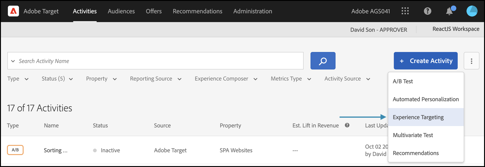
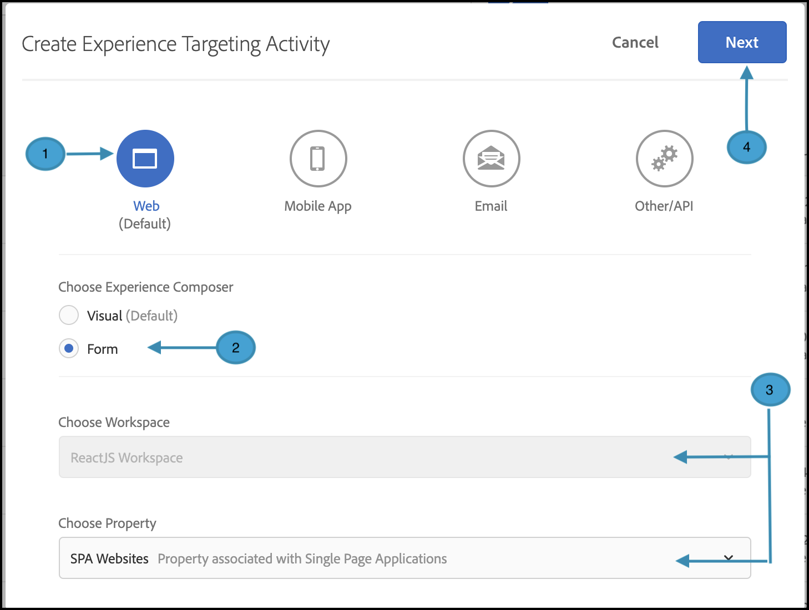
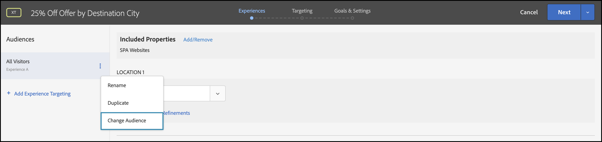
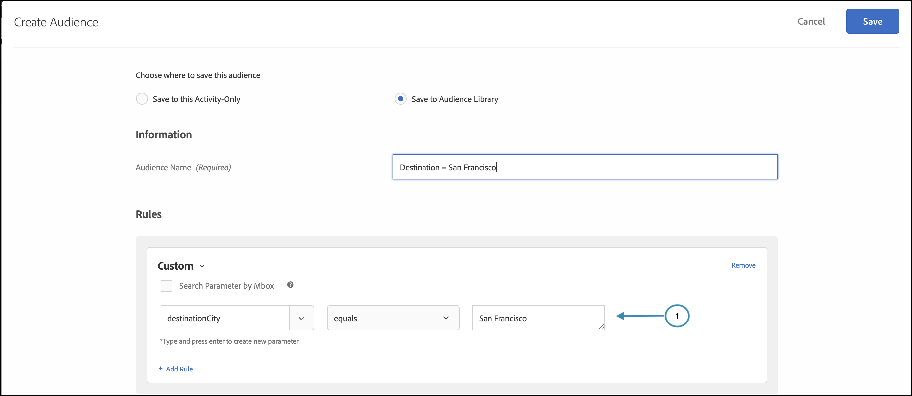
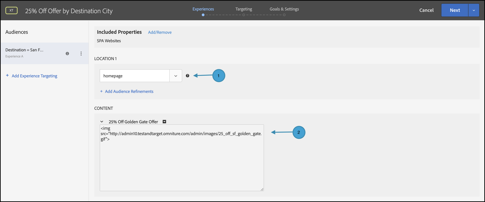
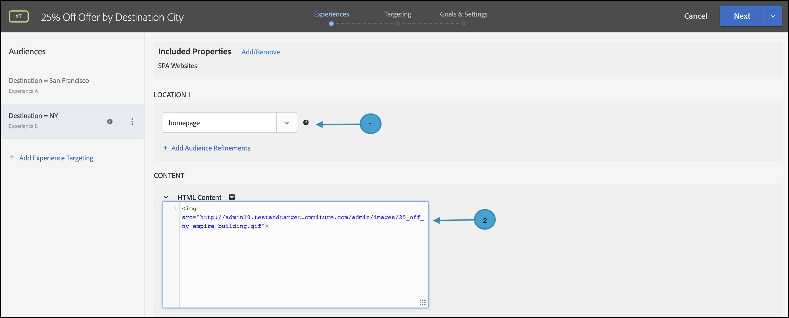
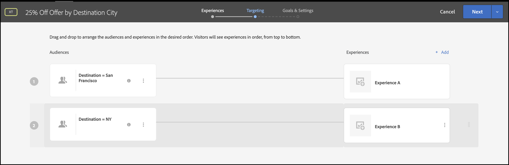
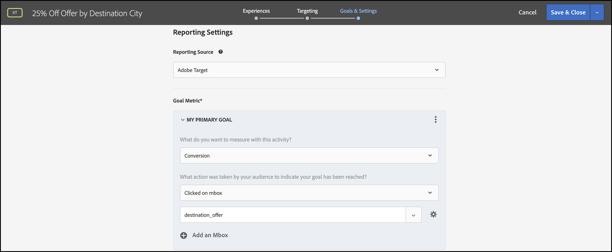
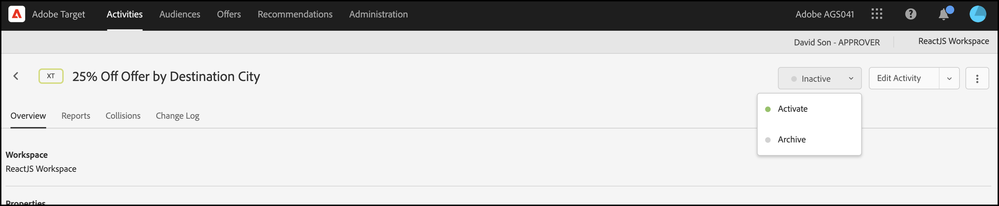

# Entregar personalização

## Resumo das etapas

1. Habilitar a [!UICONTROL decisão no dispositivo] para sua organização
1. Criar uma atividade de [!UICONTROL Direcionamento de experiência] (XT)
1. Definir experiência personalizada por público
1. Verificar experiência personalizada por público-alvo
1. Configurar relatórios
1. Adicionar métricas para KPIs de rastreamento
1. Implementar ofertas personalizadas em seu aplicativo
1. Implementar código para rastrear eventos de conversão
1. Ativar sua atividade de personalização de [!UICONTROL Direcionamento de experiência] (XT)

Suponha que você seja uma empresa de turismo. Você deseja entregar uma oferta personalizada com 25% de desconto em determinados pacotes de viagem. Para que a oferta repercuta com seus usuários, você decide mostrar um ponto de referência da cidade de destino. Além disso, verifique se a entrega de suas ofertas personalizadas tem latência próxima de zero para que não afete negativamente as experiências do usuário e distorça os resultados.

## &#x200B;1. Habilitar a [!UICONTROL decisão no dispositivo] para sua organização

1. A ativação da decisão no dispositivo garante que uma atividade A/B seja executada com latência próxima a zero. Para habilitar este recurso, navegue até **[!UICONTROL Administração]** > **[!UICONTROL Implementação]** > **[!UICONTROL Detalhes da conta]** em [!DNL Adobe Target] e habilite a opção **[!UICONTROL Decisão no Dispositivo]**.

   

   >[!NOTE]
   >
   >Você deve ter a [função de usuário](https://experienceleague.adobe.com/docs/target/using/administer/manage-users/user-management.html) de Administrador ou Aprovador para habilitar ou desabilitar a [!UICONTROL Decisão no Dispositivo].

   Depois de habilitar a opção **[!UICONTROL Decisão no Dispositivo]**, o [!DNL Adobe Target] começa a gerar *artefatos de regra* para o seu cliente.

## &#x200B;2. Criar uma atividade de [!UICONTROL Direcionamento de experiência] (XT)

1. Em [!DNL Adobe Target], navegue até a página **[!UICONTROL Atividades]** e selecione **[!UICONTROL Criar atividade]** > **[!UICONTROL Direcionamento de experiência]**.

   

1. No modal **[!UICONTROL Criar Atividade de Direcionamento de Experiência]**, deixe a opção padrão **[!UICONTROL Web]** selecionada (1), selecione **[!UICONTROL Formulário]** como seu compositor de experiência (2), selecione um espaço de trabalho e uma propriedade (3) e clique em **[!UICONTROL Avançar]** (4).

   

## &#x200B;3. Definir uma experiência personalizada por público

1. Na etapa **[!UICONTROL Experiências]** da criação da atividade, clique em **[!UICONTROL Alterar público-alvo]** para criar um público-alvo para os visitantes que desejam viajar para São Francisco, Califórnia.

   

1. No modal **[!UICONTROL Criar público-alvo]**, defina uma regra personalizada em que `destinationCity = San Francisco`. Isso define o grupo de usuários que deseja viajar para São Francisco.

   

1. Ainda na etapa **[!UICONTROL Experiências]**, digite o nome do local (1) no aplicativo em que você deseja renderizar uma oferta especial sobre o Golden Gate Bridge, mas apenas para aqueles que estão indo para São Francisco. No exemplo mostrado aqui, a página inicial é o local selecionado para a oferta do HTML (2), que é definido na área **[!UICONTROL Conteúdo]**.

   

1. Adicione outro público-alvo de direcionamento clicando em **[!UICONTROL Adicionar direcionamento de experiência]**. Desta vez, direcione a um público que gostaria de viajar para Nova York definindo uma regra de público em que `destinationCity = New York`. Defina o local no aplicativo onde deseja renderizar uma oferta especial sobre o Empire State Building. No exemplo mostrado aqui, `homepage` é o local selecionado para a oferta do HTML (2), que é definido na área **[!UICONTROL Conteúdo]**.

   

## &#x200B;4. Verificar experiência personalizada por público-alvo

Na etapa **[!UICONTROL Direcionamento]**, verifique se você configurou a experiência personalizada desejada por público-alvo.



## &#x200B;5. Configurar relatórios

Na etapa **[!UICONTROL Metas e Configurações]**, escolha **[!UICONTROL Adobe Target]** como a **[!UICONTROL Source de Relatórios]** para exibir os resultados da atividade na interface do usuário do [!DNL Adobe Target], ou escolha **[!UICONTROL Adobe Analytics]** para exibi-los na interface do usuário do Adobe Analytics.



## &#x200B;6. Adicionar métricas para KPIs de rastreamento

Escolha uma **[!UICONTROL Métrica de meta]** para medir o sucesso da atividade. Neste exemplo, uma conversão bem-sucedida se baseia no fato de o usuário clicar na oferta de destino personalizada.

## &#x200B;7. Implementar ofertas personalizadas no aplicativo

>[!BEGINTABS]

>[!TAB Node.js]

```js {line-numbers="true"}
const TargetClient = require("@adobe/target-nodejs-sdk");

const CONFIG = {
  client: "acmeclient",
  organizationId: "1234567890@AdobeOrg"
};

const targetClient = TargetClient.create(CONFIG);

targetClient.getOffers({
  request: {      
    execute: {
      pageLoad: {
        parameters: {
          destinationCity: "San Francisco"
        }
      }
    }       
  }
})
.then(console.log)
.catch(console.error);
```

>[!TAB Java]

```java {line-numbers="true"}
ClientConfig config = ClientConfig.builder()
  .client("acmeclient")
  .organizationId("1234567890@AdobeOrg")
  .build();
TargetClient targetClient = TargetClient.create(config);

Context context = new Context().channel(ChannelType.WEB);

ExecuteRequest executeRequest = new ExecuteRequest();

RequestDetails pageLoad = new RequestDetails();
pageLoad.setParameters(
    new HashMap<String, String>() {
      {
        put("destinationCity", "San Francisco");
      }
    });

executeRequest.setPageLoad(pageLoad);

TargetDeliveryRequest request = TargetDeliveryRequest.builder()
  .context(context)
  .execute(executeRequest)
  .build();

TargetDeliveryResponse offers = targetClient.getOffers(request);
```

>[!ENDTABS]

## &#x200B;8. Implementar código para rastrear eventos de conversão

>[!BEGINTABS]

>[!TAB Node.js]

```js {line-numbers="true"}
//... Code removed for brevity

//When a conversion happens
TargetClient.sendNotifications({
    targetCookie,
    "request" : {
      "notifications" : [
        {
          type: "click",
          timestamp : Date.now(),
          id: "conversion",
          mbox : {
            name : "destinationOffer"
          }
        }
      ]
    }
})
```

>[!TAB Java]

```java {line-numbers="true"
ClientConfig config = ClientConfig.builder()
  .client("acmeclient")
  .organizationId("1234567890@AdobeOrg")
  .build();
TargetClient targetClient = TargetClient.create(config);

Context context = new Context().channel(ChannelType.WEB);

ExecuteRequest executeRequest = new ExecuteRequest();

RequestDetails pageLoad = new RequestDetails();
pageLoad.setParameters(
    new HashMap<String, String>() {
      {
        put("destinationCity", "San Francisco");
      }
    });

executeRequest.setPageLoad(pageLoad);
NotificationDeliveryService notificationDeliveryService = new NotificationDeliveryService();

Notification notification = new Notification();
notification.setId("conversion");
notification.setImpressionId(UUID.randomUUID().toString());
notification.setType(MetricType.CLICK);
notification.setTimestamp(System.currentTimeMillis());
notification.setTokens(
    Collections.singletonList(
        "IbG2Jz2xmHaqX7Ml/YRxRGqipfsIHvVzTQxHolz2IpSCnQ9Y9OaLL2gsdrWQTvE54PwSz67rmXWmSnkXpSSS2Q=="));

TargetDeliveryRequest targetDeliveryRequest =
    TargetDeliveryRequest.builder()
        .context(context)
        .execute(executeRequest)
        .notifications(Collections.singletonList(notification))
        .build();

TargetDeliveryResponse offers = targetClient.getOffers(request);
notificationDeliveryService.sendNotification(request);
```

>[!ENDTABS]

## &#x200B;9. Ativar a atividade de Direcionamento de experiência (XT)


