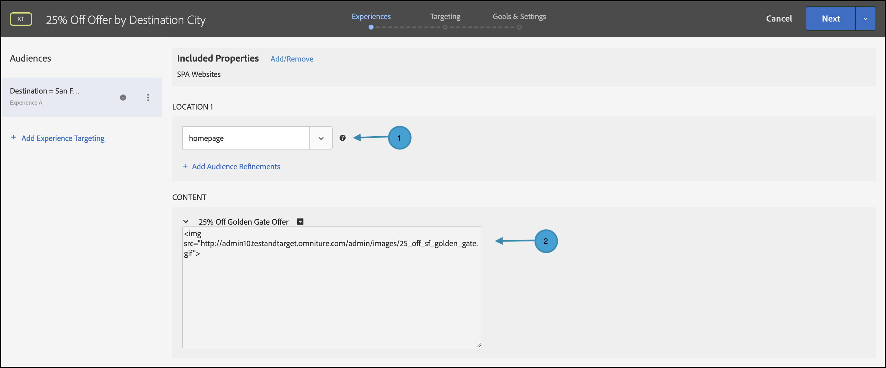

# Entregar personalização

## Resumo das etapas

1. Ativar [!UICONTROL decisão no dispositivo] para sua organização
1. Criar um [!UICONTROL Direcionamento de experiência] Atividade de (XT)
1. Definir experiência personalizada por público
1. Verificar experiência personalizada por público-alvo
1. Configurar relatórios
1. Adicionar métricas para KPIs de rastreamento
1. Implementar ofertas personalizadas em seu aplicativo
1. Implementar código para rastrear eventos de conversão
1. Ativar o [!UICONTROL Direcionamento de experiência] Atividade de personalização do (XT)

Suponha que você seja uma empresa de turismo. Você deseja entregar uma oferta personalizada com 25% de desconto em determinados pacotes de viagem. Para que a oferta repercuta com seus usuários, você decide mostrar um ponto de referência da cidade de destino. Além disso, verifique se a entrega de suas ofertas personalizadas tem latência próxima de zero para que não afete negativamente as experiências do usuário e distorça os resultados.

## 1. Ativar [!UICONTROL decisão no dispositivo] para sua organização

1. A ativação da decisão no dispositivo garante que uma atividade A/B seja executada com latência próxima a zero. Para ativar esse recurso, navegue até **[!UICONTROL Administração]** > **[!UICONTROL Implementação]** > **[!UICONTROL Detalhes da conta]** in [!DNL Adobe Target]e habilite o **[!UICONTROL Decisão no dispositivo]** alternar.

   

   >[!NOTE]
   >
   >Você precisa ter um Administrador ou Aprovador [função do usuário](https://experienceleague.adobe.com/docs/target/using/administer/manage-users/user-management.html) para ativar ou desativar o [!UICONTROL Decisão no dispositivo] alternar.

   Depois de ativar o **[!UICONTROL Decisão no dispositivo]** alternar, [!DNL Adobe Target] começa a gerar *artefatos de regra* para o seu cliente.

## 2. Criar um [!UICONTROL Direcionamento de experiência] Atividade de (XT)

1. Entrada [!DNL Adobe Target], navegue até o **[!UICONTROL Atividades]** e selecione **[!UICONTROL Criar atividade]** > **[!UICONTROL Direcionamento de experiência]**.

   

1. No **[!UICONTROL Criar atividade de direcionamento de experiência]** modal, deixe o padrão **[!UICONTROL Web]** selecionada (1), selecione **[!UICONTROL Formulário]** como experience composer (2), selecione um espaço de trabalho e propriedade (3) e clique em **[!UICONTROL Próxima]** (4).

   

## 3. Definir uma experiência personalizada por público

1. No **[!UICONTROL Experiências]** etapa da criação da atividade, clique em **[!UICONTROL Alterar público-alvo]** para criar um público-alvo para os visitantes que desejam viajar para São Francisco, Califórnia.

   

1. No **[!UICONTROL Criar público-alvo]** modal, defina uma regra personalizada onde `destinationCity = San Francisco`. Isso define o grupo de usuários que deseja viajar para São Francisco.

   

1. Ainda no **[!UICONTROL Experiências]** etapa, digite o nome do local (1) no aplicativo onde deseja renderizar uma oferta especial sobre a Golden Gate Bridge, mas apenas para aqueles que vão para São Francisco. No exemplo mostrado aqui, homepage é o local selecionado para a oferta HTML (2), que é definido na variável **[!UICONTROL Conteúdo]** área.

   

1. Adicione outro público-alvo de direcionamento clicando em **[!UICONTROL Adicionar direcionamento de experiência]**. Desta vez, direcione a um público-alvo que gostaria de viajar para Nova York definindo uma regra de público-alvo em que `destinationCity = New York`. Defina o local no aplicativo onde deseja renderizar uma oferta especial sobre o Empire State Building. No exemplo mostrado aqui, `homepage` é o local selecionado para a oferta HTML (2), que é definido na variável **[!UICONTROL Conteúdo]** área.

   

## 4. Verificar a experiência personalizada por público

No **[!UICONTROL Direcionamento]** etapa, verifique se você configurou a experiência personalizada desejada por público-alvo.


## 5. Configurar relatórios

No **[!UICONTROL Metas e configurações]** etapa, escolha **[!UICONTROL Adobe Target]** como o **[!UICONTROL Fonte dos relatórios]** para exibir os resultados da atividade no [!DNL Adobe Target] ou escolha **[!UICONTROL Adobe Analytics]** para visualizá-los na interface do usuário do Adobe Analytics.


## 6. Adicionar métricas para rastrear KPIs

Escolha um **[!UICONTROL Métrica de objetivo]** para medir o sucesso da atividade. Neste exemplo, uma conversão bem-sucedida se baseia no fato de o usuário clicar na oferta de destino personalizada.

## 7. Implemente suas ofertas personalizadas no aplicativo

>[!BEGINTABS]

>[!TAB Node.js]

```js {line-numbers="true"}
const TargetClient = require("@adobe/target-nodejs-sdk");

const CONFIG = {
  client: "acmeclient",
  organizationId: "1234567890@AdobeOrg"
};

const targetClient = TargetClient.create(CONFIG);

targetClient.getOffers({
  request: {      
    execute: {
      pageLoad: {
        parameters: {
          destinationCity: "San Francisco"
        }
      }
    }       
  }
})
.then(console.log)
.catch(console.error);
```

>[!TAB Java]

```java {line-numbers="true"}
ClientConfig config = ClientConfig.builder()
  .client("acmeclient")
  .organizationId("1234567890@AdobeOrg")
  .build();
TargetClient targetClient = TargetClient.create(config);

Context context = new Context().channel(ChannelType.WEB);

ExecuteRequest executeRequest = new ExecuteRequest();

RequestDetails pageLoad = new RequestDetails();
pageLoad.setParameters(
    new HashMap<String, String>() {
      {
        put("destinationCity", "San Francisco");
      }
    });

executeRequest.setPageLoad(pageLoad);

TargetDeliveryRequest request = TargetDeliveryRequest.builder()
  .context(context)
  .execute(executeRequest)
  .build();

TargetDeliveryResponse offers = targetClient.getOffers(request);
```

>[!ENDTABS]

## 8. Implementar código para rastrear eventos de conversão

>[!BEGINTABS]

>[!TAB Node.js]

```js {line-numbers="true"}
//... Code removed for brevity

//When a conversion happens
TargetClient.sendNotifications({
    targetCookie,
    "request" : {
      "notifications" : [
        {
          type: "click",
          timestamp : Date.now(),
          id: "conversion",
          mbox : {
            name : "destinationOffer"
          }
        }
      ]
    }
})
```

>[!TAB Java]

```java {line-numbers="true"
ClientConfig config = ClientConfig.builder()
  .client("acmeclient")
  .organizationId("1234567890@AdobeOrg")
  .build();
TargetClient targetClient = TargetClient.create(config);

Context context = new Context().channel(ChannelType.WEB);

ExecuteRequest executeRequest = new ExecuteRequest();

RequestDetails pageLoad = new RequestDetails();
pageLoad.setParameters(
    new HashMap<String, String>() {
      {
        put("destinationCity", "San Francisco");
      }
    });

executeRequest.setPageLoad(pageLoad);
NotificationDeliveryService notificationDeliveryService = new NotificationDeliveryService();

Notification notification = new Notification();
notification.setId("conversion");
notification.setImpressionId(UUID.randomUUID().toString());
notification.setType(MetricType.CLICK);
notification.setTimestamp(System.currentTimeMillis());
notification.setTokens(
    Collections.singletonList(
        "IbG2Jz2xmHaqX7Ml/YRxRGqipfsIHvVzTQxHolz2IpSCnQ9Y9OaLL2gsdrWQTvE54PwSz67rmXWmSnkXpSSS2Q=="));

TargetDeliveryRequest targetDeliveryRequest =
    TargetDeliveryRequest.builder()
        .context(context)
        .execute(executeRequest)
        .notifications(Collections.singletonList(notification))
        .build();

TargetDeliveryResponse offers = targetClient.getOffers(request);
notificationDeliveryService.sendNotification(request);
```

>[!ENDTABS]

## 9. Ativar sua atividade de Direcionamento de experiência (XT)


