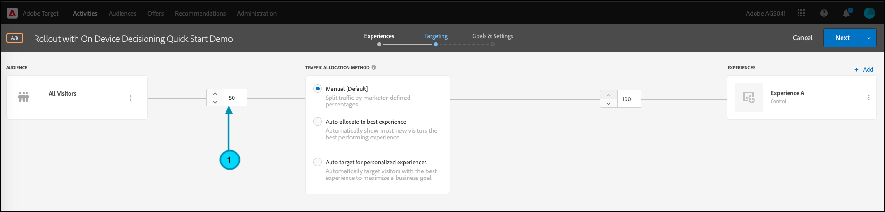

# Gerenciar implantações para testes de recursos

## Resumo das etapas

1. Habilitar [!UICONTROL on-device decisioning] para sua organização
1. Criar uma atividade [!UICONTROL A/B Test]
1. Definir as configurações de recurso e implantação
1. Implementar e renderizar o recurso em seu aplicativo
1. Implementar o rastreamento de eventos no aplicativo
1. Ativar atividade A/B
1. Ajuste a implantação e a alocação de tráfego conforme necessário

## 1. Habilitar [!UICONTROL on-device decisioning] para sua organização

A ativação da decisão no dispositivo garante que uma atividade A/B seja executada com latência próxima a zero. Para habilitar este recurso, navegue até **[!UICONTROL Administration]** > **[!UICONTROL Implementation]** > **[!UICONTROL Account details]** em [!DNL Adobe Target] e habilite a alternância **[!UICONTROL On-Device Decisioning]**.


>[!NOTE]
>
>Você deve ter a [função de usuário](https://experienceleague.adobe.com/docs/target/using/administer/manage-users/user-management.html?lang=pt-BR) de Administrador ou Aprovador para habilitar ou desabilitar a [!UICONTROL On-Device Decisioning].

Depois de habilitar a alternância [!UICONTROL On-Device Decisioning], [!DNL Adobe Target] começa a gerar *artefatos de regra* para o seu cliente.

## 2. Criar uma atividade [!UICONTROL A/B Test]

1. Em [!DNL Adobe Target], navegue até a página **[!UICONTROL Activities]** e selecione **[!UICONTROL Create Activity]** > **[!UICONTROL A/B test]**.

   

1. No modal **[!UICONTROL Create A/B Test Activity]**, deixe a opção padrão **[!UICONTROL Web]** selecionada (1), selecione **[!UICONTROL Form]** como compositor de experiência (2), selecione **[!UICONTROL Default Workspace]** com **[!UICONTROL No Property Restrictions]** (3) e clique em **[!UICONTROL Next]** (4).

   

## 3. Definir as configurações de recurso e implantação

Na etapa **[!UICONTROL Experiences]** da criação da atividade, forneça um nome para a atividade (1). Digite o nome do local (2) no aplicativo onde deseja gerenciar implantações para o recurso. Por exemplo, `ondevice-rollout` ou `homepage-addtocart-rollout` são nomes de locais que indicam os destinos para o gerenciamento de implantações de recursos. No exemplo mostrado abaixo, `ondevice-rollout` é o local definido para a Experiência A. Opcionalmente, é possível adicionar refinamentos de Público-alvo (4) para restringir a qualificação à atividade.


1. Na seção **[!UICONTROL Content]** na mesma página, selecione **[!UICONTROL Create JSON Offer]** no menu suspenso (1), conforme mostrado.

   

1. Na caixa de texto **[!UICONTROL JSON Data]** exibida, insira a variável do sinalizador de recurso do recurso que você pretende implantar com esta atividade na Experiência A (1), usando um objeto JSON válido (2).

   

1. Clique em **[!UICONTROL Next]** (1) para avançar para a etapa **[!UICONTROL Targeting]** da criação da atividade.

   

1. Na etapa **[!UICONTROL Targeting]**, mantenha o **[!UICONTROL All Visitors]** público-alvo (1), para simplificar. Mas ajuste a alocação de tráfego (2) para 10%. Isso restringirá o recurso a apenas 10% dos visitantes do site. Clique em Avançar (3) para avançar para a etapa **[!UICONTROL Goals & Settings]**.

   

1. Na etapa **[!UICONTROL Goals & Settings]**, escolha **[!UICONTROL Adobe Target]** (1) como **[!UICONTROL Reporting Source]** para exibir os resultados da atividade na interface do usuário [!DNL Adobe Target].

1. Escolha um **[!UICONTROL Goal Metric]** para medir a atividade. Neste exemplo, uma conversão bem-sucedida se baseia no fato de o usuário comprar um item, conforme indicado pelo fato de o usuário ter atingido o local orderConfirm (2).

1. Clique em **[!UICONTROL Save & Close]** (3) para salvar a atividade.

   

## 4. Implementar e renderizar o recurso em seu aplicativo

>[!BEGINTABS]

>[!TAB Node.js]

```js {line-numbers="true"}
targetClient.getAttributes(["ondevice-rollout"]).then(function(attributes) {
      const featureFlags = attributes.asObject("ondevice-rollout");

      // Your flag variables are now available in the featureFlags object variable.
      //If you failed to qualify for the Activity, you will have an empty object.
      console.log(featureFlags);
    });
```

>[!TAB Java]

```java {line-numbers="true"}
    Attributes attrs = targetJavaClient.getAttributes(targetDeliveryRequest, "ondevice-rollout");
    Map<String, Object> featureFlags = attrs.toMboxMap("ondevice-rollout");
​
    // Your flag variables are now available in the featureFlags object variable.
    //If you failed to qualify for the Activity, you will have an empty object.
    System.out.println(featureFlags);
```

>[!ENDTABS]

## 5. Implementar o rastreamento de eventos no aplicativo

Depois de disponibilizar a variável do sinalizador de recurso no aplicativo, você pode usá-la para ativar qualquer recurso que já faça parte do aplicativo. Se um visitante não se qualificar para a atividade, significa que não foi incluído como parte do intervalo de 10% definido como o público-alvo.

>[!BEGINTABS]

>[!TAB Node.js]

```js {line-numbers="true"}
//... Code removed for brevity

if(featureFlags.enable == "yes") { //Fell within 10% traffic
    console.log("Render Feature");
}
else {
    console.log("Disable Feature");
}

// alternatively, the getValue method could be used on the Attributes object.

if(attributes.getValue("ondevice-rollout", "enable") === "yes") { //Fell within 10% traffic
    console.log("Render Feature");
}
else {
    console.log("Disable Feature");
}
```

>[!TAB Java]

```java {line-numbers="true"}
//... Code removed for brevity
​
if("yes".equals(String.valueOf(featureFlags.get("enable")))) { //Fell within 10% traffic
    System.out.println("Render Feature");
}
else {
    System.out.println("Disable Feature");
}
​
// alternatively, the getString method could be used on the Attributes object.
​
if("yes".equals(attrs.getString("ondevice-rollout", "enable"))) { //Fell within 10% traffic
    System.out.println("Render Feature");
}
else {
    System.out.println("Disable Feature");
}
```

>[!ENDTABS]

## 6. Ativar a atividade de implantação


## 7. Ajuste a implantação e a alocação de tráfego conforme necessário

Depois de ativar sua atividade, edite-a a qualquer momento para aumentar ou diminuir a alocação de tráfego, conforme necessário.

Aumento da alocação de tráfego de 10% para 50% devido ao sucesso da implantação inicial.


