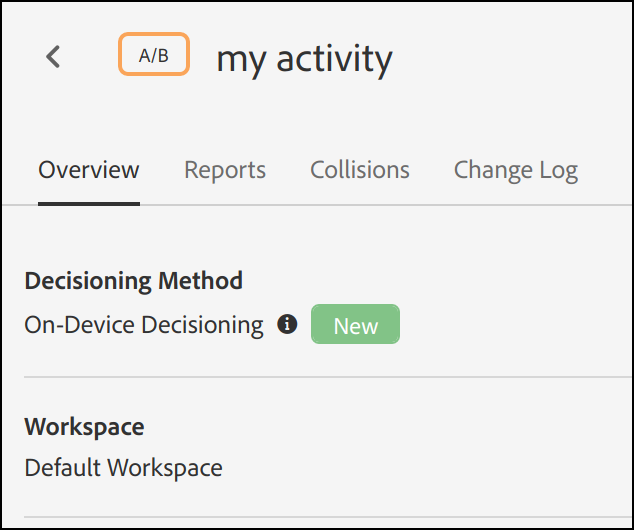
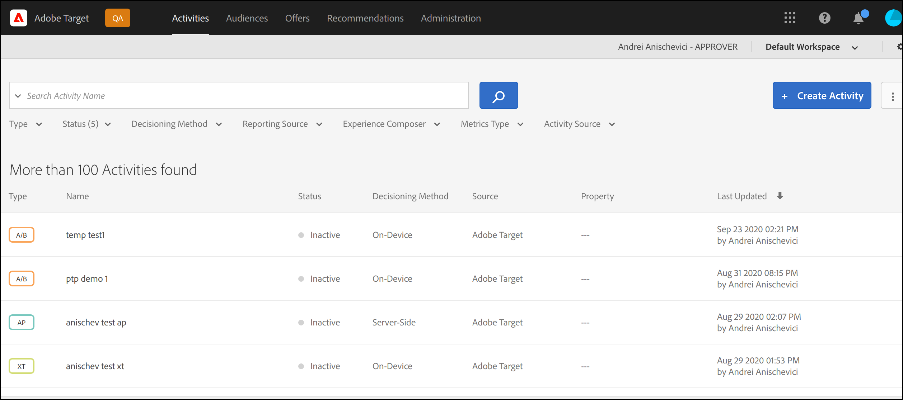

# Visão geral da decisão no dispositivo

Os [!DNL Adobe Target] SDKs da próxima geração agora oferecem [!UICONTROL decisões no dispositivo], que fornecem a capacidade de armazenar em cache suas campanhas A/B e de Direcionamento de experiência (XT) no servidor e tomar decisões na memória com latência próxima a zero, sem bloquear solicitações de rede para a Edge Network do [!DNL Adobe Target].

O [!DNL Adobe Target] também oferece a flexibilidade de fornecer a experiência mais relevante e atualizada de suas campanhas de experimentação e personalização orientadas por aprendizado de máquina por meio de uma chamada de servidor em tempo real. Em outras palavras, quando o desempenho é mais importante, você pode optar por utilizar a [!UICONTROL decisão no dispositivo], mas quando a experiência mais relevante e atualizada for necessária, uma chamada de servidor poderá ser feita. Consulte [quando usar a decisão no dispositivo vs. a decisão na borda](../../sdk-guides/on-device-decisioning/supported-features.md) para saber mais sobre os casos de uso que garantem o uso de uma sobre a outra.

>[!NOTE]
>
>A decisão no dispositivo está disponível para implementações do lado do cliente e do lado do servidor. Este artigo descreve a [!UICONTROL decisão no dispositivo] para o lado do servidor. Para obter informações sobre a [!UICONTROL decisão no dispositivo] para o lado do cliente, consulte a documentação de implementação do lado do cliente [aqui](../../../client-side/atjs/on-device-decisioning/on-device-decisioning.md).

## Como funciona?

Quando você instala e inicializa um [!DNL Adobe Target] SDK com a [!UICONTROL decisão no dispositivo] habilitada, um *artefato de regra* é baixado e armazenado em cache localmente no seu servidor, a partir do Akamai CDN mais próximo ao seu servidor. Quando uma solicitação para recuperar uma experiência do [!DNL Adobe Target] é feita no aplicativo do lado do servidor, a decisão sobre qual conteúdo retornar é tomada na memória, com base nos metadados codificados no artefato de regra em cache, que define todas as suas [!UICONTROL atividades A/B e XT de decisão no dispositivo].

O diagrama a seguir mostra a arquitetura da [!UICONTROL decisão no dispositivo]. Clique em para expandir a imagem.

(Clique na imagem para expandir até a largura total.)

{zoomable="yes"}

## Quais são os benefícios?

* **Fornecer decisões de latência quase zero.** O particionamento e a decisão são executados na memória e no dispositivo para evitar o bloqueio de solicitações de rede.
* **Aprimorar o desempenho do aplicativo.** Execute experimentos e forneça personalização aos seus clientes e usuários sem comprometer as experiências do usuário final.
* **Melhore A Pontuação De Qualidade Do Site Do Google.** Com as decisões acontecendo na memória e no lado do servidor, melhore a pontuação da Qualidade do site do Google de seu negócio online para torná-lo mais detectável pelos consumidores.
* **Aprenda com a análise em tempo real.** Obtenha insights do desempenho da sua atividade em tempo real por meio dos relatórios do [!DNL Adobe Target] ou do A4T, permitindo que você dinamize sua estratégia em momentos críticos.

## Funcionalidade compatível

### Atividades

A decisão no dispositivo é compatível com os seguintes tipos de atividades criadas pelo [Experience Composer baseado em formulário](https://experienceleague.adobe.com/docs/target/using/experiences/form-experience-composer.html?lang=pt-BR):

* [!UICONTROL Teste A/B]
* [!UICONTROL Direcionamento de experiência] (XT)

### Método de Alocação

A decisão no dispositivo é compatível com o seguinte método de alocação:

* Manual

### Direcionamento de público

A decisão no dispositivo é compatível com as seguintes regras de público-alvo:

| Regra de público-alvo | Decisão no dispositivo |
| --- | --- |
| [Geografia](https://experienceleague.adobe.com/docs/target/using/audiences/create-audiences/categories-audiences/geo.html?lang=pt-BR) | Sim
Ao usar a decisão no dispositivo, os seguintes atributos geográficos são compatíveis:<ul><li>País/Região</li><li>Cidade</li><li>Latitude</li><li>Longitude</li></ul> |
| [Rede](https://experienceleague.adobe.com/docs/target/using/audiences/create-audiences/categories-audiences/network.html?lang=pt-BR) | Não |
| [Móvel](https://experienceleague.adobe.com/docs/target/using/audiences/create-audiences/categories-audiences/mobile.html?lang=pt-BR) | Não |
| [Parâmetros personalizados](https://experienceleague.adobe.com/docs/target/using/audiences/create-audiences/categories-audiences/custom-parameters.html?lang=pt-BR) | Sim |
| [Sistema operacional](https://experienceleague.adobe.com/docs/target/using/audiences/create-audiences/categories-audiences/operating-system.html?lang=pt-BR) | Sim |
| [Páginas do site](https://experienceleague.adobe.com/docs/target/using/audiences/create-audiences/categories-audiences/site-pages.html?lang=pt-BR) | Sim |
| [Navegador](https://experienceleague.adobe.com/docs/target/using/audiences/create-audiences/categories-audiences/browser.html?lang=pt-BR) | Sim |
| [Perfil do visitante](https://experienceleague.adobe.com/docs/target/using/audiences/create-audiences/categories-audiences/visitor-profile.html?lang=pt-BR) | Não |
| [Fontes de Tráfego](https://experienceleague.adobe.com/docs/target/using/audiences/create-audiences/categories-audiences/traffic-sources.html?lang=pt-BR) | Não |
| [Intervalo de tempo](https://experienceleague.adobe.com/docs/target/using/audiences/create-audiences/categories-audiences/time-frame.html?lang=pt-BR) | Sim |
| [Públicos-alvo da Experience Cloud](https://experienceleague.adobe.com/docs/target/using/integrate/mmp.html?lang=pt-BR) (públicos-alvo da Adobe Audience Manager, Adobe Analytics e Adobe Experience Manager) | Não |

## Como provisionar meu cliente para usar a [!UICONTROL decisão no dispositivo]?

A decisão no dispositivo está disponível para todos os clientes do [!DNL Adobe Target] que usam SDKs do lado do servidor do [!DNL Adobe Target]. Para habilitar este recurso, navegue até **[!UICONTROL Administração]** > **[!UICONTROL Implementação]** > **[!UICONTROL Detalhes da conta]** na interface do usuário do [!DNL Adobe Target] e habilite a opção **[!UICONTROL Decisão no Dispositivo]**.

>[!NOTE]
>
>Você deve ter a *função de usuário* de Administrador ou Aprovador para habilitar ou desabilitar a [!UICONTROL Decisão no Dispositivo].

Depois de habilitar a opção de Decisão no Dispositivo, o [!DNL Adobe Target] começará a gerar e propagar *artefatos de regras* para o seu cliente.

>[!NOTE]
>
>Habilite o botão de alternância antes de inicializar o SDK [!DNL Adobe Target] para usar a [!UICONTROL decisão no dispositivo]. Os artefatos da regra precisarão primeiro ser gerados e propagados para os CDNs do Akamai para que a [!UICONTROL decisão no dispositivo] funcione.

### Incluir todas as [!UICONTROL decisões no dispositivo] atividades qualificadas existentes na alternância de artefato

Ative esta **em** quando desejar que todas as suas atividades [!DNL Target] ativas qualificadas para [!UICONTROL decisões no dispositivo] sejam incluídas automaticamente no artefato.

Deixar este botão **desativado** significa que você precisará recriar e ativar quaisquer atividades de [!UICONTROL decisão no dispositivo] para que elas sejam incluídas no artefato de regras gerado.

## Como faço para saber se uma atividade tem capacidade para [!UICONTROL a decisão no dispositivo]?

Depois que você cria uma atividade, um rótulo chamado **[!UICONTROL Método de decisão]**, visível na página de detalhes da atividade, indica se a atividade é compatível com [!UICONTROL a decisão no dispositivo].

Você também pode ver todas as atividades [!UICONTROL com capacidade de decisão no dispositivo] na página **[!UICONTROL Atividades]** adicionando a coluna **[!UICONTROL Método de Decisão]** à lista de atividades.

>[!NOTE]
>
>Após criar e ativar uma atividade com capacidade de [!UICONTROL decisão no dispositivo], pode levar até 20 minutos para que ela seja incluída no artefato de regras gerado e propagado para os PoPs da Akamai CDN.

## Qual é o resumo das etapas que preciso seguir para garantir que minhas [!UICONTROL atividades de decisão no dispositivo] sejam entregues com êxito por meio da SDK do lado do servidor do [!DNL Adobe Target]?

1. Acesse a interface do usuário do [!DNL Adobe Target] e navegue até **[!UICONTROL Administração]** > **[!UICONTROL Implementação]** > **[!UICONTROL Detalhes da conta]** para habilitar a opção **[!UICONTROL Decisão no Dispositivo]**.
1. Habilite a **[!UICONTROL Inclusão de todas as atividades qualificadas [!UICONTROL da decisão no dispositivo] existentes na alternância de artefato]**.
1. Crie e ative um tipo de atividade que seja suportado pela [!UICONTROL decisão no dispositivo] e verifique se o **[!UICONTROL Método de Decisão]** é a **[!UICONTROL Decisão no Dispositivo]** para essa atividade.
1. Instale e inicialize o [Node.js](../../node-js/overview.md) ou o [Java](../../java/overview.md) SDK com `decisioningMethod = on-device`.
1. Implemente `getOffers()` ou `getAttributes()` em seu código para recuperar uma experiência no dispositivo.
1. Implante seu código.

Para obter exemplos demonstrando como começar a usar as etapas 1 a 3 acima, consulte a seção [Introdução](../getting-started/getting-started.md).

## Recursos adicionais

### Webinário: Personalize e teste em latência zero com decisões no dispositivo do [!DNL Adobe Target]

Mais do que nunca, os profissionais de marketing, proprietários de produtos e desenvolvedores estão sendo incumbidos de otimizar a experiência geral do cliente em sites, aplicativos e em todos os outros lugares onde eles se conectam com seus clientes. Várias ferramentas com silos de dados e implementações complicadas são inadequadas.

Neste webinário gravado, os especialistas em produtos do [!DNL Adobe Target] discutem como mover as decisões de otimização de experiência crítica no dispositivo para execução local com latência próxima a zero pode abrir portas para novos casos de uso interessantes e, ao mesmo tempo, melhorar o desempenho do site para seus clientes.

>[!VIDEO](https://video.tv.adobe.com/v/328148/?quality=12)

### Tutorial: decisão no dispositivo

A [!DNL Adobe Target] [!UICONTROL decisão no dispositivo] habilita a entrega de conteúdo de latência próxima a zero.

Este vídeo de 7 minutos:

* Descreve a [!UICONTROL decisão no dispositivo], incluindo como ela se compara a outros métodos de implementação de [!DNL Target]
* Demonstra como habilitar a [!UICONTROL decisão no dispositivo] no Target
* Examina uma amostra de atividade de compositor baseada em formulário que foi configurada com conteúdo JSON
* Mostra o exemplo de código SDK Node.JS contendo a configuração de chave necessária para [!UICONTROL a decisão no dispositivo]
* Demonstra resultados em um navegador

>[!VIDEO](https://video.tv.adobe.com/v/329032/?quality=12)

Para obter mais vídeos e tutoriais, consulte os [[!DNL Adobe Target] Tutoriais](https://experienceleague.adobe.com/docs/target-learn/tutorials/overview.html?lang=pt-BR).

### Adobe Tech Blog — Parte 1: Execute o [!DNL Adobe Target] NodeJS SDK para experimentação e personalização em plataformas de borda (Trabalhadores do Akamai Edge)

[Clique aqui para acessar a publicação do blog](https://medium.com/adobetech/part-1-run-adobe-target-nodejs-sdk-for-experimentation-and-personalization-on-edge-platforms-4d8660964ed9).

### Adobe Tech Blog — Parte 2: Execute o SDK NodeJS do [!DNL Adobe Target] para experimentação e personalização em plataformas de borda (AWS Lambda@Edge)

[Clique aqui para acessar a publicação do blog](https://medium.com/adobetech/part-2-run-adobe-target-nodejs-sdk-for-experimentation-and-personalization-on-edge-platforms-aws-4d6bdac24563).
