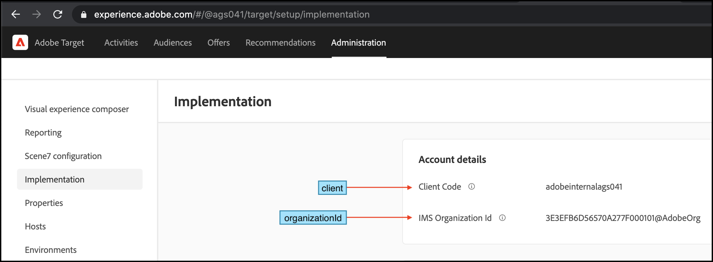

# Baixar, armazenar e atualizar o artefato da regra por meio da carga JSON

Essa abordagem é melhor se o aplicativo estiver estruturado de uma maneira que exija que o SDK seja inicializado em cada arquivo no qual ele usa os métodos do SDK. Antes que seu aplicativo da Web possa usar a carga JSON do artefato de regra durante a inicialização do SDK, você deve garantir que a carga JSON seja baixada e esteja disponível para uso pelo seu aplicativo.

## Resumo das etapas

1. Instalar o SDK
1. Inicializar o SDK
1. Armazenar e usar a carga JSON

## &#x200B;1. Instalar o SDK

>[!BEGINTABS]

>[!TAB NPM]

```javascript {line-numbers="true"}
npm i @adobe/target-nodejs-sdk -P
```

>[!TAB MVN]

```javascript {line-numbers="true"}
<dependency>
    <groupId>com.adobe.target</groupId>
    <artifactId>java-sdk</artifactId>
    <version>1.0</version>
</dependency>
```

>[!ENDTABS]

## &#x200B;2. Inicializar o SDK

1. Primeiro, importe o SDK. Importar para o mesmo arquivo a partir do qual você pode controlar a inicialização do servidor.

   **Node.js**

   ```javascript {line-numbers="true"}
   const TargetClient = require("@adobe/target-nodejs-sdk");
   ```

   **Java**

   ```javascript {line-numbers="true"}
   import com.adobe.target.edge.client.ClientConfig;
   import com.adobe.target.edge.client.TargetClient;
   ```

1. Para configurar o SDK, use o método create.

   **Node.js**

   ```javascript {line-numbers="true"}
   const CONFIG = {
       client: "<your target client code>",
       organizationId: "your EC org id",
       decisioningMethod: "on-device",
       pollingInterval : 300000,
       events: {
           artifactDownloadSucceeded: onArtifactDownloadSucceeded,
           artifactDownloadFailed: onArtifactDownloadFailed
       }
   };
   
   const TargetClient = TargetClient.create(CONFIG);
   
   function onArtifactDownloadSucceeded(event) {
       //Adobe Target SDK has now downloaded the JSON Artifact/Payload
       console.log(event.artifactLocation) // Location from where the Artifact is downloaded.
       console.log(event.artifactPayload) // JSON Payload which we can store locally.
   }
   
   function onArtifactDownloadFailed(event) {
       //Adobe Target SDK has failed to download the JSON Artifact/Payload.
       console.log(event.artifactLocation) // Location from where the Artifact is downloaded.
       console.log(event.error.message) // Error message
   }
   ```

   **Java**

   ```javascript {line-numbers="true"}
   package com.adobe.target.edge.client.model.ondevice.OnDeviceDecisioningHandler;
   
   ClientConfig config = ClientConfig.builder()
       .client("<you target client code>")
       .organizationId("<your EC org id>")
       .onDeviceDecisioningHandler(
         new OnDeviceDecisioningHandler() {
           void onDeviceDecisioningReady() {
             // On-Device Decision is ready.
           }
           void artifactDownloadSucceeded(byte[] artifactData) {
             // Store artifactData to local disk.        
             // ...
           }
         }
       )
       .build();
   TargetClient targetClient = TargetClient.create(config);
   ```

1. O cliente e `organizationId` podem ser recuperados de [!DNL Adobe Target] navegando até **[!UICONTROL Administration]** > **[!UICONTROL Implementation]**, como mostrado aqui.

   &lt;!— Insira image-client-code.png —>
   

## &#x200B;3. Armazene e reinicie a carga JSON

O mecanismo usado para armazenar a carga JSON depende da arquitetura do sistema. Você pode usar um arquivo local, um banco de dados ou um sistema de cache de objetos de memória, como Memcached. Você precisa ler este JSON do seu aplicativo para consumo. Neste guia, usamos um arquivo local como armazenamento.

>[!BEGINTABS]

>[!TAB Node.js]

```javascript {line-numbers="true"}
//... Code removed for brevity

function onArtifactDownloadSucceeded(event) {
    const jsonPath = 'src/config/target-rules.json'
    fs.writeFile(jsonPath, JSON.stringify(event.artifactPayload), 'utf8', (err) => {
        if (err) {
            throw err;
        };
        console.log(`The artifact from '${event.artifactLocation}' is now saved to '${jsonPath}'`);
    });
}


function onArtifactDownloadFailed(event) {
  console.log(`The local decisioning artifact failed to download from '${event.artifactLocation}' with the following error message: ${event.error.message}`);
}

//... Code removed for brevity
```

>[!TAB Java]

```javascript {line-numbers="true"}
MboxRequest mbox = new MboxRequest().name("homepage").index(0);
TargetDeliveryRequest request = TargetDeliveryRequest.builder()
    .context(new Context().channel(ChannelType.WEB))
    .execute(new ExecuteRequest().mboxes(Arrays.asList(mbox)))
    .build();
TargetDeliveryResponse response = targetClient.getOffers(request);
```

>[!ENDTABS]

>[!NOTE]
>
>Ao inicializar o [!DNL Adobe Target]SDK por meio da carga JSON, o servidor estará pronto para atender às solicitações imediatamente com atividades de decisão no dispositivo, já que o [!DNL Adobe Target]SDK não precisa aguardar o download do artefato da regra.

Este é um exemplo demonstrando o recurso de inicialização de carga JSON.

>[!BEGINTABS]

>[!TAB Node.js]

```javascript {line-numbers="true"}
const express = require("express");
const cookieParser = require("cookie-parser");
const TargetClient = require("@adobe/target-nodejs-sdk");
const CONFIG = {
    client: "<your target client code>",
    organizationId: "your EC org id",
    decisioningMethod: "on-device",
    pollingInterval : 300000,
    events: {
        clientReady : startWebServer,
        artifactDownloadSucceeded : onArtifactDownloadSucceeded,
        artifactDownloadFailed : onArtifactDownloadFailed
    },
};

function onArtifactDownloadSucceeded(event) {
    const jsonPath = 'src/config/target-rules.json'
    fs.writeFile(jsonPath, JSON.stringify(event.artifactPayload), 'utf8', (err) => {
        if (err) {
            throw err;
        };
        console.log(`The artifact from '${event.artifactLocation}' is now saved to '${jsonPath}'`);
    });
}

function onArtifactDownloadFailed(event) {
  console.log(`The on-device decisioning artifact failed to download from '${event.artifactLocation}' with the following error message: ${event.error.message}`);
}

const app = express();
const targetClient = TargetClient.create(CONFIG);

app.use(cookieParser());

function saveCookie(res, cookie) {
  if (!cookie) {
    return;
  }

  res.cookie(cookie.name, cookie.value, {maxAge: cookie.maxAge * 1000});
}

const getResponseHeaders = () => ({
  "Content-Type": "text/html",
  "Expires": new Date().toUTCString()
});

function sendSuccessResponse(res, response) {
  res.set(getResponseHeaders());
  saveCookie(res, response.targetCookie);
  res.status(200).send(response);
}

function sendErrorResponse(res, error) {
  res.set(getResponseHeaders());
  res.status(500).send(error);
}

function startWebServer() {
    app.get('/*', async (req, res) => {
    const targetCookie = req.cookies[TargetClient.TargetCookieName];
    const request = {
        execute: {
        mboxes: [{
            address: { url: req.headers.host + req.originalUrl },
            name: "on-device-homepage-banner" // Ensure that you have a LIVE Activity running on this location
        }]
        }};

    try {
        const response = await targetClient.getOffers({ request, targetCookie });
        sendSuccessResponse(res, response);
    } catch (error) {
        console.error("Target:", error);
        sendErrorResponse(res, error);
    }
    });

    app.listen(3000, function () {
    console.log("Listening on port 3000 and watching!");
    });
}
```

>[!TAB Java]

```javascript {line-numbers="true"}
import com.adobe.target.edge.client.ClientConfig;
import com.adobe.target.edge.client.TargetClient;
import com.adobe.target.delivery.v1.model.ChannelType;
import com.adobe.target.delivery.v1.model.Context;
import com.adobe.target.delivery.v1.model.ExecuteRequest;
import com.adobe.target.delivery.v1.model.MboxRequest;
import com.adobe.target.edge.client.entities.TargetDeliveryRequest;
import com.adobe.target.edge.client.model.TargetDeliveryResponse;

@Controller
public class TargetController {

  private TargetClient targetClient;

  TargetController() {
    // You should instantiate TargetClient in a Bean and inject the instance into this class 
    // but we show the code here for demonstration purpose.
    ClientConfig config = ClientConfig.builder()
        .client("<you target client code>")
        .organizationId("<your EC org id>")
        .onDeviceDecisioningHandler(
          new OnDeviceDecisioningHandler() {
            void onDeviceDecisioningReady() {
              // On-Device Decision is ready.
            }
            void artifactDownloadSucceeded(byte[] artifactData) {
              // Store artifactData to local disk.        
              // ...
            }
          }
        )
        .build();
    targetClient = TargetClient.create(config);
  }

  @GetMapping("/")
  public String homePage() {
    MboxRequest mbox = new MboxRequest().name("homepage").index(0);
    TargetDeliveryRequest request = TargetDeliveryRequest.builder()
        .context(new Context().channel(ChannelType.WEB))
        .execute(new ExecuteRequest().mboxes(Arrays.asList(mbox)))
        .build();
    TargetDeliveryResponse response = targetClient.getOffers(request);
    // ...
  }
}
```

>[!ENDTABS]
