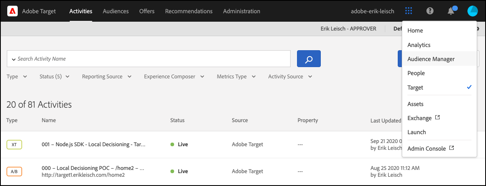
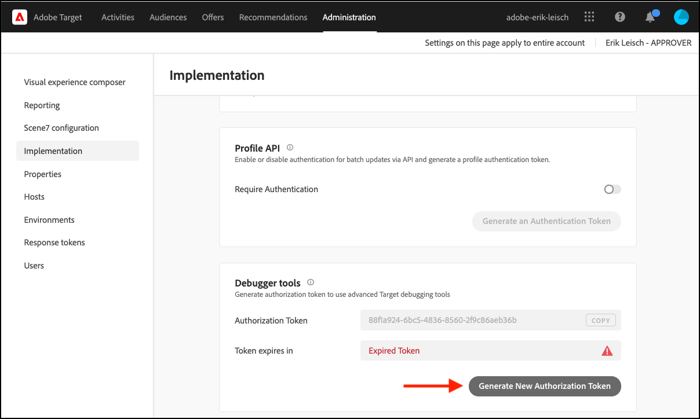

# Visão geral do artefato da regra

O artefato da regra é uma representação JSON das suas atividades de [!DNL Adobe Target] [!UICONTROL decisão no dispositivo]. Ele é gerado por [!DNL Adobe Target] e propagado para o Akamai CDN para garantir que haja um artefato de regra disponível o mais próximo possível dos usuários finais. Ele contém metadados que garantem a execução e o delivery precisos de suas atividades, além de permitir análises em tempo real por meio do rastreamento de eventos. Os [!DNL Adobe Target] SDKs podem ser configurados de forma a permitir o gerenciamento automático do artefato de regra, pelo qual ele pode ser baixado ou atualizado de acordo com um intervalo de tempo especificado pelo usuário. Além disso, você também pode manter sua própria cópia local do artefato da regra usando um sistema de cache de memória distribuída como o [Memcached](https://memcached.org/) para inicializar o SDK [!DNL Adobe Target], de forma que os servidores sem estado possam atender às solicitações imediatamente. Para saber mais sobre essas opções, consulte os seguintes guias:

* [Baixando, Armazenando e Atualizando o Artefato de Regra Automaticamente pelo  [!DNL Adobe Target] SDK](rule-artifact-sdk.md)
* [Download, armazenamento e atualização do artefato da regra por meio da carga JSON](rule-artifact-json.md)

## Exemplo de artefato de regra

Clique aqui para obter um exemplo do [artefato de regra](rule-artifact-example.md).

## Como visualizar o artefato da regra para seu cliente

A habilitação de rastreamentos resultará em informações adicionais de [!DNL Adobe Target] em relação ao artefato da regra, especificamente a URL.

1. Navegue até a interface do Target.

   <!-- Insert image-target-ui-1.png -->
   

1. Navegue até **[!UICONTROL Administração]** > **[!UICONTROL Implementação]** e clique em **[!UICONTROL Gerar novo token de autorização]**.

   <!-- Insert image-target-ui-2.png -->
   

1. Copie o token de autorização recém-gerado para a área de transferência e adicione-o à solicitação do Target.

   ```javascript {line-numbers="true"}
   const request = {
     trace: {
       authorizationToken: '88f1a924-6bc5-4836-8560-2f9c86aeb36b'
     },
     execute: {
       mboxes: [{
         address: getAddress(req),
         name: "node-sdk-mbox"
       }]
   }};
   ```

1. Gere a saída do Target Trace por meio do terminal para exibir detalhes sobre o artefato. A URL pode ser acessada pela variável `artifactLocation`.

   ```
   "trace": {
     "clientCode": "your-client-code",
     "artifact": {
       "artifactLocation": "https://assets.adobetarget.com/your-client-code/production/v1/rules.bin",
       "pollingInterval": 300000,
       "pollingHalted": false,
       "artifactVersion": "1.0.0",
       "artifactRetrievalCount": 10,
       "artifactLastRetrieved": "2020-09-20T00:09:42.707Z",
        "clientCode": "your-client-code",
      "environment": "production",
       "generatedAt": "2020-09-22T17:17:59.783Z"
     },
   ```
