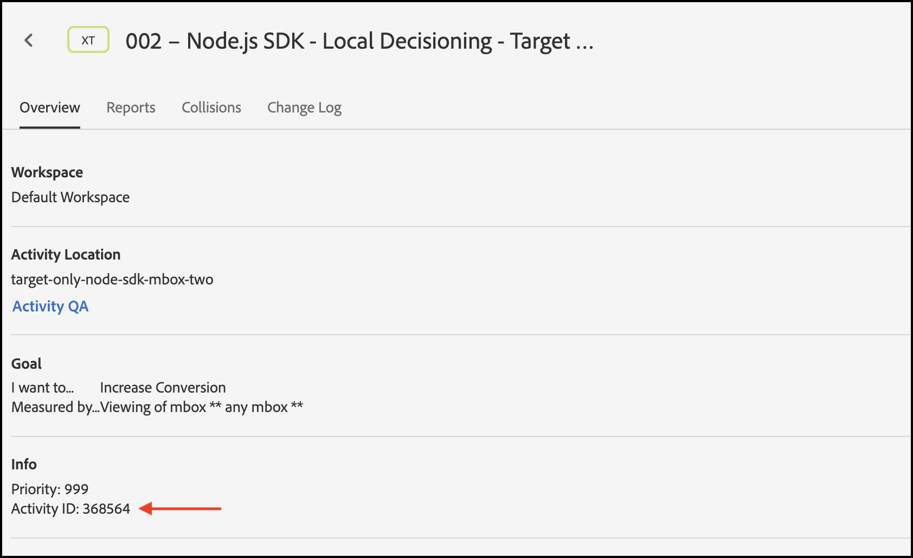

# Solução de problemas [!UICONTROL on-device decisioning]

## Validando configuração

### Resumo das etapas

1. Verifique se o `logger` está configurado
1. Verifique se os rastreamentos de [!DNL Target] estão habilitados
1. Verifique se o [!UICONTROL on-device decisioning] *artefato de regra* foi recuperado e armazenado em cache de acordo com o intervalo de sondagem definido.
1. Valide a entrega de conteúdo por meio do artefato de regra em cache criando uma atividade de teste [!UICONTROL on-device decisioning] por meio do Experience Composer baseado em formulário.
1. Erros de notificação de envio do Inspect

## 1. Verifique se o agente de log está configurado

Ao inicializar o SDK, ative o registro.

**Node.js**

Para o SDK do Node.js, um objeto `logger` deve ser fornecido.

```js {line-numbers="true"}
const CONFIG = {
  client: "<your client code>",
  organizationId: "<your organization ID>",
  logger: console
};
```

**SDK Java**

Para o SDK Java `logRequests` em `ClientConfig` deve estar habilitado.

```js {line-numbers="true"}
ClientConfig config = ClientConfig.builder()
  .client("<your client code>")
  .organizationId("<your organization ID>")
  .logRequests(true)
  .build();
```

Além disso, a JVM deve ser iniciada com o seguinte parâmetro de linha de comando:

```bash {line-numbers="true"}
java -Dorg.slf4j.simpleLogger.defaultLogLevel=DEBUG ...
```

## 2. Verifique se [!DNL Target]Rastreamentos está habilitado

A habilitação de rastreamentos resultará em informações adicionais de [!DNL Adobe Target] em relação ao artefato de regras.

1. Navegue até a [!DNL Target]IU em [!DNL Experience Cloud].

   

1. Navegue até **[!UICONTROL Administration]** > **[!UICONTROL Implementation]** e clique em **[!UICONTROL Generate New Authorization Token]**.

   

1. Copie o token de autorização recém-gerado para a área de transferência e adicione-o à sua solicitação [!DNL Target]:

   **Node.js**

   ```js {line-numbers="true"}
   const request = {
     trace: {
       authorizationToken: "88f1a924-6bc5-4836-8560-2f9c86aeb36b"
     },
     execute: {
       mboxes: [{
         name: "sdk-mbox"
       }]
   }};
   ```

   **Java**

   ```js {line-numbers="true"}
   Trace trace = new Trace()
     .authorizationToken("88f1a924-6bc5-4836-8560-2f9c86aeb36b");
   Context context = new Context()
     .channel(ChannelType.WEB);
   MboxRequest mbox = new MboxRequest()
     .name("sdk-mbox")
     .index(0);
   ExecuteRequest executeRequest = new ExecuteRequest()
     .mboxes(Arrays.asList(mbox));
   
   TargetDeliveryRequest request = TargetDeliveryRequest.builder()
     .trace(trace)
     .context(context)
     .execute(executeRequest)
     .build();
   ```

1. Com o agente de log e o rastreamento em vigor, inicie o aplicativo e monitore o terminal do servidor. A seguinte saída do agente de log confirma que o artefato da regra foi recuperado:

   **SDK do Node.js**

   ```text {line-numbers="true"}
     AT: LD.ArtifactProvider fetching artifact - https://assets.adobetarget.com/your-client-code/production/v1/rules.json
     AT: LD.ArtifactProvider artifact received - status=200
   ```

## 3. Verifique se o [!UICONTROL on-device decisioning] *artefato de regra* foi recuperado e armazenado em cache de acordo com o intervalo de sondagem definido.

1. Aguarde a duração do intervalo de pesquisa (o padrão é 20 minutos) e verifique se o artefato está sendo buscado pelo SDK. Os mesmos logs de terminal serão gerados.

   Além disso, as informações do [!DNL Target]Rastreamento devem ser geradas no terminal com detalhes sobre o artefato da regra.

   ```text {line-numbers="true"}
   "trace": {
     "clientCode": "your-client-code",
     "artifact": {
       "artifactLocation": "https://assets.adobetarget.com/your-client-code/production/v1/rules.json",
       "pollingInterval": 300000,
       "pollingHalted": false,
       "artifactVersion": "1.0.0",
       "artifactRetrievalCount": 10,
       "artifactLastRetrieved": "2020-09-20T00:09:42.707Z",
       "clientCode": "your-client-code",
       "environment": "production",
       "generatedAt": "2020-09-22T17:17:59.783Z"
     },
   ```

## 4. Valide a entrega de conteúdo por meio do artefato de regra em cache criando uma atividade de teste [!UICONTROL on-device decisioning] por meio do Experience Composer baseado em formulário

1. Navegue até a [!DNL Target]IU no Experience Cloud

   

1. Crie uma nova atividade de XT usando o Experience Composer baseado em formulário.

   

1. Insira o nome da mbox usada em sua solicitação [!DNL Target] como o local da atividade XT (observe que esse deve ser um nome de mbox exclusivo especificamente para fins de desenvolvimento).

   

1. Altere o conteúdo para uma oferta HTML ou oferta JSON. Isso será retornado na solicitação [!DNL Target] para o seu aplicativo. Deixe o direcionamento para a atividade como &quot;Todos os visitantes&quot; e selecione a métrica desejada. Nomeie a atividade, salve-a e ative-a para garantir que a mbox/localização em uso seja somente para desenvolvimento.

   

1. Em seu aplicativo, adicione instruções de log para o conteúdo recebido na resposta de sua solicitação [!DNL Target]

   **SDK do Node.js**

   ```js {line-numbers="true"}
   try {
     const response = await targetClient.getOffers({ request });
     console.log('Response: ', response.response.execute.mboxes[0].options[0].content);
   } catch (error) {
     console.error('Something went wrong', error);
   }
   ```

   **SDK Java**

   ```js {line-numbers="true"}
   try {
     Context context = new Context()
       .channel(ChannelType.WEB);
     MboxRequest mbox = new MboxRequest()
       .name("sdk-mbox")
       .index(0);
     ExecuteRequest executeRequest = new ExecuteRequest()
       .mboxes(Arrays.asList(mbox));
   
     TargetDeliveryRequest request = TargetDeliveryRequest.builder()
       .context(context)
       .decisioningMethod(DecisioningMethod.ON_DEVICE)
       .execute(executeRequest)
       .build();
   
       TargetDeliveryResponse response = targetClient.getOffers(request);
     logger.debug("Response: ", response.getResponse().getExecute().getMboxes().get(0).getOptions().get(0).getContent());
   } catch (Exception exception) {
     logger.error("Something went wrong", exception);
   }
   ```

1. Revise os logs no terminal para verificar se o conteúdo está sendo entregue e se foi entregue por meio do artefato de regras no servidor. O objeto `LD.DeciscionProvider` é gerado quando a qualificação e a decisão da atividade foram determinadas no dispositivo com base no artefato de regras. Além disso, devido ao registro de `content`, você deve ver `<div>test</div>` ou como você decidiu que a resposta será ao criar a atividade de teste.

   **Saída do agente de log**

   ```text {line-numbers="true"}
   AT: LD.DecisionProvider {...}
   AT: Response received {...}
   Response:  <div>test</div>
   ```

## Erros de notificação de envio do Inspect

Ao usar a Decisão no dispositivo, as notificações são enviadas automaticamente para as solicitações de execução de getOffers. Essas solicitações são enviadas silenciosamente em segundo plano. Todos os erros podem ser inspecionados ao assinar um evento chamado `sendNotificationError`. Esta é uma amostra de código que mostra como assinar erros de notificação usando o SDK do Node.js.

```js {line-numbers="true"}
const TargetClient = require("@adobe/target-nodejs-sdk");
let client;

function onSendNotificationError({ notification, error }) {
  console.log(
    `There was an error when sending a notification: ${error.message}`
  );
  console.log(`Notification Payload: ${JSON.stringify(notification, null, 2)}`);
}

async function targetClientReady() {
  const request = {
    context: { channel: "web" },
    execute: {
      mboxes: [{
        name: "a1-serverside-ab",
        index: 1
      }]
    }
  };
  const targetResponse = await client.getOffers({ request });
}

client = TargetClient.create({
  events: {
    clientReady: targetClientReady,
    sendNotificationError: onSendNotificationError
  }
});
```

## Cenários comuns de solução de problemas

Certifique-se de revisar os [recursos com suporte](supported-features.md) para [!UICONTROL on-device decisioning] quando estiver com problemas.

### As atividades de decisão no dispositivo não são executadas devido a público-alvo ou atividade não compatível

Um problema comum que pode ocorrer são [!UICONTROL on-device decisioning] atividades não executadas devido ao público-alvo em uso ou o tipo de atividade não suportado.

(1) Usando a saída do agente de log, revise as entradas na propriedade trace no objeto de resposta. Identifique especificamente a propriedade das campanhas:

**Rastrear saída**

```text {line-numbers="true"}
  "execute": {
  "mboxes": [
    {
      "name": "your-mbox-name",
      "index": 0,
      "trace": {
        "clientCode": "your-client-code",
        ...
        "campaigns": [],
        ...
      }
    }
```

Você observará que a atividade para a qual está tentando se qualificar não está na propriedade `campaigns`, pois não há suporte para o público-alvo ou tipo de atividade. Se a atividade estiver listada na propriedade `campaigns`, seu problema não será devido a um público ou tipo de atividade sem suporte.

(2) Além disso, localize o arquivo `rules.json` observando `trace` > `artifact` > `artifactLocation` na saída do log e observe que sua atividade está ausente na propriedade `rules` > `mboxes`:

**Saída do agente de log**

```text {line-numbers="true"}
 ...
 rules: {
   mboxes: { },
   views: { }
 }
```

Finalmente, navegue até a [!DNL Target]interface e localize a atividade em questão: [experience.adobe.com/target](https://experience.adobe.com/target)

Revise as regras usadas no público-alvo e certifique-se de usar somente as mencionadas acima que sejam compatíveis. Além disso, verifique se o tipo de atividade é A/B ou XT.


### As atividades de decisão no dispositivo não são executadas devido ao público-alvo não qualificado

Se uma atividade de decisão no dispositivo não estiver em execução, mas você tiver verificado que seu arquivo rules.json contém a atividade, execute as seguintes etapas:

(1) Certifique-se de que a mbox que você está executando em seu aplicativo é a mesma que a atividade está usando:

>[!BEGINTABS]

>[!TAB rule.json]

```text {line-numbers="true"}
 ...
 rules: {
   mboxes: {
    target-only-node-sdk-mbox: [{ // this mbox name must match the mbox in your request
      ...
    }]
   }
 ...
```

>[!TAB SDK do Node.js]

```js {line-numbers="true"}
 const request = {
   trace: {
     authorizationToken: '2dfc1dce-1e58-4e05-bbd6-a6725893d4d6'
   },
   execute: {
     mboxes: [{
       address: getAddress(req),
       name: "target-only-node-sdk-mbox-two" // this mbox name must match the mbox the activity is using
     }]
   }};
```

>[!TAB SDK Java]

```js {line-numbers="true"}
Context context = new Context()
  .channel(ChannelType.WEB);
MboxRequest mbox = new MboxRequest()
  .name("target-only-node-sdk-mbox-two")
  .index(0);
ExecuteRequest executeRequest = new ExecuteRequest()
  .mboxes(Arrays.asList(mbox));

TargetDeliveryRequest request = TargetDeliveryRequest.builder()
  .context(context)
  .decisioningMethod(DecisioningMethod.ON_DEVICE)
  .execute(executeRequest)
  .build();

TargetDeliveryResponse response = targetClient.getOffers(request);
```

>[!ENDTABS]

(2) Verifique se você está qualificado para o público-alvo da sua atividade revisando a propriedade `matchedRuleConditions` ou `unmatchedRuleConditions` da sua saída de rastreamento:

**Rastrear saída**

```text {line-numbers="true"}
...
},
"campaignId": 368564,
"campaignType": "landing",
"matchedSegmentIds": [],
"unmatchedSegmentIds": [
  6188838
      ],
      "matchedRuleConditions": [],
          "unmatchedRuleConditions": [
            {
              "in": [
                "true",
                {
                  "var": "mbox.auth_lc"
                }
              ]
            }
          ]
    ...
```

Se você tiver condições de regra incompatíveis, você não estará qualificado para a atividade e, portanto, a atividade não será executada. Revise as regras no seu público-alvo para ver por que você não está qualificado.

### A atividade de decisão no dispositivo não é executada, mas o motivo não é aparente

Pode não ser imediatamente evidente por que uma atividade de decisão no dispositivo não está sendo executada. Nesse caso, siga estas etapas de solução de problemas para identificar o problema:

(1) Leia a saída de rastreamento do agente de log no console e identifique a propriedade do artefato, que será semelhante ao seguinte:

**Rastrear saída**

```text {line-numbers="true"}
...
      "artifact": {
          "artifactLocation": "https://assets.adobetarget.com/your-client-code/production/v1/rules.json",
          "pollingInterval": 300000,
          "pollingHalted": false,
          "artifactVersion": "1.0.0",
          "artifactRetrievalCount": 3,
          "artifactLastRetrieved": "2020-10-16T00:56:27.596Z",
          "clientCode": "adobeinterikleisch",
          "environment": "production"
        },
...
```

Verifique a data `artifactLastRetrieved` do artefato e certifique-se de que você tenha o arquivo `rules.json` mais recente baixado no seu aplicativo.

(2) Localize a propriedade `evaluatedCampaignTargets` na saída do agente de log:

**Saída do agente de log**

```text {line-numbers="true"}
...
  "evaluatedCampaignTargets": [
      {
        "context": {
          "current_timestamp": 1602812599608,
          "current_time": "0143",
          "current_day": 5,
          "user": {
            "browserType": "unknown",
            "platform": "Unknown",
            "locale": "en",
            "browserVersion": -1
          },
          "page": {
            "url": "localhost:3000/",
            "path": "/",
            "query": "",
            "fragment": "",
            "subdomain": "",
            "domain": "3000",
            "topLevelDomain": "",
            "url_lc": "localhost:3000/",
            "path_lc": "/",
            "query_lc": "",
            "fragment_lc": "",
            "subdomain_lc": "",
            "domain_lc": "3000",
            "topLevelDomain_lc": ""
          },
          "referring": {
            "url": "localhost:3000/",
            "path": "/",
            "query": "",
            "fragment": "",
            "subdomain": "",
            "domain": "3000",
            "topLevelDomain": "",
            "url_lc": "localhost:3000/",
            "path_lc": "/",
            "query_lc": "",
            "fragment_lc": "",
            "subdomain_lc": "",
            "domain_lc": "3000",
            "topLevelDomain_lc": ""
          },
          "geo": {},
          "mbox": {},
          "allocation": 23.79
        },
        "campaignId": 368564,
        "campaignType": "landing",
        "matchedSegmentIds": [],
        "unmatchedSegmentIds": [
          6188838
        ],
        "matchedRuleConditions": [],
        "unmatchedRuleConditions": [
          {
            "in": [
              "true",
              {
                "var": "mbox.auth_lc"
              }
            ]
          }
        ]
...
```

(3) Revise os dados `context`, `page` e `referring` para garantir que sejam os esperados, pois isso pode afetar a qualificação de direcionamento da atividade.

(4) Revise o `campaignId` para garantir que a atividade ou atividades que você espera executar sejam avaliadas. O `campaignId` corresponderá à ID da atividade na guia de visão geral da atividade na interface do usuário [!DNL Target]:



(5) Revise o `matchedRuleConditions` e `unmatchedRuleConditions` para identificar problemas com a qualificação para as regras de público-alvo para uma determinada atividade.

(6) Revise o arquivo `rules.json` mais recente para garantir que a atividade ou atividades que você deseja executar localmente estejam incluídas. O local é referenciado acima na etapa 1.

(7) Certifique-se de que você esteja usando os mesmos nomes de mbox em sua solicitação e atividades.

(8) Verifique se você está usando regras de público-alvo e tipos de atividades compatíveis.

### Uma chamada de servidor é feita, embora a configuração da atividade em uma mbox diga &quot;Qualificado para decisão no dispositivo&quot; na interface do usuário do [!DNL Target]

Há alguns motivos pelos quais uma chamada de servidor é feita, mesmo que o dispositivo esteja qualificado para a tomada de decisão no dispositivo:

* Quando a mbox usada para uma atividade &quot;Qualificada para decisão no dispositivo&quot; também é usada para outras atividades que não são &quot;Qualificadas para decisão no dispositivo&quot;, a mbox é listada na seção `remoteMboxes` no artefato `rules.json`. Quando uma mbox é listada em `remoteMboxes`, qualquer chamada de `getOffer(s)` para essa mbox resulta em uma chamada de servidor.

* Se você definir uma atividade em um espaço de trabalho/propriedade e não incluir o mesmo ao configurar o SDK, isso pode fazer com que o `rules.josn` do espaço de trabalho padrão seja baixado, que pode usar a mbox na seção `remoteMboxes`.
