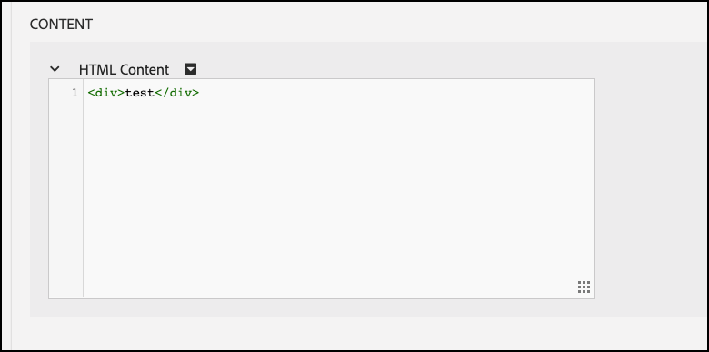

# Solução de problemas [!UICONTROL decisão no dispositivo]

## Validando configuração

### Resumo das etapas

1. Assegure a `logger` está configurado
1. Assegurar [!DNL Target] rastreamentos está ativado
1. Verifique se [!UICONTROL decisão no dispositivo] *artefato de regra* foi recuperado e armazenado em cache de acordo com o intervalo de sondagem definido.
1. Validar a entrega de conteúdo por meio do artefato de regra em cache criando um teste [!UICONTROL decisão no dispositivo] atividade por meio do experience composer baseado em formulário.
1. Erros de notificação de envio do Inspect

## 1. Verifique se o agente de log está configurado

Ao inicializar o SDK, ative o registro.

**Node.js**

Para o SDK do Node.js, uma `logger` objeto deve ser fornecido.

```js {line-numbers="true"}
const CONFIG = {
  client: "<your client code>",
  organizationId: "<your organization ID>",
  logger: console
};
```

**SDK do Java**

Para SDK Java `logRequests` no `ClientConfig` deve ser ativado.

```js {line-numbers="true"}
ClientConfig config = ClientConfig.builder()
  .client("<your client code>")
  .organizationId("<your organization ID>")
  .logRequests(true)
  .build();
```

Além disso, a JVM deve ser iniciada com o seguinte parâmetro de linha de comando:

```bash {line-numbers="true"}
java -Dorg.slf4j.simpleLogger.defaultLogLevel=DEBUG ...
```

## 2. Assegurar[!DNL Target]O Traces está habilitado

Habilitar rastreamentos resultará em informações adicionais de [!DNL Adobe Target] no que diz respeito ao artefato de regras.

1. Navegue até a[!DNL Target]Interface do usuário no [!DNL Experience Cloud].

   

1. Navegue até **[!UICONTROL Administração]** > **[!UICONTROL Implementação]** e clique em **[!UICONTROL Gerar novo token de autorização]**.

   

1. Copie o token de autorização recém-gerado para a área de transferência e adicione-o a[!DNL Target]solicitação:

   **Node.js**

   ```js {line-numbers="true"}
   const request = {
     trace: {
       authorizationToken: "88f1a924-6bc5-4836-8560-2f9c86aeb36b"
     },
     execute: {
       mboxes: [{
         name: "sdk-mbox"
       }]
   }};
   ```

   **Java**

   ```js {line-numbers="true"}
   Trace trace = new Trace()
     .authorizationToken("88f1a924-6bc5-4836-8560-2f9c86aeb36b");
   Context context = new Context()
     .channel(ChannelType.WEB);
   MboxRequest mbox = new MboxRequest()
     .name("sdk-mbox")
     .index(0);
   ExecuteRequest executeRequest = new ExecuteRequest()
     .mboxes(Arrays.asList(mbox));
   
   TargetDeliveryRequest request = TargetDeliveryRequest.builder()
     .trace(trace)
     .context(context)
     .execute(executeRequest)
     .build();
   ```

1. Com o agente de log e o rastreamento em vigor, inicie o aplicativo e monitore o terminal do servidor. A seguinte saída do agente de log confirma que o artefato da regra foi recuperado:

   **SDK do Node.js**

   ```text {line-numbers="true"}
     AT: LD.ArtifactProvider fetching artifact - https://assets.adobetarget.com/your-client-code/production/v1/rules.json
     AT: LD.ArtifactProvider artifact received - status=200
   ```

## 3. Verifique se o [!UICONTROL decisão no dispositivo] *artefato de regra* foi recuperado e armazenado em cache de acordo com o intervalo de sondagem definido.

1. Aguarde a duração do intervalo de sondagem (o padrão é 5 minutos) e verifique se o artefato está sendo buscado pelo SDK. Os mesmos logs de terminal serão gerados.

   Além disso, as informações do[!DNL Target]O rastreamento deve ser enviado para o terminal com detalhes sobre o artefato da regra.

   ```text {line-numbers="true"}
   "trace": {
     "clientCode": "your-client-code",
     "artifact": {
       "artifactLocation": "https://assets.adobetarget.com/your-client-code/production/v1/rules.json",
       "pollingInterval": 300000,
       "pollingHalted": false,
       "artifactVersion": "1.0.0",
       "artifactRetrievalCount": 10,
       "artifactLastRetrieved": "2020-09-20T00:09:42.707Z",
       "clientCode": "your-client-code",
       "environment": "production",
       "generatedAt": "2020-09-22T17:17:59.783Z"
     },
   ```

## 4. Valide a entrega de conteúdo por meio do artefato de regra em cache criando um teste [!UICONTROL decisão no dispositivo] atividade por meio do experience composer baseado em formulário

1. Navegue até a[!DNL Target]Interface do usuário no Experience Cloud

   

1. Crie uma nova atividade de XT usando o Experience Composer baseado em formulário.

   

1. Insira o nome da mbox usada no[!DNL Target]solicite o como o local da atividade do XT (observe que esse deve ser um nome de mbox exclusivo especificamente para fins de desenvolvimento).

   

1. Altere o conteúdo para uma oferta HTML ou oferta JSON. Isso será retornado no[!DNL Target]para o seu aplicativo. Deixe o direcionamento para a atividade como &quot;Todos os visitantes&quot; e selecione a métrica desejada. Nomeie a atividade, salve-a e ative-a para garantir que a mbox/localização em uso seja somente para desenvolvimento.

   

1. Em seu aplicativo, adicione instruções de log para o conteúdo recebido na resposta de sua[!DNL Target]solicitação

   **SDK do Node.js**

   ```js {line-numbers="true"}
   try {
     const response = await targetClient.getOffers({ request });
     console.log('Response: ', response.response.execute.mboxes[0].options[0].content);
   } catch (error) {
     console.error('Something went wrong', error);
   }
   ```

   **SDK do Java**

   ```js {line-numbers="true"}
   try {
     Context context = new Context()
       .channel(ChannelType.WEB);
     MboxRequest mbox = new MboxRequest()
       .name("sdk-mbox")
       .index(0);
     ExecuteRequest executeRequest = new ExecuteRequest()
       .mboxes(Arrays.asList(mbox));
   
     TargetDeliveryRequest request = TargetDeliveryRequest.builder()
       .context(context)
       .decisioningMethod(DecisioningMethod.ON_DEVICE)
       .execute(executeRequest)
       .build();
   
       TargetDeliveryResponse response = targetClient.getOffers(request);
     logger.debug("Response: ", response.getResponse().getExecute().getMboxes().get(0).getOptions().get(0).getContent());
   } catch (Exception exception) {
     logger.error("Something went wrong", exception);
   }
   ```

1. Revise os logs no terminal para verificar se o conteúdo está sendo entregue e se foi entregue por meio do artefato de regras no servidor. A variável `LD.DeciscionProvider` o objeto é emitido quando a qualificação e a decisão da atividade foram determinadas no dispositivo com base no artefato de regras. Além disso, devido ao registro dos `content`, você deverá ver `<div>test</div>` ou, no entanto, você decidiu que a resposta será ao criar a atividade de teste.

   **Saída do agente de log**

   ```text {line-numbers="true"}
   AT: LD.DecisionProvider {...}
   AT: Response received {...}
   Response:  <div>test</div>
   ```

## Erros de notificação de envio do Inspect

Ao usar a Decisão no dispositivo, as notificações são enviadas automaticamente para as solicitações de execução de getOffers. Essas solicitações são enviadas silenciosamente em segundo plano. Todos os erros podem ser inspecionados ao assinar um evento chamado `sendNotificationError`. Esta é uma amostra de código que mostra como assinar erros de notificação usando o SDK do Node.js.

```js {line-numbers="true"}
const TargetClient = require("@adobe/target-nodejs-sdk");
let client;

function onSendNotificationError({ notification, error }) {
  console.log(
    `There was an error when sending a notification: ${error.message}`
  );
  console.log(`Notification Payload: ${JSON.stringify(notification, null, 2)}`);
}

async function targetClientReady() {
  const request = {
    context: { channel: "web" },
    execute: {
      mboxes: [{
        name: "a1-serverside-ab",
        index: 1
      }]
    }
  };
  const targetResponse = await client.getOffers({ request });
}

client = TargetClient.create({
  events: {
    clientReady: targetClientReady,
    sendNotificationError: onSendNotificationError
  }
});
```

## Cenários comuns de solução de problemas

Certifique-se de revisar [recursos compatíveis](supported-features.md) para [!UICONTROL decisão no dispositivo] ao encontrar problemas.

### As atividades de decisão no dispositivo não são executadas devido a público-alvo ou atividade não compatível

Um problema comum que pode ocorrer é [!UICONTROL decisão no dispositivo] atividades não são executadas porque o público-alvo está em uso ou o tipo de atividade não é compatível.

(1) Usando a saída do agente de log, revise as entradas na propriedade trace no objeto de resposta. Identifique especificamente a propriedade das campanhas:

**Rastrear saída**

```text {line-numbers="true"}
  "execute": {
  "mboxes": [
    {
      "name": "your-mbox-name",
      "index": 0,
      "trace": {
        "clientCode": "your-client-code",
        ...
        "campaigns": [],
        ...
      }
    }
```

Você notará que a atividade para a qual está tentando se qualificar não está na `campaigns` propriedade, pois o público-alvo ou o tipo de atividade não é compatível. Se a atividade estiver listada sob o `campaigns` propriedade, seu problema não se deve a um público-alvo ou tipo de atividade não compatível.

(2) Além disso, localize a `rules.json` arquivo observando o `trace` > `artifact` > `artifactLocation` na saída do agente de log e observe que sua atividade está ausente na `rules` > `mboxes` propriedade:

**Saída do agente de log**

```text {line-numbers="true"}
 ...
 rules: {
   mboxes: { },
   views: { }
 }
```

Por fim, navegue até o[!DNL Target]e localize a atividade em questão: [experience.adobe.com/target](https://experience.adobe.com/target)

Revise as regras usadas no público-alvo e certifique-se de usar somente as mencionadas acima que sejam compatíveis. Além disso, verifique se o tipo de atividade é A/B ou XT.


### As atividades de decisão no dispositivo não são executadas devido ao público-alvo não qualificado

Se uma atividade de decisão no dispositivo não estiver em execução, mas você tiver verificado que seu arquivo rules.json contém a atividade, execute as seguintes etapas:

(1) Certifique-se de que a mbox que você está executando em seu aplicativo é a mesma que a atividade está usando:

>[!BEGINTABS]

>[!TAB rule.json]

```text {line-numbers="true"}
 ...
 rules: {
   mboxes: {
    target-only-node-sdk-mbox: [{ // this mbox name must match the mbox in your request
      ...
    }]
   }
 ...
```

>[!TAB SDK do Node.js]

```js {line-numbers="true"}
 const request = {
   trace: {
     authorizationToken: '2dfc1dce-1e58-4e05-bbd6-a6725893d4d6'
   },
   execute: {
     mboxes: [{
       address: getAddress(req),
       name: "target-only-node-sdk-mbox-two" // this mbox name must match the mbox the activity is using
     }]
   }};
```

>[!TAB SDK do Java]

```js {line-numbers="true"}
Context context = new Context()
  .channel(ChannelType.WEB);
MboxRequest mbox = new MboxRequest()
  .name("target-only-node-sdk-mbox-two")
  .index(0);
ExecuteRequest executeRequest = new ExecuteRequest()
  .mboxes(Arrays.asList(mbox));

TargetDeliveryRequest request = TargetDeliveryRequest.builder()
  .context(context)
  .decisioningMethod(DecisioningMethod.ON_DEVICE)
  .execute(executeRequest)
  .build();

TargetDeliveryResponse response = targetClient.getOffers(request);
```

>[!ENDTABS]

(2) Verifique se você está qualificado para o público-alvo da sua atividade, revisando o `matchedRuleConditions` ou `unmatchedRuleConditions` propriedade da saída de rastreamento:

**Rastrear saída**

```text {line-numbers="true"}
...
},
"campaignId": 368564,
"campaignType": "landing",
"matchedSegmentIds": [],
"unmatchedSegmentIds": [
  6188838
      ],
      "matchedRuleConditions": [],
          "unmatchedRuleConditions": [
            {
              "in": [
                "true",
                {
                  "var": "mbox.auth_lc"
                }
              ]
            }
          ]
    ...
```

Se você tiver condições de regra incompatíveis, você não estará qualificado para a atividade e, portanto, a atividade não será executada. Revise as regras no seu público-alvo para ver por que você não está qualificado.

### A atividade de decisão no dispositivo não é executada, mas o motivo não é aparente

Pode não ser imediatamente evidente por que uma atividade de decisão no dispositivo não está sendo executada. Nesse caso, siga estas etapas de solução de problemas para identificar o problema:

(1) Leia a saída de rastreamento do agente de log no console e identifique a propriedade do artefato, que será semelhante ao seguinte:

**Rastrear saída**

```text {line-numbers="true"}
...
      "artifact": {
          "artifactLocation": "https://assets.adobetarget.com/your-client-code/production/v1/rules.json",
          "pollingInterval": 300000,
          "pollingHalted": false,
          "artifactVersion": "1.0.0",
          "artifactRetrievalCount": 3,
          "artifactLastRetrieved": "2020-10-16T00:56:27.596Z",
          "clientCode": "adobeinterikleisch",
          "environment": "production"
        },
...
```

Olhe para o `artifactLastRetrieved` data do artefato e certifique-se de ter a última `rules.json` arquivo baixado no seu aplicativo.

(2) Encontre o `evaluatedCampaignTargets` propriedade na saída do agente de log:

**Saída do agente de log**

```text {line-numbers="true"}
...
  "evaluatedCampaignTargets": [
      {
        "context": {
          "current_timestamp": 1602812599608,
          "current_time": "0143",
          "current_day": 5,
          "user": {
            "browserType": "unknown",
            "platform": "Unknown",
            "locale": "en",
            "browserVersion": -1
          },
          "page": {
            "url": "localhost:3000/",
            "path": "/",
            "query": "",
            "fragment": "",
            "subdomain": "",
            "domain": "3000",
            "topLevelDomain": "",
            "url_lc": "localhost:3000/",
            "path_lc": "/",
            "query_lc": "",
            "fragment_lc": "",
            "subdomain_lc": "",
            "domain_lc": "3000",
            "topLevelDomain_lc": ""
          },
          "referring": {
            "url": "localhost:3000/",
            "path": "/",
            "query": "",
            "fragment": "",
            "subdomain": "",
            "domain": "3000",
            "topLevelDomain": "",
            "url_lc": "localhost:3000/",
            "path_lc": "/",
            "query_lc": "",
            "fragment_lc": "",
            "subdomain_lc": "",
            "domain_lc": "3000",
            "topLevelDomain_lc": ""
          },
          "geo": {},
          "mbox": {},
          "allocation": 23.79
        },
        "campaignId": 368564,
        "campaignType": "landing",
        "matchedSegmentIds": [],
        "unmatchedSegmentIds": [
          6188838
        ],
        "matchedRuleConditions": [],
        "unmatchedRuleConditions": [
          {
            "in": [
              "true",
              {
                "var": "mbox.auth_lc"
              }
            ]
          }
        ]
...
```

(3) Rever a `context`, `page`, e `referring` para garantir que seja o mais esperado, pois isso pode afetar a qualificação de direcionamento da atividade.

(4) Rever a `campaignId` para garantir que a atividade ou atividades que você espera executar sejam avaliadas. A variável `campaignId` corresponderá à ID da atividade na guia visão geral da atividade no[!DNL Target]Interface do usuário:


(5) Rever a `matchedRuleConditions` e `unmatchedRuleConditions` para identificar problemas de qualificação para as regras de público-alvo de determinada atividade.

(6) Examinar os últimos `rules.json` arquivo para garantir que a atividade ou atividades que você deseja executar localmente sejam incluídas. O local é referenciado acima na etapa 1.

(7) Certifique-se de que você esteja usando os mesmos nomes de mbox em sua solicitação e atividades.

(8) Verifique se você está usando regras de público-alvo e tipos de atividades compatíveis.

### Uma chamada de servidor é feita, mesmo que a configuração da atividade em uma mbox indique &quot;On Device Decisioning Elieligible&quot; na[!DNL Target]interface do usuário

Há alguns motivos pelos quais uma chamada de servidor é feita, mesmo que o dispositivo esteja qualificado para a tomada de decisão no dispositivo:

* Quando a mbox usada para uma atividade &quot;Qualificada para decisão no dispositivo&quot; também é usada para outras atividades que não são &quot;Qualificadas para decisão no dispositivo&quot;, a mbox é listada na `remoteMboxes` na seção `rules.json` artefato. Quando uma mbox é listada em `remoteMboxes`, qualquer `getOffer(s)` As chamadas para essa mbox resultam em uma chamada de servidor.

* Se você definir uma atividade em um espaço de trabalho/propriedade e não incluir o mesmo ao configurar o SDK, isso pode causar `rules.josn` do espaço de trabalho padrão a ser baixado, que pode usar a mbox sob o `remoteMboxes` seção.
